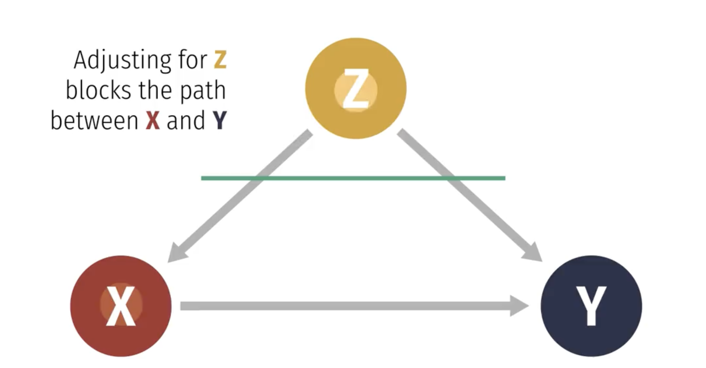

```{r setup, include=FALSE}
# set knit options
knitr::opts_chunk$set(
  fig.width=9, 
  fig.height=5, 
  fig.retina=3,
  fig.align="center",
  out.width = "100%",
  cache = FALSE,
  echo = FALSE,
  message = FALSE, 
  warning = FALSE
)

# load libraries
library(socviz)
library(juanr)
library(gapminder)
library(patchwork)
library(broom)
library(ggdag)
library(paletteer)
library(huxtable)
library(moderndive)

# source
source(here::here("slides/R", "funcs.R"))

WaffleDivorce = read_delim("data/WaffleDivorce.csv", delim = ";")


# waffles per capita
WaffleDivorce$Waffles = WaffleDivorce$WaffleHouses/WaffleDivorce$Population

# rescale gapminder data
gap = 
  gapminder %>% 
  mutate(gdpPercap = gdpPercap / 1e4, 
         pop = pop / 1e6)
```

# Plan for today {.center background-color="#dc354a"}

. . .

Controlling for confounds

. . .

Intuition

. . .

Limitations

# Where are we so far?

. . .

Want to estimate the effect of X on Y

. . .

Elemental confounds get in our way

. . .

DAGs + `ggdag()` to model causal process

. . .

figure out **which** variables to control for and which to avoid

## Do waffles cause divorce?

Remember, we have strong reason to believe the South is **confounding** the relationship between Waffle Houses and divorce rates:

```{r}
    dagify(Divorce ~ South + Waffle, 
           Waffle ~ South, 
           exposure = "Waffle",
           outcome = "Divorce", 
           coords = list(x = c(Waffle = 0, Divorce = 1, South = .5), 
                         y = c(Waffle = 0, Divorce = 0, South = 1))) %>% 
      ggdag_status(text = FALSE, use_labels = "name") + theme_dag_blank() + 
      theme(legend.position = "none")
```

::: notes
Speak about true effects and null effects
:::

# A problem we share with Lincoln {.center background-color="#dc354a"}

. . .

We need to **control (for) the South**

. . .

It has a bad influence on divorce, waffle house locations, and the integrity of the union

. . .

But how do we do *control* (for) the South? And what does that even *mean*?

## We've already done it

One way to adjust/control for backdoor paths is with **multiple regression**:

. . .

In general: $Y = \alpha + \beta_1X_1 + \beta_2X_2 + \dots$

. . .

In this case: $Y = \alpha + \beta_1Waffles + \beta_2South$

. . .

In multiple regression, coefficients ($\beta_i$) are different: they describe the relationship between **X1** and **Y**, *after adjusting for the X2, X3, X4, etc.*

## What does it mean to control?

::::: columns
::: {.column width="50%"}
$Y = \alpha + \beta_1Waffles + \beta_2South$

Three ways of thinking about $\color{red}{\beta_1}$ here:

-   The relationship between Waffles and Divorce, **controlling for the South**

-   The relationship between Waffles and Divorce that **cannot be explained by the South**

-   The relationship between Waffles and Divorce, **comparing *among* similar states (South vs. South, North vs. North)**
:::

::: {.column width="50%"}
```{r}

```
:::
:::::

## Comparing models

Let's fit two models of the effect of GDP on life expectancy, one with controls and one without:

```{r,echo = TRUE}
no_controls = lm(lifeExp ~ gdpPercap, data = gap)
controls = lm(lifeExp ~ gdpPercap + pop + year, data = gap)
```

. . .

Population and year might be forks here: they affect both economic activity and life expectancy

. . .

::: callout-note
I've re-scaled gdp (10,000s) and population (millions)
:::

## The regression table {.scrollable}

We can compare models using a **regression table**;

many different functions, we'll use `huxreg()` from the `huxtable` package

. . .

```{r, echo = TRUE, eval = FALSE}
huxreg("No controls" = no_controls, "With controls" = controls)
```

::: callout-note
Format: `huxreg("label for model 1" = model_1, "label for model 2" = model_2, ...)`
:::

## The regression table {.scrollable}

```{r, echo = TRUE}
huxreg("No controls" = no_controls, "With controls" = controls)
```

## Comparison

::::: columns
::: {.column width="50%"}
-   Model 1 has no controls: just the relationship between GDP and life expectancy

-   Model 2 controls/adjusts for: population and year

-   the effect of GDP per capita on life expectancy **changes** with controls

-   The estimate is **smaller**
:::

::: {.column width="50%"}
```{r}
huxreg("No controls" = no_controls, "With controls" = controls)
```
:::
:::::

## Interpretation

::::: columns
::: {.column width="50%"}
No controls: every additional 10k of GDP = 7.6 years more life expectancy

With controls: *after adjusting for population and year*, every additional 10k of GDP = 6.7 years more of life expectancy
:::

::: {.column width="50%"}
```{r}
huxreg("No controls" = no_controls, "With controls" = controls, statistics = "nobs")
```
:::
:::::

In other words: .shout\[comparing countries with similar population levels and in the same year\], every additional 10k of GDP = 6.7 years more of life expectancy

## Another example: 🚽 and 💰 {.scrollable}

How much does having an additional bathroom boost a house's value?

```{r}
house_prices |> 
  sample_n(8) |> 
  select(price, bedrooms, bathrooms, sqft_living, waterfront) |> 
  kbl(digits = 0)
```

## Another example: 🚽 and 💰 {.scrollable}

A huge effect:

```{r, echo = TRUE}
no_controls = lm(price ~ bathrooms, data = house_prices)
huxreg("No controls" = no_controls)
```

## The problem

We are comparing houses with more and fewer bathrooms. But houses with more bathrooms tend to be **larger**! So house size is confounding the relationship between 🚽 and 💰

```{r, out.width="90%"}
dagify(Price ~ Bathrooms + Size, 
       Bathrooms ~ Size, 
       exposure = "Bathrooms", 
       outcome = "Price", 
       coords = list(x = c(Bathrooms = 0, Price = 1, Size = .5), 
                     y = c(Bathrooms = 0, Price = 0, Size = 1))) %>% 
  ggdag_status(text = FALSE, use_labels = "name", stylized = TRUE) +
  theme_dag_blank() + 
  theme(legend.position = "none") + 
  scale_color_manual(values = c(blue, red, yellow)) + 
  scale_fill_manual(values = c(blue, red, yellow))
```

## Controlling for size {.scrollable}

What happens if we control for how large a house is?

::::: columns
::: {.column width="50%"}
-   The effect goes very close to zero (by house price standards), and is even negative
:::

::: {.column width="50%"}
```{r, echo = TRUE}
controls = lm(price ~ bathrooms + sqft_living, data = house_prices)
huxreg("No controls" = no_controls, "Controls" = controls)
```
:::
:::::

## Does this actually work? Back to the waffles

These are examples with real data, where we can't know for sure if our controls are doing what we think

. . .

Only way to know for sure is with made-up data, where we **know** the effects ex ante:

. . .

```{r, echo = TRUE}
fake = tibble(south = sample(c(0, 1), size = 50, replace = TRUE), 
              waffle = rnorm(n = 50, mean = 20, sd = 4) + 10 * south,
              divorce = rnorm(n = 50, mean = 20, sd = 2) + 8 * south) 
```

# What do we know?

```{r, echo = TRUE}
fake = tibble(south = sample(c(0, 1), size = 50, replace = TRUE), 
              waffle = rnorm(n = 50, mean = 20, sd = 4) + 10*south,
              divorce = rnorm(n = 50, mean = 20, sd = 2) + 8*south) 
```

We *know* that waffles have **0 effect** on divorce

We *know* that the south has an effect of **10** on divorce

We *know* that the south has an effect of **8** on waffles

## Controlling for the South

Fit a **naive** model without controls, and the correct one **controlling** for the South:

```{r, echo = TRUE}
naive_waffles = lm(divorce ~ waffle, data = fake)
control_waffles = lm(divorce ~ waffle + south, data = fake)
```

## The results

Perfect! Naive model is **confounded**; but controlling for the South, we get pretty close to the truth (0 effect)

```{r}
huxreg("Naive model" = naive_waffles, 
       "Control South" = control_waffles, statistics = "nobs")
```

## What's going on?

. . .

In our made-up world, if we control for the South we can get back the **uncounfounded** estimate of Divorce \~ Waffles

. . .

But what's `lm()` doing under-the-hood that makes this possible?

## What's going on?

::::: columns
::: {.column width="50%"}
-   `lm()` is *estimating* $South \rightarrow Divorce$ and $South \rightarrow Waffles$

-   it is then subtracting out or **removing** the effect of South on Divorce and Waffles

-   what's left is the relationship between Waffles and Divorce, *adjusting for the influence of the South on each*
:::

::: {.column width="50%"}
```{r}

```
:::
:::::

## Visualizing controlling for the South

This is the **confounded** relationship between waffles and divorce (zoomed out)

```{r, out.width="90%"}
ggplot(fake, aes(x = waffle, y = divorce)) + 
  geom_point(size = 3, alpha = .8) + 
  geom_smooth(method = "lm", color = red, fill = red) + 
  theme_nice() + 
  labs(x = "Waffle Houses per million residents", 
       y = "Divorce rate per 1,000 adults") + 
  coord_cartesian(xlim = c(-10, 45), 
                  ylim = c(-10, 35)) + 
  geom_label_repel(data = tibble(waffle = 30, divorce = 20, 
                                 label = glue::glue("estimated effect = {round(coef(naive_waffles)[2], 2)}")), aes(label = label), 
                   color = red, nudge_y = -10)
```

## Add the south

We can see what we already know: states in the South tend to have *more divorce*, and *more waffles*

```{r}
ggplot(fake, aes(x = waffle, y = divorce, color = factor(south))) + 
  geom_point(size = 3, alpha = .8) + 
  geom_smooth(method = "lm", color = red, fill = red) + 
  theme_nice() + 
  labs(x = "Waffle Houses per million residents", 
       y = "Divorce rate per 1,000 adults", 
       color = "Is the state in the South?") + 
  theme(legend.position = "right") + 
  coord_cartesian(xlim = c(-10, 45), 
                  ylim = c(-10, 35))
```

## Effect of south on divorce

$South \rightarrow Divorce = 10$ How much higher, on average, divorce is in the South than the North

```{r}
fake2 = fake %>% 
  group_by(south) %>% 
  mutate(south_waffles = mean(waffle), 
         south_divorce = mean(divorce)) %>% 
  ungroup() %>% 
  mutate(waffles_res = waffle - south_waffles, 
         divorce_res = divorce - south_divorce)


ggplot(fake2, aes(x = waffle, y = divorce, color = factor(south))) + 
  geom_point(size = 3) + 
  geom_hline(yintercept = mean(fake2$divorce[fake2$south == 1]), 
             color = "blue", size = 2) + 
  geom_hline(yintercept = mean(fake2$divorce[fake2$south == 0]), 
             color = "blue", size = 2) + 
  coord_cartesian(xlim = c(-10, 45), 
                  ylim = c(-10, 35)) + 
  theme_nice() + 
  labs(x = "Waffle Houses per million residents", 
       y = "Divorce rate per 1,000 adults", 
       color = "In the South?") + 
  theme(legend.position = "right")
```

## Remove effect of South on divorce

Regression **subtracts out** the effect of the South on divorce

```{r}
ggplot(fake2, aes(x = waffle, y = divorce_res, color = factor(south))) + 
  geom_point(size = 3) + 
  geom_hline(yintercept = mean(fake2$divorce_res[fake2$south == 1]), 
             color = "blue", size = 2) + 
  geom_hline(yintercept = mean(fake2$divorce_res[fake2$south == 0]), 
             color = "blue", size = 2) + 
  coord_cartesian(xlim = c(-10, 45), 
                  ylim = c(-10, 35)) + 
  theme_nice() + 
  labs(x = "Waffle Houses per million residents", 
       y = "Divorce rate per 1,000 adults", 
       color = "In the South?") + 
  theme(legend.position = "right")
```

## Next: effect of South on waffles

$South \rightarrow Waffles = 8$ How many more, on average, Waffle Houses there are in the South than the North

```{r, out.width="90%"}
ggplot(fake2, aes(x = waffle, y = divorce_res, color = factor(south))) + 
  geom_point(size = 3) + 
  geom_vline(xintercept = mean(fake2$waffle[fake2$south == 1]), 
             color = "blue", size = 2) + 
  geom_vline(xintercept = mean(fake2$waffle[fake2$south == 0]), 
             color = "blue", size = 2) + 
  coord_cartesian(xlim = c(-10, 45), 
                  ylim = c(-10, 35)) + 
  theme_nice() + 
  labs(x = "Waffle Houses per million residents", 
       y = "Divorce rate per 1,000 adults", 
       color = "In the South?") + 
  theme(legend.position = "right")
```

## Subtract out the effect of south on waffles

Regression **subtracts out** the effect of the South on waffles

```{r}
ggplot(fake2, aes(x = waffles_res, y = divorce_res, color = factor(south))) + 
  geom_point(size = 3) + 
  geom_vline(xintercept = mean(fake2$waffles_res[fake2$south == 1]), 
             color = "blue", size = 2) + 
  geom_vline(xintercept = mean(fake2$waffles_res[fake2$south == 0]), 
             color = "blue", size = 2) + 
  coord_cartesian(xlim = c(-10, 45), 
                  ylim = c(-10, 35)) + 
  theme_nice() + 
  labs(x = "Waffle Houses per million residents", 
       y = "Divorce rate per 1,000 adults", 
       color = "In the South?") + 
  theme(legend.position = "right")
```

## What's left over?

The true effect of waffles on divorce $\approx$ 0

```{r}
ggplot(fake2, aes(x = waffles_res, y = divorce_res)) + 
  geom_point(size = 3) + 
  geom_smooth(method = "lm") + 
  coord_cartesian(xlim = c(-10, 45), 
                  ylim = c(-10, 35)) + 
  theme_nice() + 
  labs(x = "Waffle Houses per million residents", 
       y = "Divorce rate per 1,000 adults", 
       color = "In the South?") + 
  geom_label_repel(data = tibble(waffles_res = 0, divorce_res = 0, 
                                 label = glue::glue("estimated effect = {round(coef(control_waffles)[2], 3)}")), aes(label = label), 
                   color = blue, nudge_y = 10, nudge_x = 10)
```

# The other confounds {.center background-color="#dc354a"}

## The perplexing pipe

Remember, with a perplexing pipe, controlling for Z blocks the effect of X on Y:

```{r}
dagify(Y ~ Z, 
       Z ~ X, 
       exposure = "X", 
       outcome = "Y",
       coords = list(x = c(X = -.5, Z = 0, Y = .5), 
                     y = c(Y = 0, Z = 0, X = 0))) %>% 
  ggdag_status() + theme_dag_blank() + 
  theme(legend.position = "none")
```

## Simulation

Let's make up some data to show this: every unit of foreign aid increases corruption by 8; every unit of corruption increases the number of protest by 4

. . .

```{r, echo = TRUE}
fake_pipe = tibble(aid = rnorm(n = 200, mean = 10), 
                   corruption = rnorm(n = 200, mean = 10) + 8 * aid, 
                   protest = rnorm(n = 200, mean = 10) + 4 * corruption)
```

. . .

What is the true effect of aid on protest? Tricky since the effect **runs through** corruption

. . .

For every unit of aid, corruption increases by 8; and for every unit of corruption, protest increases by 4...

. . .

The effect of aid on protest is $4 \times 8 = 32$

## The data

```{r}
fake_pipe %>% head() |> knitr::kable(digits = 2)
```

## Bad controls

Remember, with a **pipe** controlling for Z (corruption) is a **bad idea**

. . .

Let's fit two models, where one makes the mistake of controlling for corruption

. . .

```{r, echo = TRUE}
right_model = lm(protest ~ aid, data = fake_pipe)
bad_control = lm(protest ~ aid + corruption, data = fake_pipe)
```

## Bad controls

Notice how the model that mistakenly controls for Z tells you that X basically has no effect on Y (*wrong*)

```{r}
huxreg("Correct model" = right_model, 
       "Bad control" = bad_control, statistics = "nobs")
```

## The exploding collider

Remember, with an exploding collider, controlling for M creates strange correlations between X and Y:

```{r}
collider_triangle(x = "X", y = "Y", m = "Z") %>% 
  ggdag_status(use_labels = "name", text = FALSE) + theme_dag() + 
  theme(legend.position = "none")
```

## Simulation

Let's make up some data to show this:

```{r, echo = TRUE}
fake_collider = tibble(x = rnorm(n = 100, mean = 10), 
                   y = rnorm(n = 100, mean = 10),
                   m = rnorm(n = 100, mean = 10) + 8 * x + 4 * y)
```

-   X has an effect of 8 on M

-   Y has an effect of 4 on M

-   X has no effect on Y

## The data

```{r}
fake_collider %>% head() |> knitr::kable()
```

## Bad controls

What's the true effect of X on Y? it's zero

Remember, with a **collider** controlling for M is a **bad idea**

Let's fit two models, where one makes the mistake of controlling for M

```{r, echo = TRUE}
right_model = lm(y ~ x, data = fake_collider)
collided_model = lm(y ~ x + m, data = fake_collider)
```

## Bad controls

Notice how the model that mistakenly controls for M tells you that X has a strong, **negative** effect on Y (*wrong*)

```{r}
huxreg("Correct model" = right_model, 
       "Collided!" = collided_model, statistics = "nobs")
```

## Colliding as sample selection

Most of the time when we see a collider, it's because we're looking at a weird **sample** of the population we're interested in

. . .

Examples: the non-relationship between height and scoring, among NBA players; the (alleged) negative correlation between how surprising and reliable findings are, among published research

## Hiring at Google

Imagine Google wants to hire the best of the best, and they have two criteria: interpersonal skills, and technical skills

. . .

Say Google can measure how socially and technically skilled someone is (0-100)

```{r, echo = TRUE}
fake_google = tibble(social_skills = rnorm(n = 200, mean = 50, sd = 10), 
                     tech_skills = rnorm(n = 200, mean = 50, sd = 10))
```

. . .

The two are **causally unrelated**: one does not affect the other; improving someone's social skills would not hurt their technical skills

## The data

```{r}
fake_google %>% sample_n(8) |> knitr::kable(digits = 2)
```

## Simulate the hiring process

Now imagine that they add up the two skills to see a person's **overall quality**:

```{r, echo = TRUE}
fake_google %>% 
  mutate(total_score = social_skills + tech_skills)
```

## Simulating the hiring process

Now imagine that Google **only hires** people who are in the top 15% of quality (in this case that's 112.8 or higher)

```{r, echo = TRUE, eval = FALSE}
fake_google %>% 
  mutate(total_score = social_skills + tech_skills) %>% 
  mutate(hired = case_when(total_score >= quantile(total_score, .85) ~ "yes", 
                           total_score < quantile(total_score, .85) ~ "no"))
```

```{r, echo = FALSE}
collide_google = fake_google %>% 
  mutate(total_score = social_skills + tech_skills) %>% 
  mutate(hired = case_when(total_score >= quantile(total_score, .85) ~ "yes", 
                           total_score < quantile(total_score, .85) ~ "no"))
collide_google
```

## General population

No relationship between social and technical skills among all job **candidates**

```{r}
ggplot(collide_google, aes(x = social_skills, y = tech_skills)) + 
  geom_point(size = 2, alpha = .8) + 
  theme_nice() + labs(x = "Social skill score", y = "Technical skill score") + 
  geom_smooth(method = "lm")
```

## Collided!

If we only look at Google workers we see a **trade-off** between social and technical skills:

```{r}
ggplot(collide_google, aes(x = social_skills, y = tech_skills, 
                           color = hired)) + 
  geom_point(size = 2, alpha = .8) + 
  theme_nice() + labs(x = "Social skill score", y = "Technical skill score", 
                     color = "Works at Google?") + 
  geom_smooth(method = "lm") + 
  theme(legend.position = "right")
```

## Limitations

It's cool that we can control for a **confound**, or avoid colliders/pipes and get back **the truth**

. . .

But there are big limitations we must keep in mind when evaluating research:

-   We need to know what to control for (confident in our DAG)

. . .

-   We need to have data on the controls (e.g., data on Z)

. . .

-   We need our data to measure the variable well (e.g., \# of homicides a good proxy for crime?)

## Stuff that's hard to measure

**Ability** is a likely **fork** for the effect of Education on Earnings; but how do you measure ability?

```{r}
dagify(Earnings ~ Education + Ability + Parents + Networks + Region,
       Education ~ Ability + Parents + Region,
       exposure = "Education",
       outcome = "Earnings",
       latent = "Ability") |> 
  ggdag_status(use_labels = "name", text = FALSE) + theme_dag() + 
  theme(legend.position = "none")
```

## 🚨 Your turn: pipes, colliders 🚨

Using the templates in the class script:

-   Make a **realistic** pipe scenario

-   Use models to show that everything goes wrong when you *mistakenly* control for the pipe

-   Make a **realistic** fork scenario

-   Use models to show that everything goes wrong when you *fail to control* for the fork

```{r}
countdown::countdown(minutes = 10L)
```
