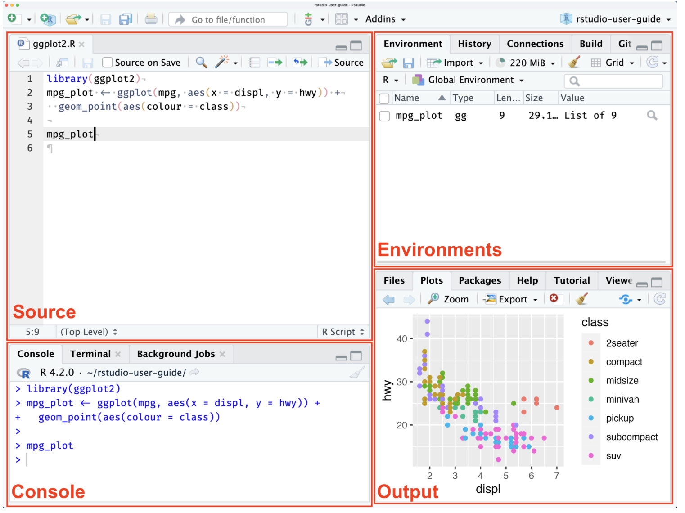

```{r}
#| include: false
library(countdown)
```

# Welcome

## Meet the professor

::::: columns
::: {.column width="50%"}
{fig-alt="Headshot of Dr. Mine Çetinkaya-Rundel" fig-align="center" width="200"}
:::

::: {.column width="50%" style="font-size: 75%;"}
-   Political Science PhD Candidate
    -   Comparative Politics and Methodology
    -   Crime, Violence, Behavior, and Gender
-   My Summer Ins:
    -   Hockey, Hiking, Iced Tea
-   My Summer Outs:
    -   California Heat, Fires, Allergies
:::
:::::

## Tell Me About you!

-   What is your name?
-   What is your major?
-   What year are you?
-   What is one summer in for you and what is one summer out?

## Course learning objectives

-   By the end of this course you will be able to...
    -   Analyze real-world data to answer questions about different relationships.
    -   Feel comfortable manipulating data in R
    -   Craft effective visualizations of patterns in data
    -   Draw causal diagrams and identify obstacles to causal claims
    -   Understand the basics of regression and uncertainty

# Course info

|   | Day | Time | Location |
|------------------|------------------|------------------|-------------------|
| Lectures | Mon, Tue & Wed. | 12:10 pm - 1:50 pm | Hoagland Hall 168 |
| Discussion/Lab | Thu | 12:10 pm - 1:50 pm | Teaching and Learning Complex 2212 |
| Office Hours | Tue | 2:00 - 4:00 PM | Kerr Hall 569 |

# Course toolkit

-   All materials for this course are **free and online.** You will do all of your analysis with the open source (and free) programming language R and RStudio.

-   Textbook: Sumner, Jane L. *R for Political Science Research : An Introduction for Absolute Beginners*. 1st ed. 2024., Springer Nature Switzerland, 2024, <https://doi.org/10.1007/978-3-031-75853-9>.

-   R and R Studio:

-   Course Website:

## Activities: Prepare, Participate, Practice, Perform {.smaller}

-   **Prepare:** Introduce new content and prepare for lectures by completing the readings (and sometimes watching the videos)

-   **Participate:** Attend and actively participate in lectures and labs, office hours, team meetings

-   **Practice:** Practice applying statistical concepts and computing with application exercises during lecture, graded for completion

-   **Perform:** Put together what you've learned to analyze real-world data

    | Category                             | Percentage   |
    |--------------------------------------|--------------|
    | Application Exercises (Particpation) | 15%          |
    | Labs                                 | 35% (7% x 5) |
    | Final Project                        | 50%          |

## Final Project

-   *Make a Research Question, Pick a data set, and do analysis. That is your final project.*

-   The goal of the final project is for you to apply the skills you have been learning throuhg out the quarter and apply to real life data to answer a question YOU HAVE MADE.

-   You will be split into teams, I recommend sitting with these teams during lecture and labs.

-   Learn More on the [Project Description](project-description.qmd) page on the course website.

## Teams

-   Team assignments
    -   Assigned by me
    -   Application exercises, labs, and project
    -   Peer evaluation during teamwork and after completion
-   Expectations and roles
    -   Everyone is expected to contribute equal *effort*
    -   Everyone is expected to understand *all* code turned in
    -   Individual contribution evaluated by peer evaluation, commits, etc.

## Support

-   Attend office hours
-   Ask and answer questions on the discussion forum
-   Reserve email for questions that can be answered quickly and timely

## Diversity + inclusion {.smaller}

It is my intent that students from all diverse backgrounds and perspectives be well-served by this course, that students' learning needs be addressed both in and out of class, and that the diversity that the students bring to this class be viewed as a resource, strength and benefit.

::: incremental
-   This is a political science course, and as such we will be discussing political issues. As each of us comes into the section with unique opinions about political issues, there may be disagreements. I insist we discuss our differences with respect, civility, and empathy. Please do your best to keep an open mind about your peers’ perspectives as your peers will expect the same of you.
-   This does not mean you should avoid participating if/when you have an alternative point of view just because you may not wish to provoke an argument. Be bold, and share what you think (respectfully)
    -   *If I believe any of the discussion is becoming disrespectful or includes hateful or inappropriate speech, I hold the right to end the discussion.*
:::

## Accessibility

-   If you believe you have a disability requiring an accommodation or would like additional information about the resources available for students with disabilities, please visit the UC Davis Student Disability Center website at [sdc.ucdavis.edu](sdc.ucdavis.edu).

-   Students must contact me about any accommodations.

-   Outside Resources - The Student Academic Success Center is a campus wide resource assisting students by helping them improve in study skills, academic writing, and other specific topics

# Course policies

## Late work, waivers, regrades policy

-   If there are circumstances that prevent you from completing a lab or project assignment by the stated due date, you may email me before the deadline to waive the late penalty
    -   FINAL PROJECT IS EXCLUDED FROM THIS
-   Labs may be submitted up to 3 days late. There will be a 5% deduction for each 24-hour period the assignment is late.

## Sharing / reusing code policy

-   I am aware that there is a large amount of code is available online, and many tasks may have solutions posted

-   Unless explicitly stated otherwise, this course's policy is that you may make use of any online resources (e.g. RStudio Community, StackOverflow, etc.) but you must explicitly cite where you obtained any code you directly use or use as inspiration in your solution(s).

-   Any recycled code that is discovered and is not explicitly cited will be treated as plagiarism, regardless of source.

## Policy on AI

**AI is NOT allowed for usage in this classroom.**

-   You may not use artificial intelligence tools such as ChatGPT, Gemini, Claude, Grok, etc. to complete academic work

    -   The Office of Student Support and Judicial Affairs (OSSJA) considers the unauthorized use of content generated by artificial intelligence (AI) to be academic misconduct and/or plagiarism (see: <https://ossja.ucdavis.edu/code-academic-conduct).>

## Academic Integrity

-   Cheating and plagiarism will be evaluated and disciplined according to University policy.

-   For information on academic integrity, please read: <http://cai.ucdavis.edu/aip.html.>

-   You are responsible for understanding and following all aspects of University policy on academic integrity; ignorance is not an excuse.

## Most importantly!

Ask if you're not sure if something violates a policy!

## This week's tasks

-   Download R and Rstudio
-   R Basics
-   Assign Teams
-   Data Visualization I and II
-   Project Topic Idea Submission
-   Complete Lab 1

# Downloading R

## Why R? {.smaller}

::: incremental
-   R is a coding language language and environment built for statistical computing and graphics that includes a large variety in statistical and graphical techniques.

-   As political scientists R is an effective way to store and handle data, and a large selection of data analysis tools including graphing tools in a coherent and effective language.

-   The majority of users will use Rstudio an IDE or integrated development environment to write the code and see outputs.

    -   **Rstudio** is a software application with a code editor, compiler, debugger, and project manager in a single interface that allows us to write, edit, compile, and debug code in a singular location.
:::

## R as a language {.smaller}

::: incremental
-   Think of R as a language it has: vocabulary, punctuation, grammar, and syntax

-   R is a language you can use to speak to your computer to tell it how to manage and visual data
:::

## What is R?

-   R is freely maintained by an international team of developers and is available through *The Comprehensive R Archive Network*.

-   Follow the instructions to download R.

-   If you are using an older computer or iPad, go to **Using Posit Cloud for R in the FAQ page**.

## Instructions for Downloading R

-   Go to The Comprehensive R Archive Network webpage:

    -   <https://cran.r-project.org>

-   To install R on Windows, click the "Download R for Windows" link.

-   To install R on a Mac, click the "Download R for Mac" link.

# Downloading RStudio

## What is Rstudio?

-   One way to picture what RStudio does is to compare it to Microsoft Word, a software application that allows us to write documents.

-   RStudio, instead of being a platform to write text, helps us write in the coding language R. Follow the instructions below to download RStudio.

## Instructions for Downloading Rstudio

-   Go to the [Posit RStudio Desktop page](https://posit.co/download/rstudio-desktop/).

-   To install for Mac:

-   Scroll to the button that says "Install R on a Mac," and click the “Download R for Mac OS 13+” link.

    -   If you're using an older version, click the "Previous Versions" link to find a version that works with your computer.

-   To install for Windows:

    -   Scroll to the button that says "Install R on Windows 10/11," and click the link to download.

# R Basics

## R Layout

There are four primary quadrants in RStudio:

-   **Source pane**
-   **Console pane**
-   **Environment pane**
-   **Output pane**

## R Layout



## Writing "Text"

-   Writing text in R is called a script, a strong of letters connected by the use of " " or ' '.

```{r}
#| eval: true

"Hello World!"
'Hello World!' 

```

## Writing Numbers

-   To output numbers you just type out the number. Also, note that I do not use a comma when writing out my four-digit number:

```{r}
#| eval: true

5
75
1000

```

## Basic Calculations {.smaller}

R at its core is a gigantic calculator, so let's practice doing basic calculations.

```{r}
#| echo: true
#| eval: false

# addition
10 + 2

# subtraction
10 - 2

# multipilication
10 * 2

# division
10/2

# exponent
10^2

```

## Basic Calculations {.smaller}

R at its core is a gigantic calculator, so let's practice doing basic calculations.

```{r}
#| echo: true

# addition
10 + 2

# subtraction
10 - 2

# multipilication
10 * 2

# division
10/2

# exponent
10^2
```

## Comments

It's also important to annotate your code. It will help you write notes and explain what you are doing. To annotate your code, you will use the number sign #:

```{r}
#| echo: true

# addition
10 + 2
# the answer is 12
```

## Creating Objects {.smaller}

In R, we save our data in what we call objects! Objects store information about different types of elements. If you know any other coding languages, they typically call these variables.

-   `print()` is a function that 'prints' out an output from an object.

-   **R functions** are like the verbs of the R coding language, they tell your computer what action to make with sets of information.

    -   A function is usually defined by a keyword and then parenthesis.

```{r}
#| echo: true

# The <- saves the caculation as math
math <- 10 + 2
#print()
print(math)

```

```{r}
#| echo: true

# The = saves the caculation as math
math = 10 + 2
# print() will print out what is saved in the object math
print(math)
```

## Data Types

There are 6 types of data in R that are important to know, but the essential ones are logical, numeric, and character.

In this class we are going to focus on only three: Logical, Numeric, and Characters.

1.  **Logical** Also known as boolean data, logical data is shown as TRUE or FALSE values:

```{r}
#| echo: true

logical1 <- TRUE
logical2 <- FALSE

# The class() function outputs the data type of the object
class(logical1)


print(logical2)
print(class(logical2))

```

## Data Types

2.  **Numeric** represents all data types that are real numbers with or with out decimal points.

```{r}
#| echo: true


height <- 5.5
acres <- 1000

class(height)


print(acres)
print(class(acres))
```

## Data Types

3.  **Character** specifies character or string values in a variable such as a singular character 'A' or a string of characters in 'Apple'.

```{r}
#| echo: true

# Use '' or "" to show it's a string of characters
motorsports <- "formula1"

print(motorsports)
print(class(motorsports))
```

# Packages

## What is a Package?

-   **Packages** are collections of R functions, data, and code compiled in a well-defined format

-   Some packages come pre-installed in R.

-   However, the majority do not, so you need to install them first using the r function `install.packages`

```{r}
#| echo: true
#| eval: false

install.packages("tidyverse") # install this package
```

## Using a Package

-   After installing the packages we need to "attach" the package.

    -   This means telling your computer that you want to use that package during this working session

-   You can do this by using the function `library()` and the name of the package.

```{r}
#| echo: true
#| eval: false

library("tidyverse")
```

# Application exercise

::: appex
Submit a screenshot or photo of RStudio running on your computer with the code from class today on your computer.
:::
