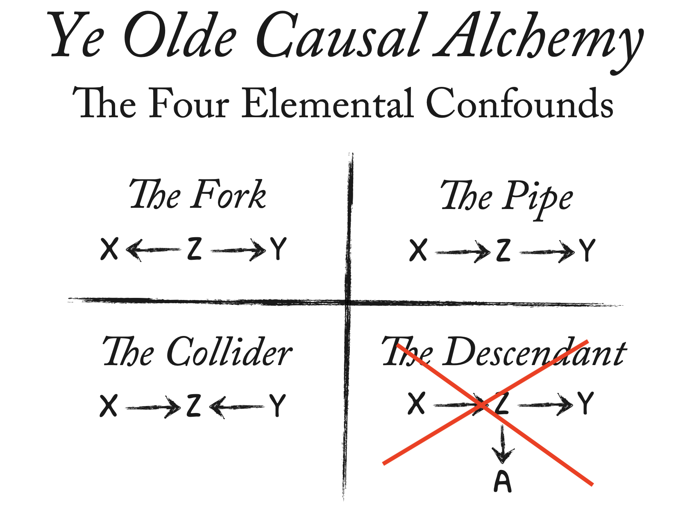
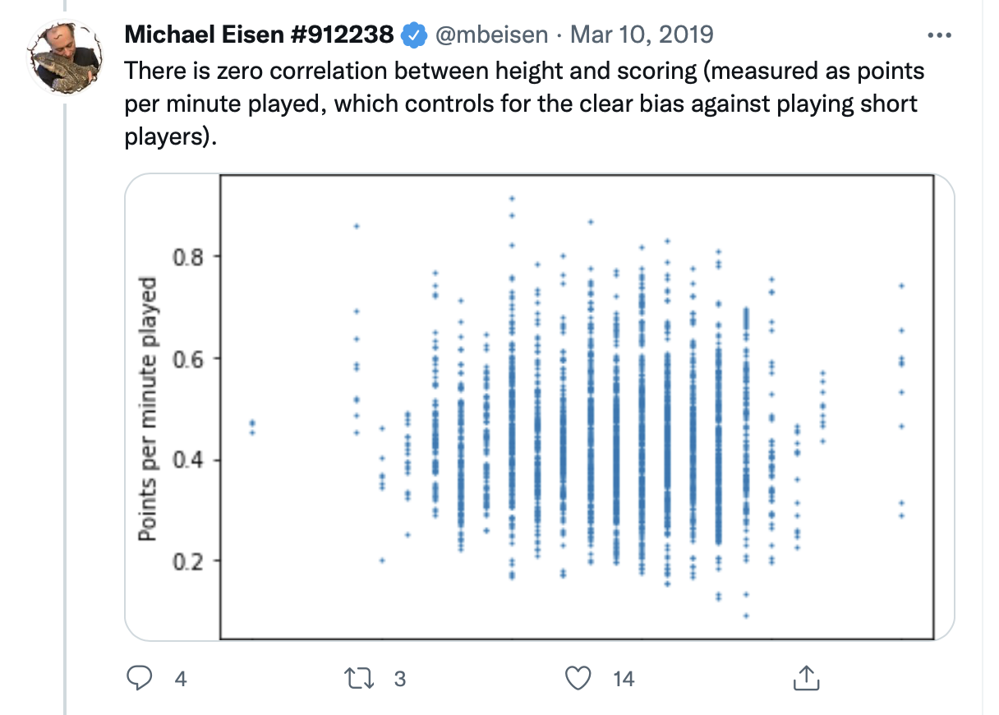
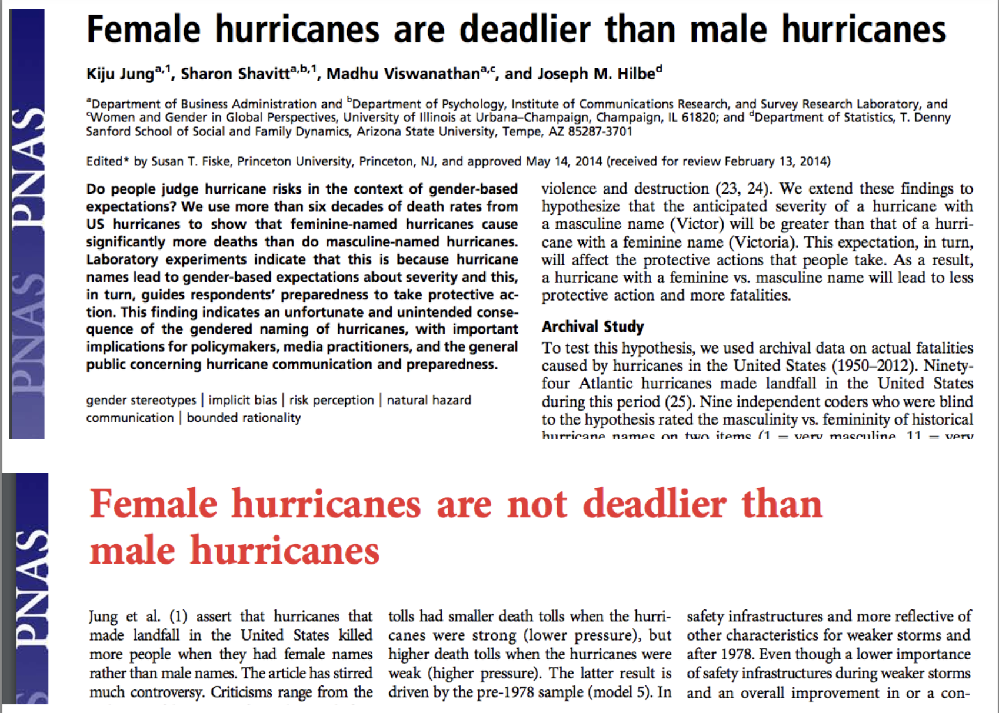
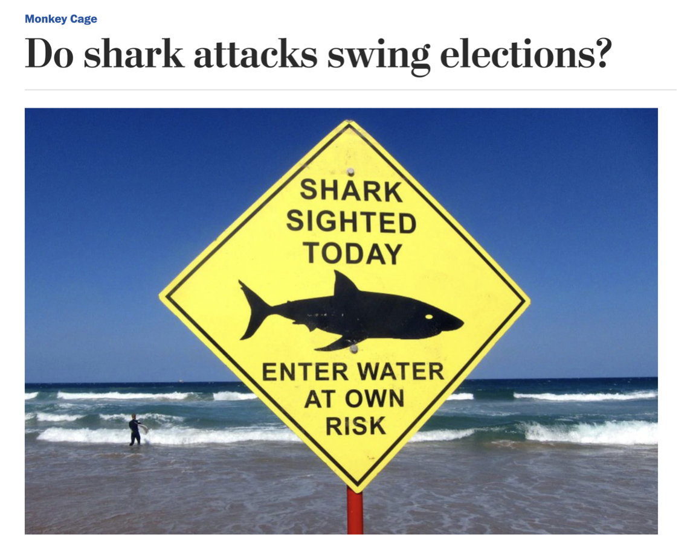

```{r setup, include=FALSE}
# set knit options
knitr::opts_chunk$set(
  fig.width=9, 
  fig.height=5, 
  fig.retina=3,
  fig.align="center",
  out.width = "100%",
  cache = FALSE,
  echo = FALSE,
  message = FALSE, 
  warning = FALSE
)

# load libraries
library(socviz)
library(juanr)
library(gapminder)
library(patchwork)
library(broom)
library(ggdag)

# source
source(here::here("slides/R", "funcs.R"))

WaffleDivorce = read_delim("data/WaffleDivorce.csv", delim = ";")
```

# Midway Notes

. . .

Labs 1 - 3 graded

. . .

Email me if you used a waiver and on what assignment

. . .

Presentations moved to the Monday of Week 6, 07/28

. . .

If you have any questions or concerns let me know ASAP

# Plan for today {.center background-color="#dc354a"}

. . .

DAGs

. . .

Waffles and divorce

. . .

The elemental confounds

# Last class

. . .

We want to know if X **causes** Y, using data

. . .

We *can* use models to capture the effect of X on Y, if in fact X does affect Y

. . .

Problem is some correlations are causal, others aren't

. . .

How can we tell?

## Causal diagram

::::: columns
::: {.column width="50%"}
We need a *causal model*

The model is our idea of how the data came to be (the **data-generating process**)

The model tells us how to *identify* a causal effect (if it's possible!)
:::

::: {.column width="50%"}
```{r}
knitr::include_graphics("img/models.jpeg")
```
:::
:::::

## Directed Acyclical Graphs (DAGs)

A popular modeling tool for thinking about causality is the **DAG**

Nodes (points) = variables; Edges (arrows) = direction of *causality*

```{r}
dagify(Y ~ X + Z + A + B, 
       X ~ Z + W, 
       Z ~ B, 
       A ~ B + W, 
       exposure = "X", outcome = "Y") %>% 
  ggdag_status(stylized = TRUE) + 
  theme_dag(legend.position = "none") + 
  scale_color_manual(values = c(blue, red))
```

## DAGs

Nodes = variables; Arrows = direction of *causality*

. . .

```{r,out.width="60%", fig.align='center'}
dagify(Y ~ X1, 
       coords = c(list(x = c(X1 = 1, Y = 1.5), 
                       y = c(X1 = 1, Y = 1)))) %>% 
  ggdag(node_size = 20, text_size = 5, stylized = TRUE) + theme_dag()
```

Read: X1 has an effect on Y

## DAGs

```{r, out.width = "80%"}
dagify(Y ~ X1, 
       X1 ~ X2) %>% 
  ggdag(node_size = 18, text_size = 4.5, stylized = TRUE) + theme_dag()
```

. . .

X1 has an effect on Y; X2 has an effect on X1; X2 affects Y *only through* X1

*Missing* arrows matter!

::: notes
Example of x2 - x1 - y?
:::

## DAGs

```{r, out.width="80%"}
dagify(Y ~ X1 + X3, 
       X1 ~ X2 + X3) %>% 
  ggdag(node_size = 20, text_size = 5, stylized = TRUE) + theme_dag()
```

. . .

X1 has an effect on Y; X2 has an effect on X1 and Y (via X1); X3 has an effect on X1 and Y

## Example: ideology

Where does (liberal) ideology come from?

. . .

Variables in the literature: Income (I), Liberal (L), Age (A), Media (M), Parents (P)

. . .

```{r, out.width="70%"}
dag = dagify(L ~ M + P + A + I, 
             M ~ P, 
             exposure = "M", 
             outcome = "L")
ggdag(dag, stylized = TRUE) + theme_dag() + theme(legend.position = "none")
```

::: notes
What are our assumptions? What's this DAG saying?
:::

## DAGs

DAGs encode everything we know about some process

. . .

We can see all of our assumptions and how they fit together

. . .

For example: the effect of Parents on how Liberal someone is happens *directly* and *indirectly* (through Media)

. . .

Missing arrows also matter: we are assuming that Age has *no effect* on Media diet

## Identification

Why do this?

. . .

Later: DAGs help us figure out how to estimate the effect of one variable on another

. . .

While at the same time being mindful of all the other variables that we need to **adjust**, or **control** for

. . .

For instance, we might want to estimate the effect of Media consumption (M) on how Liberal (L) someone is

. . .

This process is called "identification" $\rightarrow$ to **identify** the effect of X on Y

## Waffles and Divorce

```{r}

```

## Waffle House Index

::::: columns
::: {.column width="50%"}
```{r}

```
:::

::: {.column width="50%"}
```{r}

```
:::
:::::

## Does Waffle House cause divorce?

States with more waffle houses tend to have more divorce

```{r}
WaffleDivorce %>% 
  mutate(`Waffles per Person` = WaffleHouses/Population) %>% 
  select(Location, Marriage, Divorce, `Waffles per Person`) %>% 
  sample_n(7) |> 
  knitr::kable(digits = 2)
```

## Does Waffle House cause divorce?

Do cheap, delicious waffles put marriages at risk?

```{r}
ggplot(WaffleDivorce, aes(x = WaffleHouses/Population, y = Divorce)) + 
  geom_point(size = 3, fill = red, alpha = .8, shape = 21, color = "white") + 
  geom_smooth(method = "lm", color = red, fill = red) + 
  theme_nice() + 
  labs(x = "Waffle Houses per million residents", 
       y = "Divorce rate per 1,000 adults")
```

::: notes
Speculate on underlying mechanism
:::

## Does Waffle House cause divorce?

. . .

Almost certainly *not*

. . .

No one thinks there is a *plausible* way in which Waffle House causes divorce

. . .

When we see a correlation of this kind we wonder about other variables that are **actually** driving the relationship

. . .

You've likely thought about this before: *a "lurking" variable, "other factors", that "matter"*

. . .

But what might that *variable* be? And *how* exactly does it lead us astray?

## The lurking variable

It turns out that Waffle Houses originated in the South (Georgia), and most of them are still there

. . .

The South also happens to have some of the highest divorce rates in the country

## The DAG

So the DAG might look something like this: South **has an effect on** Waffle Houses and Divorce, but Waffles **do not cause** Divorce

```{r, out.width="80%"}
dagify(Divorce ~ South, 
       Waffle ~ South, 
       exposure = "Waffle",
       outcome = "Divorce", 
       coords = list(x = c(Waffle = 0, Divorce = 2, South = 1), 
                      y = c(Waffle = 0, Divorce = 0, South = 1))) %>% 
  ggdag_status(text = FALSE, use_labels = "name", stylized = TRUE) + theme_dag_blank() + 
  theme(legend.position = "none") + scale_color_manual(values = c(blue, red)) + 
  scale_fill_manual(values = c(blue, red))
```

## The problem

```{r, out.width="60%"}
dagify(Divorce ~ South, 
       Waffle ~ South, 
       exposure = "Waffle",
       outcome = "Divorce", 
       coords = list(x = c(Waffle = 0, Divorce = 2, South = 1), 
                      y = c(Waffle = 0, Divorce = 0, South = 1))) %>% 
  ggdag_status(text = FALSE, use_labels = "name", stylized = TRUE) + theme_dag_blank() + 
  theme(legend.position = "none") + scale_color_manual(values = c(blue, red)) + 
  scale_fill_manual(values = c(blue, red))
```

. . .

A DAG like this will produce a *correlation* between Waffles and Divorce, even when there is no **causal** relationship

. . .

This is called **confounding**: the South is **confounding** the relationship between Waffles and Divorce

## How does this happen?

Let's make up data to convince ourselves this is true

. . .

fifty states, about half of them are in the South

. . .

```{r, echo  = TRUE}
tibble(south = sample(c(0, 1), size = 50, replace = TRUE))
```

::: callout-note
`sample()` is choosing at random between 0 and 1, 50 times, with replacement
:::

## Simulate the treatment

Step 2: make Waffle houses, let's say about 20 per million residents, +/- 4

```{r, echo = TRUE}
tibble(south = sample(c(0, 1), size = 50, replace = TRUE), 
       waffle = rnorm(n = 50, mean = 20, sd = 4))
```

## Make Waffles more common in the South

Step 3: The arrow from South to Waffles, let's say Southern states have about 10 more Waffles, on average

```{r, echo = TRUE}
tibble(south = sample(c(0, 1), size = 50, replace = TRUE), 
       waffle = rnorm(n = 50, mean = 20, sd = 4) + 10 * south)
```

## Simulate the outcome

Step 4: make a divorce rate, let's say about 20 divorces per 1,000 adults

```{r, echo = TRUE}
fake = tibble(south = sample(c(0, 1), size = 50, replace = TRUE), 
              waffle = rnorm(n = 50, mean = 20, sd = 4) + 10 * south,
              divorce = rnorm(n = 50, mean = 20, sd = 2))
```

## Make the South have more divorce

Step 5: the arrow from South to divorce, let's say southern states have about 8 more divorces per 1,000 residents

```{r, echo = TRUE}
fake = tibble(south = sample(c(0, 1), size = 50, replace = TRUE), 
              waffle = rnorm(n = 50, mean = 20, sd = 4) + 10 * south,
              divorce = rnorm(n = 50, mean = 20, sd = 2) + 8 * south)
```

**NOTICE!** Waffles have no effect on divorce in our fake data

## A totally confounded relationship

The South's **effect** on Waffle House and on Divorce creates a **confounded** correlation between the two

```{r}
ggplot(fake, aes(x = waffle, y = divorce)) + 
  geom_point(size = 3, fill = red, alpha = .8, shape = 21, color = "white") + 
  geom_smooth(method = "lm", color = red, fill = red) + 
  theme_nice() + 
  labs(title = "Our fake waffle data", 
       x = "Waffle Houses per million residents", 
       y = "Divorce rate per 1,000 adults")
```

## A totally confounded relationship

The DAG on the left will produce an association like the one on the right

::::: columns
::: {.column width="50%"}
```{r}
dagify(Divorce ~ South, 
       Waffle ~ South, 
       exposure = "Waffle",
       outcome = "Divorce", 
       coords = list(x = c(Waffle = 0, Divorce = 2, South = 1), 
                      y = c(Waffle = 0, Divorce = 0, South = 1))) %>% 
  ggdag_status(text = FALSE, use_labels = "name", stylized = TRUE) + theme_dag_blank() + 
  theme(legend.position = "none") + scale_color_manual(values = c(blue, red)) + 
  scale_fill_manual(values = c(blue, red))
```
:::

::: {.column width="50%"}
```{r}
ggplot(fake, aes(x = waffle, y = divorce)) + 
  geom_point(size = 3, fill = red, alpha = .8, shape = 21, color = "white") + 
  geom_smooth(method = "lm", color = red, fill = red) + 
  theme_nice() + 
  labs(title = "Our fake waffle data", 
       x = "Waffle Houses per million residents", 
       y = "Divorce rate per 1,000 adults")
```
:::
:::::

Even if Waffles and Divorce are **causally** unrelated

## 🧇 Your turn: confounded waffles 🧇

Make up data where a lurking variable creates a confounded relationship between two other variables that isn't truly causal.

1.  Change the [confound]{.yellow}, [treatment]{.blue} and [outcome]{.red} variables in the code to ones of your choosing

2.  Make a scatterplot with a trend line -- use `labs()` to help us make sense of the plot axes and tell us what the confound is with the `title =` argument in `labs()`

```{r}
#| eval: false
#| echo: true

fake_data = tibble(confound = rnorm(n = , mean = , sd = ),
                   treatment = rnorm(n = , mean = , sd = ) + or - #*confound,
                   outcome = rnorm(n = , mean = , sd = ) + or - #*treament + or - #*confound
  
)
```

::: callout-note
If you want to make a binary or categorical variable use `sample()`

example = `sample(c("Woman", "Man"), size = 50, replace = TRUE)`
:::

```{r}
countdown::countdown(minutes = 20L)
```

## What's going on here?

::::: columns
::: {.column width="50%"}
Think of causality as water flowing in the direction of the arrows

We want look at water flowing **directly** from a **treatment** to an **outcome**

But **account** for the fact that there is often *indirect* flow that *contaminates* our estimates
:::

::: {.column width="50%"}


Source: the mighty Andrew Heiss
:::
:::::

## What's going on here?

To **identify** the effect of Waffles on Divorce we need to **account**, or **control for**, the influence of the South

Otherwise we will be *confounded*

```{r, out.width="80%"}
dagify(Divorce ~ South, 
       Waffle ~ South, 
       exposure = "Waffle",
       outcome = "Divorce", 
       coords = list(x = c(Waffle = 0, Divorce = 2, South = 1), 
                      y = c(Waffle = 0, Divorce = 0, South = 1))) %>% 
  ggdag_status(text = FALSE, use_labels = "name", stylized = TRUE) + theme_dag_blank() + 
  theme(legend.position = "none") + scale_color_manual(values = c(blue, red)) + 
  scale_fill_manual(values = c(blue, red))
```

## The formula

1.  Make a DAG of what we think is going on with our treatment and outcome

2.  Figure out where the *indirect flows* are (today)

3.  Account for those in our analysis (later in class)

## What do we need to control?

```{r}
dagify(Y ~ X, 
       exposure = "X", 
       outcome = "Y") %>% 
  ggdag_status(text = FALSE, use_labels = "name", stylized = TRUE) + theme_dag_blank() + 
  theme(legend.position = "none") + scale_color_manual(values = c(blue, red)) + 
  scale_fill_manual(values = c(blue, red))
```

. . .

Nothing

## What do we need to control?

```{r}
dagify(Y ~ X + Z, 
       exposure = "X", 
       outcome = "Y") %>% 
  ggdag_status(text = FALSE, use_labels = "name", stylized = TRUE) + theme_dag_blank() + 
  theme(legend.position = "none") + scale_color_manual(values = c(blue, red)) + 
  scale_fill_manual(values = c(blue, red))
```

. . .

Nothing! No indirect flow to X

## What do we need to control?

```{r}
dagify(Y ~ X + Z + A + B, 
       X ~ G + H + J + K, 
       exposure = "X", 
       outcome = "Y") %>% 
  ggdag_status(text = FALSE, use_labels = "name", stylized = TRUE) + theme_dag_blank() + 
  theme(legend.position = "none") + scale_color_manual(values = c(blue, red)) + 
  scale_fill_manual(values = c(blue, red))
```

. . .

Nothing! No indirect flow to X!

## What do we need to control to identify...

Media consumption (M) $\rightarrow$ Liberal (L)

```{r}
dag = dagify(L ~ M + P + A + I, 
             M ~ P, 
             exposure = "M", 
             outcome = "L")
ggdag_status(dag, text = FALSE, use_labels = "name", stylized = TRUE) + theme_dag_blank() + 
  theme(legend.position = "none") + scale_color_manual(values = c(blue, red)) + 
  scale_fill_manual(values = c(blue, red))
```

## The elemental confounds

```{r,out.width="70%",fig.align='center'}

```

# The fork 🍴 {.center background-color="#dc354a"}

## The confounding fork 🍴

Y $\leftarrow$ Z $\rightarrow$ X

There is a third variable, Z, that is a **common cause** of X and Y

```{r, out.width="90%"}
dagify(Y ~ Z, 
       X ~ Z, 
       exposure = "X",
       outcome = "Y", 
       coords = list(x = c(Y = 0, X = 2, Z = 1), 
                      y = c(Y = 0, X = 0, Z = 1))) %>% 
  ggdag_status(text = FALSE, use_labels = "name", stylized = TRUE) + theme_dag_blank() + 
  theme(legend.position = "none") + scale_color_manual(values = c(blue, red)) + 
  scale_fill_manual(values = c(blue, red))
```

## The confounding fork

We've already seen this!

::::: columns
::: {.column width="50%"}
```{r}
dagify(Divorce ~ South, 
       Waffle ~ South, 
       exposure = "Waffle",
       outcome = "Divorce", 
       coords = list(x = c(Waffle = 0, Divorce = 2, South = 1), 
                      y = c(Waffle = 0, Divorce = 0, South = 1))) %>% 
  ggdag_status(text = FALSE, use_labels = "name", stylized = TRUE) + theme_dag_blank() + 
  theme(legend.position = "none") + scale_color_manual(values = c(blue, red)) + 
  scale_fill_manual(values = c(blue, red))
```

Creates an association between X and Y that isn't causal
:::

::: {.column width="50%"}
```{r}
dagify(Divorce ~ South + Waffle, 
       Waffle ~ South, 
       exposure = "Waffle",
       outcome = "Divorce", 
       coords = list(x = c(Waffle = 0, Divorce = 2, South = 1), 
                      y = c(Waffle = 0, Divorce = 0, South = 1))) %>% 
  ggdag_status(text = FALSE, use_labels = "name", stylized = TRUE) + theme_dag_blank() + 
  theme(legend.position = "none") + scale_color_manual(values = c(blue, red)) + 
  scale_fill_manual(values = c(blue, red))
```

Distorts the true causal relation between X and Y
:::
:::::

Note that **both** of these fork scenarios will **confound**

## The second scenario

Say that Waffles do cause Divorce, but the effect is tiny

```{r, echo = TRUE}
fake = tibble(south = sample(c(0, 1), size = 50, replace = TRUE), 
              waffle = rnorm(n = 50, mean = 20, sd = 4) + 10*south,
              divorce = rnorm(n = 50, mean = 20, sd = 2) + 8*south + .0001 * waffle)
```

Same code as before, I've just added a tiny effect of waffle houses on divorce = .0001 more divorces per waffle house

## The second scenario

The effect of Z (South) on X (Waffles) and Y (Divorce) will **distort** our estimates:

```{r, echo = TRUE}
mod = lm(divorce ~ waffle, data = fake) 
tidy(mod)
```

. . .

Estimate is $\frac{estimated}{true}$ = `r coef(mod)[2]/.0001` times larger than the true effect!

## Dealing with forks

We need to figure out what Z is, measure it, and **adjust for it** in our analysis

```{r, out.width="90%"}
dagify(Y ~ Z, 
       X ~ Z, 
       exposure = "X",
       outcome = "Y", 
       coords = list(x = c(Y = 0, X = 2, Z = 1), 
                      y = c(Y = 0, X = 0, Z = 1))) %>% 
  ggdag_dseparated() + theme_dag_blank() + 
  theme(legend.position = "none")
```

# The pipe 🚰 {.center background-color="#dc354a"}

## The perplexing pipe 🚰

X $\rightarrow$ Z $\rightarrow$ Y

X causes Z, which causes Y (or: Z *mediates* the effect of X on Y)

. . .

```{r, out.width="50%"}
dagify(Y ~ Z, 
       Z ~ X, 
       coords = list(x = c(X = -.5, Z = 0, Y = .5), 
                     y = c(Y = 0, Z = 0, X = 0))) %>% 
  ggdag() + theme_dag()
```

What happens if we **adjust for Z**? We **block** the effect of X on Y

## An example: foreign intervention

What effect does [US foreign wars]{.blue} have on [US support abroad]{.red}?

. . .

Say the DAG looks like this:

```{r, out.width = "50%"}
dagify(Sentiment ~ Casualties, 
       Casualties ~ War, 
       exposure = "War",
       outcome = "Sentiment") %>% 
  ggdag_status(text = FALSE, use_labels = "name", stylized = TRUE) + theme_dag_blank() + 
  theme(legend.position = "none") + scale_color_manual(values = c(blue, red)) + 
  scale_fill_manual(values = c(blue, red))
```

If we control for *casualties* we are *blocking* the effect of intervention on support

## An example: foreign intervention

What if the DAG instead looked like this:

```{r}
dagify(Support ~ Casualties + War, 
       Casualties ~ War, 
       exposure = "War",
       outcome = "Support") %>% 
  ggdag_status(text = FALSE, use_labels = "name", stylized = TRUE) + theme_dag_blank() + 
  theme(legend.position = "none") + scale_color_manual(values = c(blue, red)) + 
  scale_fill_manual(values = c(blue, red))
```

::: notes
What does it mean
:::

## An example: foreign intervention

Two ways that War affects US sentiment: directly and indirectly

Adjusting for **casualties** blocks the *indirect* effect; if that's what we want, fine -- But if we want the full effect then we'll be wrong!

```{r, out.width="80%"}
dagify(Support ~ Casualties + War, 
       Casualties ~ War, 
       exposure = "War",
       outcome = "Support") %>% 
  ggdag_status(text = FALSE, use_labels = "name", stylized = TRUE) + theme_dag_blank() + 
  theme(legend.position = "none") + scale_color_manual(values = c(blue, red)) + 
  scale_fill_manual(values = c(blue, red))
```

::: notes
What does it mean
:::

## Pipes: why are they even a problem?

Just leave pipes alone! It's a problem of "over-adjusting"

. . .

Bad social science: sometimes we are so afraid of **forks** that we control for everything we have data on

. . .

Especially when a process seems very complicated

## Example: where pipes go wrong

The effects of **smoking** on **heart problems** might be complex; lots of potential confounds to worry about

. . .

Researcher might think they need to control for a study subject's **cholesterol** because cholesterol affects heart health

. . .

"We should compare people who smoke but have similar levels of cholesterol, because cholesterol affects heart health"

## Example: where pipes go wrong

If the DAG looks like this, **cholesterol** is a pipe and controlling is bad!

. . .

```{r, out.width="80%"}
smoking_ca_dag = dagify(cardiacarrest ~ cholesterol,
                         cholesterol ~ smoking + weight,
                         smoking ~ unhealthy,
                         weight ~ unhealthy,
                         labels = c("cardiacarrest" = "Cardiac\n Arrest", 
                                    "smoking" = "Smoking",
                                    "cholesterol" = "Cholesterol",
                                    "unhealthy" = "Unhealthy\n Lifestyle",
                                    "weight" = "Fat content"),
                         exposure = "smoking",
                         outcome = "cardiacarrest")

ggdag_status(smoking_ca_dag, text = FALSE, use_labels = "name", stylized = TRUE) + theme_dag_blank() + 
  theme(legend.position = "none") + scale_color_manual(values = c(blue, red)) + 
  scale_fill_manual(values = c(blue, red))
```

# The collider 💥 {.center background-color="#dc354a"}

## The explosive collider 💥

$X \rightarrow Z \leftarrow Y$

. . .

X and Y have a common **effect**

. . .

Left alone, it's no problem; but **controlling for Z** creates strange patterns

. . .

```{r, out.width="60%"}
collider_triangle(x = "X", y = "Y", m = "Z") %>% 
  ggdag(use_labels = "label", text = FALSE, stylized = TRUE) + theme_dag()
```

## Example: the NBA

```{r,out.width="50%"}

```

. . .

Should the NBA stop worrying about height when drafting players?

## No!

Obviously, height helps in basketball

. . .

But **among NBA players** there might be no relationship between height and scoring, because...

. . .

The shorter players **who are drafted** have other advantages

. . .

**Among NBA players** = adjusting, or controlling for, being in the NBA

. . .

```{r, out.width="50%"}
dagify(Scoring ~ Height, 
       NBA ~ Scoring + Height, 
       exposure = "Height", 
       outcome = "Scoring",
       coords = list(x = c(Height = -.5, NBA = 0, Scoring = .5), 
                     y = c(Height = 0, NBA = -.5, Scoring = 0))) %>% 
  ggdag_status(text = FALSE, use_labels = "name", stylized = TRUE) + theme_dag_blank() + 
  theme(legend.position = "none") + scale_color_manual(values = c(blue, red)) + 
  scale_fill_manual(values = c(blue, red))
```

## Another example: bad findings

::::: columns
::: {.column width="50%"}
Richard McElreath asks: why are surprising findings so often untrustworthy?
:::

::: {.column width="50%"}
```{r}

```
:::
:::::

## Another example: bad findings

```{r, out.width="60%"}

```

## It's a collider

Imagine that in reality there is no relationship between how **surprising** a finding is and how **trustworthy** it is

```{r}
# simulate fake study selection data
n = 500 # number of studies
p = 0.1 # proportion of studies that get chosen
df = tibble(newsworthy = rnorm(n), 
            trustworthy = rnorm(n), 
            total = newsworthy + trustworthy, 
            top10 = quantile(total, probs = 1 - p), 
            published = ifelse(total >= top10, TRUE, FALSE))


ggplot(df, aes(x = newsworthy, y = trustworthy)) + 
  geom_point(size = 3, fill = red, alpha = .8, shape = 21, color = "white") + 
  theme_nice() +
  labs(x = "How Surprising the Study is", 
       y = "How Trustworthy the Study is") + 
  theme(legend.position = "none") + 
  scale_x_continuous(breaks = c(-2, 2), labels = c("Very unsurprising", "Very surprising")) + 
  scale_x_continuous(breaks = c(-2, 2), labels = c("Very untrustworthy", "Very trustworthy"))

```

## It's a collider

But now imagine that studies are only published **either** if they're *very trustworthy* OR *very surprising*

```{r}
ggplot(df, aes(x = newsworthy, y = trustworthy, fill = published)) + 
  geom_point(size = 3, alpha = .8, shape = 21, color = "white") + 
  theme_nice() +
  labs(x = "How Surprising the Study is", 
       y = "How Trustworthy the Study is") + 
  theme(legend.position = "none") + 
  scale_x_continuous(breaks = c(-2, 2), labels = c("Very unsurprising", "Very surprising")) + 
  scale_y_continuous(breaks = c(-2, 2), labels = c("Very untrustworthy", "Very trustworthy")) +
  scale_fill_manual(values = c(red, blue)) + 
  theme(legend.position = "top")
```

## It's a collider

By only looking at *published papers* (e.g., **controlling for publication**), we create a negative relationship that doesn't exist

```{r}
ggplot(df, aes(x = newsworthy, y = trustworthy, fill = published)) + 
  geom_point(size = 3, alpha = .8, shape = 21, color = "white") + 
  theme_nice() +
  labs(x = "How Surprising the Study is", 
       y = "How Trustworthy the Study is") + 
  theme(legend.position = "none") + 
  scale_x_continuous(breaks = c(-2, 2), labels = c("Very unsurprising", "Very surprising")) + 
  scale_x_continuous(breaks = c(-2, 2), labels = c("Very untrustworthy", "Very trustworthy")) +
  scale_fill_manual(values = c(red, blue)) + 
  theme(legend.position = "top") + 
  geom_smooth(data = filter(df, published == TRUE), method = "lm")
```

## Exploding colliders

Like pipes, colliders are a problem of controlling for the wrong thing

They are often the result of a **sample selection** problem

They can **obscure** actual relationships or **fabricate** non-existent ones

We need to avoid controlling for colliders; but they are everywhere!

::::: columns
::: {.column width="50%"}
```{r}
dagify(Scoring ~ Height, 
       NBA ~ Scoring + Height, 
       exposure = "Height", 
       outcome = "Scoring",
       coords = list(x = c(Height = -.5, NBA = 0, Scoring = .5), 
                     y = c(Height = 0, NBA = -.5, Scoring = 0))) %>% 
  ggdag_status(text = FALSE, use_labels = "name", stylized = TRUE) + theme_dag_blank() + 
  theme(legend.position = "none") + scale_color_manual(values = c(blue, red)) + 
  scale_fill_manual(values = c(blue, red))
```
:::

::: {.column width="50%"}
```{r}
dagify(Published ~ Trustworth + Surprising, 
       exposure = "Surprising", 
       outcome = "Trustworth",
       coords = list(x = c(Surprising = -.5, Published = 0, Trustworth = .5), 
                     y = c(Surprising = 0, Published = -.5, Trustworth = 0))) %>% 
  ggdag_status(text = FALSE, use_labels = "name", stylized = TRUE) + theme_dag_blank() + 
  theme(legend.position = "none") + scale_color_manual(values = c(blue, red)) + 
  scale_fill_manual(values = c(blue, red))
```
:::
:::::

## 💥 Your turn: colliders 💥

How are the following examples of colliders?

1.  Among employees at Google, there is a strong negative correlation between technical skills and social skills.

2.  A study of people who tested for COVID finds that people who smoke regularly are *less likely* to develop COVID-19. A real study!

::: notes
we are conditioning on testing, these are the only people we observe anything that's correlated with likelihood of testing here becomes a problem who gets tested? imagine that healthcare workers get tested a lot, and that people who actually have COVID 19 are tested a lot so smokers with no symptoms are very unlikely to be in the data so of those tested, non-smokers are more likely to have COVID19 than smokers
:::
