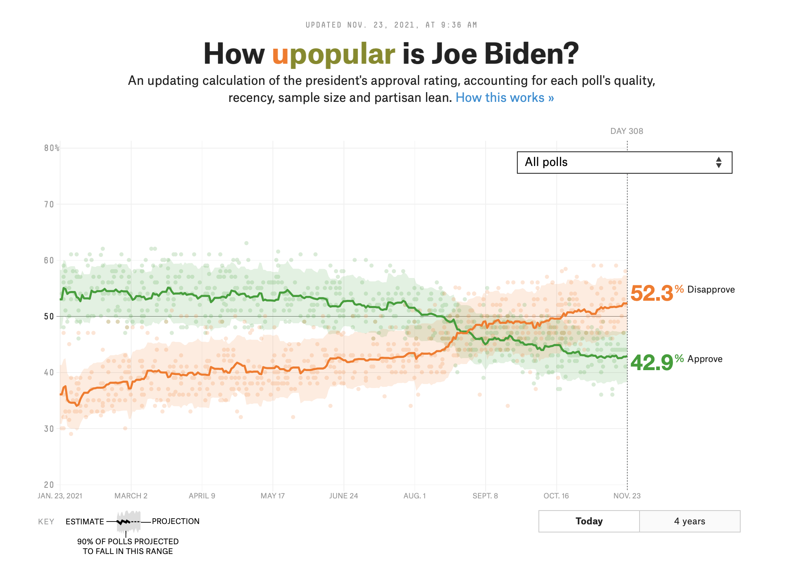
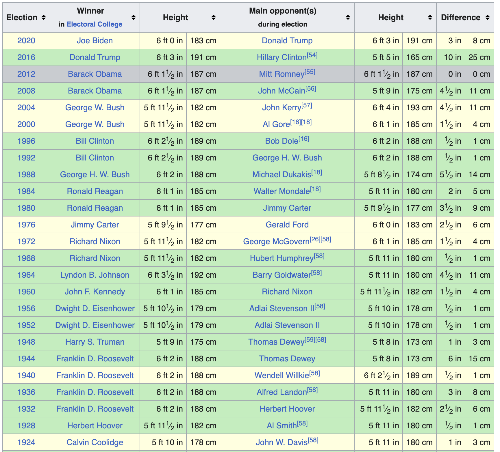
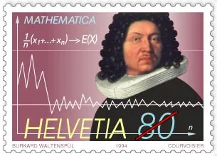
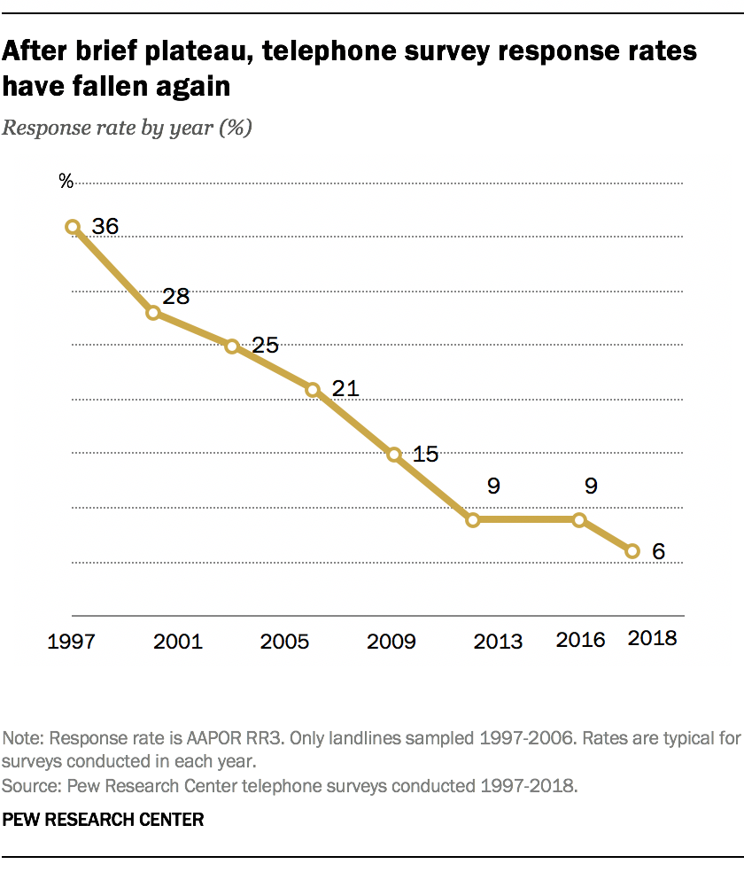
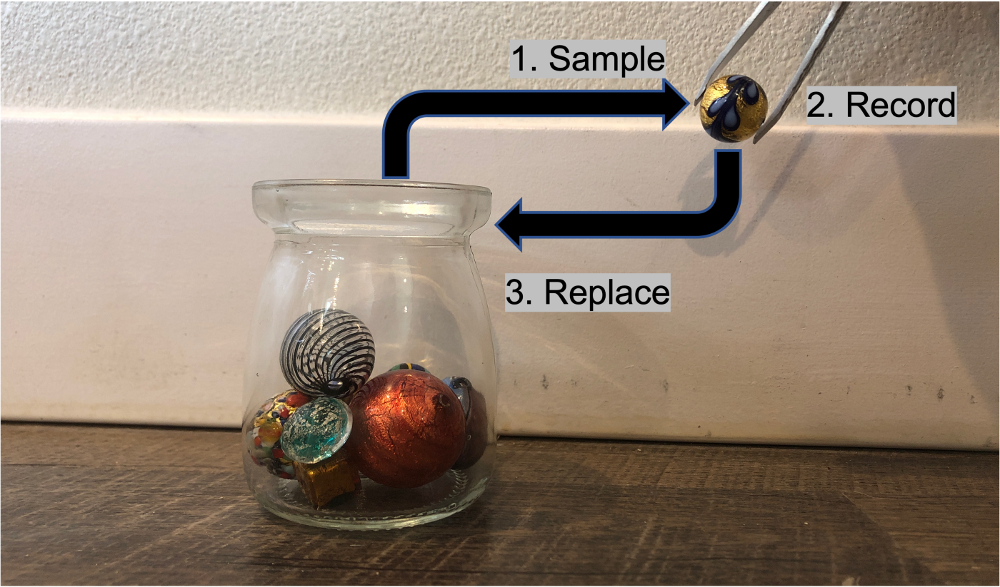
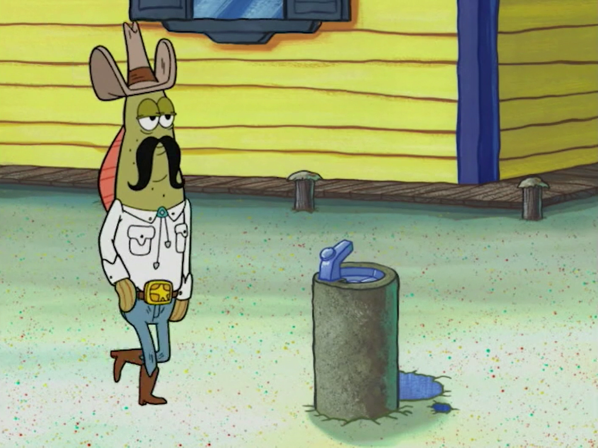

```{r setup, include=FALSE}
# set knit options
knitr::opts_chunk$set(
  fig.width=9, 
  fig.height=5, 
  fig.retina=3,
  fig.align="center",
  out.width = "100%",
  cache = FALSE,
  echo = FALSE,
  message = FALSE, 
  warning = FALSE
)

# load libraries
library(socviz)
library(juanr)
library(patchwork)
library(broom)
library(paletteer)
library(moderndive)

# source
source(here::here("slides/R", "funcs.R"))
```

# Late Assignments {.center background-color="#dc354a"}

. . .

CONTACT ME ASAP!! BEFORE FRIDAY \@ 6 PM

. . .

I will not be taking any late assignments from the first half of class after Sunday

. . .

If you used a wavier, please email me the assignment it was used on so I have it in writing

# Plan for today {.center background-color="#dc354a"}

. . .

Why are we uncertain?

. . .

Sampling

. . .

Quantifying uncertainty

. . .

Are we sure it's not zero?

## Where things stand

. . .

So far: worrying about **causality**

. . .

how can we *know* the effect of X on Y is not being confounded by something else?

. . .

Last bit: how **confident** are we in our estimates given...

. . .

that our estimates are based on **samples**?

## Uncertainty in the wild

```{r, out.width="80%"}

```

## Uncertainty in the wild

```{r, out.width="80%"}

```

## Uncertainty in the wild

The "bounds" in `geom_smooth` tells us something about how confident we should be in the line:

```{r}
ggplot(gapminder::gapminder, aes(x = gdpPercap, y = lifeExp)) + 
  geom_point(size = 2, alpha = .8, color = red) +
  geom_smooth(color = blue, fill = blue) + theme_nice() + 
  labs(x = "GDP per capita", y = "Life expectancy") + 
  scale_x_continuous(labels = scales::dollar)
```

::: notes
notice width
:::

# Uncertainty

Polling error, margin of error, uncertainty bounds, all help to *quantify* how uncertain we feel about an estimate

. . .

Vague sense that we are **uncertain** about what we are estimating

. . .

But *why* are we uncertain? And how can uncertainty be *quantified*?

# Why are we uncertain? {.center background-color="#dc354a"}

## Why are we uncertain? {visibility="hidden"}

There are three reasons we are uncertain:

1.  We don't have all the data, we have a **sample**

2.  We've measured our variables, but we know measurements **vary**

3.  We have all the data, but there's **little of it**

## Not all the data, but a sample {visibility="hidden"}

We want to know how many kids the average person has, but all we have is a survey of 2500 Americans

```{r}
socviz::gss_sm |> 
  select(year, age, childs) |> 
  sample_n(5) |> 
  kbl()
```

## Measurements vary {visibility="hidden"}

For many variables (e.g., "grades") we know that if we measured them times we'd get a different result each time

```{r}
library(wakefield)

r_data_frame(5, name, r_series(grade, 4, relate = "+1_2")) |> 
  kbl()
```

## All the data but little of it {visibility="hidden"}

What is the probability that a woman wins the US presidency? Or a person who is 5 feet tall? We have all the data, but we also know we should be very **uncertain**

. . .

```{r}

```

## Why are we uncertain?

::::: columns
::: {.column width="50%"}
-   We don't have all the data we care about

-   We have a **sample**, such as a survey, or a poll, of a **population**

-   **Problem** each sample will look different, and give us a different answer to the question we are trying to answer
:::

::: {.column width="50%"}
```{r, fig.cap="Sample locations in Guatemala"}
knitr::include_graphics("img/MPP_map1.jpeg")
```
:::
:::::

## What's going on here? terminology

```{r}
tribble(~Term, ~Meaning, ~Example,
        "Population", "All of the instances of the thing we care about", "American adults",
        "Population parameter", "The thing about the population we want to know", "Average number of kids among American adults",
        "Sample", "A subset of the population", "A survey",
        "Sample estimate", "Our estimate of the population parameter", "Average number of kids in survey") %>% 
  knitr::kable()
```

## Boring example: kids

How many children does the average American adult have? ([Population parameter]{.blue})

. . .

Let's pretend there were only 2,867 people living in the USA, and they were all *perfectly* sampled in `gss_sm`

. . .

```{r}
gss_sm %>% 
  select(year, age, childs, degree, race, sex) %>% 
  sample_n(5) %>% 
  knitr::kable(caption = "A few rows from gss_sm")
```

## Boring example: kids

How many children does the average American adult have?

. . .

We can get the exact answer, since there are only 2,867 Americans, and they're all in our data:

```{r, echo = TRUE}
gss_sm %>% 
  summarise(avg_kids = mean(childs, na.rm = TRUE))
```

The true average number of children in the US is 1.85 ([Population parameter]{.blue})

## Sampling

Now imagine that instead of having data on every American, we only have a **sample** of 10 Americans

. . .

Why do we have a sample? Because interviewing every American is prohibitively costly

. . .

Same way a poll works: a **sample** to *estimate* American public opinion

## Sampling

We can pick one sample of 10 people from `gss_sm` using the `rep_sample_n()` function from `moderndive`:

. . .

```{r, echo = TRUE}
gss_sm %>% rep_sample_n(size = 10, reps = 1)
```

::: callout-note
`size` = size of the sample; `reps` = number of samples
:::

## Sample estimate

We can then calculate the average number of kids *among that sample of 10 people*

```{r, echo = TRUE}
gss_sm %>% rep_sample_n(size = 10, reps = 1) %>% 
  summarise(avg_kids = mean(childs, na.rm = TRUE))
```

this is our **sample estimate** of the **population parameter**

. . .

Notice that it does not equal the true population parameter (1.87)

## The trouble with samples {.scrollable}

Problem: each **sample** will give you a different **estimate**. Instead of taking 1 sample of size 10, let's take 1,000 samples of size 10:

. . .

```{r, echo = TRUE}
kids_10 = gss_sm %>% rep_sample_n(size = 10, reps = 1000) %>% 
  summarise(avg_kids = mean(childs, na.rm = TRUE))
kids_10
```

## The trouble with samples

Across 1,000 samples of 10 people each, the *estimated* average number of kids can vary between `r min(kids_10$avg_kids)` and `r max(kids_10$avg_kids)`!! Remember, the true average is `r round(mean(gss_sm$childs, na.rm = TRUE), 2)`

```{r}
kids_10 = kids_10 %>% 
  mutate(size = "10")

ggplot(kids_10, aes(x = avg_kids)) + 
  geom_histogram(fill = red, color = "white") + 
  labs(x = "Average number of kids in sample") + 
  geom_vline(xintercept = mean(gss_sm$childs, na.rm = TRUE), lty = 2, color = blue, 
             size = 3)
```

# Why are we **uncertain**?

. . .

We only ever have a *sample* (10 random Americans), but we’re interested in something bigger: a *population* (the whole of `gss_sm`)

. . .

Polls often ask a couple thousand people (if that!), and try to infer something bigger (how *all* Americans feel about the President)

. . .

The problem: Each sample is going to give us different results!

. . .

Especially worrisome: some estimates will be **way** off, totally by chance

## A problem for regression

. . .

This is also a problem for **regression**, since every regression estimate is based on a sample

. . .

What's the relationship between sex and vote choice among American voters?

```{r, echo = TRUE}
mod1 = lm(obama ~ sex, data = gss_sm)
tidy(mod1)
```

. . .

So females were 8.7 percent more likely to vote for Obama than males

. . .

This is the **population parameter**, since we're pretending all Americans are in `gss_sm`

## Regression estimates vary too

Each *sample* will produce different regression *estimates*

```{r}
gss_sm %>% 
  rep_sample_n(size = 30, reps = 10) %>% 
  nest(-replicate) %>% 
  mutate(model = map(data, ~lm(obama ~ sex, data = .)),
         tidied = map(model, tidy)) %>%
  unnest(tidied) %>% 
  filter(term == "sexFemale") %>% 
  select(replicate, term, estimate) %>% 
  ungroup() |> 
  slice(1:8) |> 
  kbl(digits = 2)
```

## Wrong effect estimates

Many of the effects we estimate below are even negative! This is the opposite of the population parameter (`r round(coef(mod1)[2],3)`)

```{r}
gss_sm %>% 
  rep_sample_n(size = 40, reps = 500) %>% 
  nest(-replicate) %>% 
  mutate(model = map(data, ~lm(obama ~ sex, data = .)),
         tidied = map(model, tidy)) %>%
  unnest(tidied) %>% 
  filter(term == "sexFemale") %>% 
  select(replicate, term, estimate) |> 
  ggplot(aes(x = estimate)) +
  geom_histogram(fill = red, color = "white") + 
  labs(x = "Estimated effect of sex in lm(obama ~ sex, data = gss_sm)",
       title = "Distribution of sample regression estimates") + 
  annotate(geom = "rect", xmin = -Inf, xmax = 0, 
           ymin = 0, ymax = Inf, fill = "yellow", alpha = .4)
```

## The solution

::::: columns
::: {.column width="50%"}
-   So how do we know if our **sample estimate** is close to the **population parameter**?

-   Turns out that if a sample is random, representative, and large...

-   ...then the [LAW OF LARGE NUMBERS]{.red} tells us that...

-   the **sample estimate** will be pretty close to the **population parameter**
:::

::: {.column width="50%"}
```{r}

```
:::
:::::

## Law of large numbers

With a small sample, estimates can vary a lot:

```{r}
reps = tibble(samples = c(20, 100, 500, 1000)) %>% 
  mutate(reps = map(.x = samples, .f = ~ 
                      rep_sample_n(tbl = gss_sm, size = .x, reps = 1e3))) %>% 
  unnest(reps) %>% 
  group_by(samples, replicate) %>% 
  summarise(avg_kids = mean(childs, na.rm = TRUE))


ggplot(filter(reps, samples == 20), 
       aes(x = avg_kids, fill = factor(samples))) +  
  geom_density(alpha = .8, color = "white") +
  labs(x = "Average number of kids in sample", 
       y = NULL, fill = "Size of sample:") + 
  theme(axis.text.y = element_blank(), 
        legend.position = "bottom") + 
  scale_fill_viridis_d(option = "rocket", end = .8) + 
  geom_vline(xintercept = mean(gss_sm$childs, na.rm = TRUE), 
             lty = 1, color = red, size = 3, alpha = .9) + 
  coord_cartesian(ylim = c(0, 7)) + 
  geom_label(aes(x = 2.25, y = 6, label = "Population average = 1.85"), 
             fill = "white", color = red, fontface = "bold")

```

## Law of large numbers

As the sample size (N) increases, estimates begin to converge:

```{r}
ggplot(filter(reps, samples == 20), 
       aes(x = avg_kids, fill = factor(samples))) +  
  geom_density(alpha = .8, color = "white") +
  labs(x = "Average number of kids in sample", 
       y = NULL, fill = "Size of sample:") + 
  theme(axis.text.y = element_blank(), 
        legend.position = "bottom") + 
  scale_fill_viridis_d(option = "rocket", end = .8) + 
  geom_vline(xintercept = mean(gss_sm$childs, na.rm = TRUE), 
             lty = 1, color = red, size = 3, alpha = .9) + 
  coord_cartesian(ylim = c(0, 7)) + 
  geom_label(aes(x = 2.25, y = 6, label = "Population average = 1.85"), 
             fill = "white", color = red, fontface = "bold") + 
  geom_density(data = filter(reps, samples == 100),
               alpha = .8, color = "white") 
```

## Law of large numbers

They become more concentrated around the population average...

```{r}
ggplot(filter(reps, samples == 20), 
       aes(x = avg_kids, fill = factor(samples))) +  
  geom_density(alpha = .8, color = "white") +
  labs(x = "Average number of kids in sample", 
       y = NULL, fill = "Size of sample:") + 
  theme(axis.text.y = element_blank(), 
        legend.position = "bottom") + 
  scale_fill_viridis_d(option = "rocket", end = .8) + 
  geom_vline(xintercept = mean(gss_sm$childs, na.rm = TRUE), 
             lty = 1, color = red, size = 3, alpha = .9) + 
  coord_cartesian(ylim = c(0, 7)) + 
  geom_label(aes(x = 2.25, y = 6, label = "Population average = 1.85"), 
             fill = "white", color = red, fontface = "bold") + 
  geom_density(data = filter(reps, samples == 100),
               alpha = .8, color = "white") +
  geom_density(data = filter(reps, samples == 500),
               alpha = .8, color = "white")
```

## Law of large numbers

And eventually it becomes very unlikely the sample estimate is way off

```{r}
ggplot(filter(reps, samples == 20), 
       aes(x = avg_kids, fill = factor(samples))) +  
  geom_density(alpha = .8, color = "white") +
  labs(x = "Average number of kids in sample", 
       y = NULL, fill = "Size of sample:") + 
  theme(axis.text.y = element_blank(), 
        legend.position = "bottom") + 
  scale_fill_viridis_d(option = "rocket", end = .8) + 
  geom_vline(xintercept = mean(gss_sm$childs, na.rm = TRUE), 
             lty = 1, color = red, size = 3, alpha = .9) + 
  coord_cartesian(ylim = c(0, 7)) + 
  geom_label(aes(x = 2.25, y = 6, label = "Population average = 1.85"), 
             fill = "white", color = red, fontface = "bold") + 
  geom_density(data = filter(reps, samples == 100),
               alpha = .8, color = "white") +
  geom_density(data = filter(reps, samples == 500),
               alpha = .8, color = "white") + 
  geom_density(data = filter(reps, samples == 1000),
               alpha = .8, color = "white")
```

## This works for regression estimates, too

Regression estimates *also* become more precise as sample size increases:

```{r}
obama_50 = gss_sm %>% 
  select(obama, sex, id) %>% 
  rep_sample_n(size = 50, reps = 1000) %>% 
  nest(-replicate) %>% 
  mutate(model = map(data, ~lm(obama ~ sex, data = .)),
         tidied = map(model, tidy)) %>%
  unnest(tidied) %>% 
  filter(term == "sexFemale") %>% 
  select(replicate, term, estimate) %>% 
  mutate(size = "N = 50")

obama_300 = gss_sm %>% 
  select(obama, sex, id) %>% 
  rep_sample_n(size = 300, reps = 1000) %>% 
  nest(-replicate) %>% 
  mutate(model = map(data, ~lm(obama ~ sex, data = .)),
         tidied = map(model, tidy)) %>%
  unnest(tidied) %>% 
  filter(term == "sexFemale") %>% 
  select(replicate, term, estimate) %>% 
  mutate(size = "N = 300")

bind_rows(obama_50, obama_300) %>% 
  mutate(size = fct_rev(size)) %>% 
  ggplot(aes(x = estimate)) + 
  geom_density(fill = red, color = "white") + 
  theme_nice() + 
  facet_wrap(vars(size)) +
  labs(x = NULL, 
       title = "Sample coefficient estimates for lm(obama ~ sex)") + 
  geom_vline(xintercept = coef(mod1)[2], lty = 2, color = blue, 
             size = 3) + 
  coord_cartesian(xlim = c(-1, 1))
```

## What's going on?

The larger our sample, the less likely it is that our estimate (average number of kids, the effect of sex on vote choice, etc.) is way off

. . .

This is because as sample size increases, sample estimates tend to converge on the population parameter

. . .

Next time = we'll see how to quantify uncertainty based on this tendency

. . .

Intuitive = the more data we have, the less *uncertain* we should feel

. . .

But [this only works if we have a *good* sample]{.red}

## Good and bad samples

::::: columns
::: {.column width="50%"}
There are good and bad samples in the world

**Good sample** representative of the population and unbiased

**Bad sample** the opposite of a good sample

What does this mean?
:::

::: {.column width="50%"}
```{r, fig.cap="Good samples"}

```
:::
:::::

## When sampling goes wrong

Imagine that in our quest to find out how many kids the average American has, we do telephone surveys

. . .

Younger people are less likely to have a landline than older people, so few young people make it onto our survey

. . .

what happens to our estimate?

## When sampling goes wrong

We can simulate this by again pretending `gss_sm` is the whole of the US

. . .

Let's imagine the extreme scenario where no one under 25 makes it into the survey:

```{r, echo = TRUE, eval = FALSE}
gss_sm %>% 
  filter(age >= 25) %>%
  rep_sample_n(size = 10, reps = 1000) %>% 
  summarise(avg_kids = mean(childs, na.rm = TRUE))
```

I've filtered out all people in `gss_sm` under 25 so they cannot be sampled

## When sampling goes wrong

```{r}
gss_sm %>% 
  filter(age >= 25) %>% #<<
  rep_sample_n(size = 50, reps = 1000) %>% 
  summarise(avg_kids = mean(childs, na.rm = TRUE)) %>% 
  ggplot(aes(x = avg_kids)) + 
  geom_density(fill = red, color = "white") + 
  theme_nice() + 
  labs(x = "Average number of kids in sample", 
       title = "Sample size: 50") + 
  geom_vline(xintercept = mean(gss_sm$childs, na.rm = TRUE), lty = 2, color = blue, 
             size = 3) + 
  coord_cartesian(xlim = c(0, 4))
```

## When sampling goes wrong

As sample size increases, **variability** of estimates will still decrease

```{r}
gss_sm %>% 
  filter(age >= 25) %>% #<<
  rep_sample_n(size = 500, reps = 1000) %>% 
  summarise(avg_kids = mean(childs, na.rm = TRUE)) %>% 
  ggplot(aes(x = avg_kids)) + 
  geom_density(fill = red, color = "white") + 
  theme_nice() + 
  labs(x = "Average number of kids in sample", 
       title = "Sample size: 500") + 
  geom_vline(xintercept = mean(gss_sm$childs, na.rm = TRUE), lty = 2, color = blue, 
             size = 3) + 
  coord_cartesian(xlim = c(0, 4))
```

## When sampling goes wrong

But estimates will be **biased**, regardless of sample size

```{r}
gss_sm %>% 
  filter(age >= 25) %>% #<<
  rep_sample_n(size = 1000, reps = 1000) %>% 
  summarise(avg_kids = mean(childs, na.rm = TRUE)) %>% 
  ggplot(aes(x = avg_kids)) + 
  geom_density(fill = red, color = "white") + 
  theme_nice() + 
  labs(x = "Average number of kids in sample", 
       title = "Sample size: 1000") + 
  geom_vline(xintercept = mean(gss_sm$childs, na.rm = TRUE), lty = 2, color = blue, 
             size = 3) + 
  coord_cartesian(xlim = c(0, 4))
```

## What's going on?

The sample is *not representative* of the population (the young people are missing)

. . .

This *biases* our estimate of the population parameter

. . .

*Randomness* is key = everyone needs a similar chance of ending up in the sample

. . .

When young people don't have land-lines, not everyone has a similar chance of ending up in the sample

## A big problem!

```{r, out.width="50%",fig.align='center'}

```

## 🚨 Your turn: bias the polls 🚨

Imagine you are an evil pollster:

1.  Think about who you would have to exclude from the data to create estimates that benefit the pro-choice and pro-life side of the abortion debate.

2.  Explain how you think this change would effect the estimate variability as the sample size increases or decreases.

```{r}
countdown::countdown(minutes = 10L)
```

## \# So... Where are we at?

## The problem

We know our analysis is based on samples, and different samples give different answers:

```{r}
gss_sm %>% 
  rep_sample_n(size = 10, reps = 8) %>% 
  group_by(replicate) %>% 
  summarise(childs = mean(childs, na.rm = TRUE)) %>% 
  select(`Sample` = replicate, `Avg. num of kids in sample` = childs) %>% 
  knitr::kable(digits = 2)
```

## The way out

::::: columns
::: {.column width="50%"}
-   Turns out that if our samples are **representative** of the population, then estimates from **large** samples will tend to be pretty damn close

-   So if sample is good ✅ and "big" ✅ then most of the time we'll be OK ✅
:::

::: {.column width="50%"}
```{r}
kids = crossing(n = c(10, 20, 50, 100, 200, 500)) %>% 
  mutate(samples = map(.x = n, ~rep_sample_n(tbl = gss_sm, size = .x, reps = 1000))) %>% 
  unnest(samples) %>% 
  group_by(n, replicate) %>% 
  summarise(childs = mean(childs, na.rm = TRUE))

ggplot(kids, aes(x = childs)) + 
  geom_density(fill = red, alpha = .9, color = "white") + 
  facet_wrap(vars(n)) + 
  theme_nice() + 
  geom_vline(xintercept = mean(gss_sm$childs, na.rm = TRUE), 
             lty = 1, size = 1, color = blue) + 
  labs(x = "Distribution of sample average # of kids")
```
:::
:::::

# But this is weird

. . .

We’ve shown that if we take many (large) random samples, most of the averages of those samples will be close to **population parameter**

. . .

But in real life we only ever have one sample (e.g., one poll)

. . .

How do we get a sense for uncertainty from **our one sample**?

## Two approaches

::::: columns
::: {.column width="50%"}
❌ ~~Statistical theory~~

-   Make assumptions about distribution of samples from population
-   Design test based on those assumptions (t-test, z-test, etc.)
:::

::: {.column width="50%"}
✅ Simulation

-   Simulate different samples that **look like ours**
-   Use distribution of simulated samples to quantify uncertainty
:::
:::::

. . .

In some cases, both get you to the same answer, in others, only one works

## Simulation

We want a sense for how *uncertain* we should feel on estimates drawn from our sample

. . .

Our sample is `gss_sm`, and we have `r scales::comma(nrow(gss_sm))` observations

```{r}
gss_sm |> 
  select(1:8) |> 
  sample_n(5) |> 
  kbl(digits = 0, caption = "gss_sm")
```

. . .

How confident are we in the estimate we get from this sample, given its **size**?

## How to simulate

If we take lots of samples of size 20 $\rightarrow$ uncertainty in a sample of 20

```{r, echo = TRUE, eval = FALSE}
gss_sm %>%
  rep_sample_n(size = 20, reps = 1000)
```

```{r, echo = FALSE, eval = TRUE}
kids |> 
  filter(n == 20) |> 
  ggplot(aes(x = childs)) + 
  geom_density(fill = red, alpha = .9, color = "white") + 
  theme_nice() + 
  geom_vline(xintercept = mean(gss_sm$childs, na.rm = TRUE), 
             lty = 1, size = 2, color = blue) + 
  labs(x = "Distribution of sample average # of kids") + 
  coord_cartesian(xlim = c(0.5, 3.5))
```

## How to simulate

If we take lots of samples of size 100 $\rightarrow$ uncertainty in a sample of 100

```{r, echo = TRUE, eval = FALSE}
gss_sm %>%
  rep_sample_n(size = 100, reps = 1000)
```

```{r, echo = FALSE, eval = TRUE}
kids |> 
  filter(n == 100) |> 
  ggplot(aes(x = childs)) + 
  geom_density(fill = red, alpha = .9, color = "white") + 
  theme_nice() + 
  geom_vline(xintercept = mean(gss_sm$childs, na.rm = TRUE), 
             lty = 1, size = 2, color = blue) + 
  labs(x = "Distribution of sample average # of kids") + 
  coord_cartesian(xlim = c(0.5, 3.5))
```

## How to simulate

So to see how uncertain we should feel about `gss_sm`, we should take many samples that are **the same size** as `gss_sm`

. . .

```{r, echo = TRUE, eval = FALSE}
gss_sm %>% 
  rep_sample_n(size = 2867, reps = 1000)
```

. . .

::: callout-note
`nrow(DATA)` tells you how many observations in data object
:::

## Problem

If we have a dataset of 2,867 observations and ask R to randomly pick 2,867 observations, we'll just get a bunch of copies of the original dataset

```{r, echo = TRUE, eval = FALSE}
gss_sm %>% 
  rep_sample_n(size = nrow(gss_sm), reps = 1000)
```

. . .

Solution: sample **with replacement** $\rightarrow$ once we draw an observation it goes back into the dataset, ad can be sampled again

. . .

```{r, echo = TRUE, eval = FALSE}
gss_sm %>% 
  rep_sample_n(size = nrow(gss_sm), reps = 1000, replace = TRUE)
```

## Sampling with replacement

```{r}

```

## Sampling with and without replacement

If we were sampling **4** of these delicious fruits:

```{r, echo = TRUE}
fruits = c("Mango", "Pineapple", "Banana", "Blackberry")
fruits
```

. . .

It would look like this, with and without replacement:

```{r}
set.seed(1990)
tibble(`Sample, no replace` = sample(fruits, size = 4),
       `Sample, replace` = sample(fruits, size = 4, replace = TRUE)) %>% 
  t() %>% 
  knitr::kable()
  
```

## Bootstrapping

::::: columns
::: {.column width="50%"}
-   Generating many, **same-sized** samples with replacement is called **bootstrapping**
-   Replacement lets us generate samples that randomly differ from ours
-   Use the distribution of bootstrapped samples to quantify uncertainty
:::

::: {.column width="50%"}
```{r, fig.cap="Only one sample? Pull yourself up by your bootstraps!"}

```
:::
:::::

## Back to the kids

How uncertain should we be of our estimate of the avg. number of kids in the US, Given that it's based on our one sample, `gss_sm`? We can bootstrap:

```{r, echo = TRUE}
boot_kids = gss_sm %>% 
  rep_sample_n(size = nrow(gss_sm), reps = 1000, replace = TRUE) %>% 
  summarise(avg_kids = mean(childs, na.rm = TRUE))
boot_kids
```

## The distribution of bootstrapped estimates

Our [estimate]{.blue} and how much [simulated estimates]{.red} might vary across bootstrapped samples that **look like ours**

```{r}
p1 = ggplot(boot_kids, aes(x = avg_kids)) + 
  geom_histogram(fill = red, color = "white") + 
  theme_nice() + 
  labs(x = "Average number of kids across bootstraps") + 
  geom_vline(xintercept = mean(gss_sm$childs, na.rm = TRUE), size = 2.5, 
             color = blue)
p1
```

The red is the distribution of bootstrapped sample estimates $\rightarrow$ the **sampling distribution**

## \# Quantifying uncertainty {.center background-color="#dc354a"}

## How to quantify uncertainty?

::::: columns
::: {.column width="50%"}
The red histogram is nice, but how can we communicate uncertainty in our estimates in a pithy, more comparable way?

Three approaches:

-   The standard error
-   The confidence interval
-   Statistical significance
:::

::: {.column width="50%"}
```{r}
p1
```
:::
:::::

## The standard error

One way to quantify uncertainty would be to measure how "wide" the distribution of bootstrapped sample estimates is

. . .

As we learned so long ago, one way to measure the "spread" of a distribution (i.e., how much a variable **varies**), is with the *standard deviation*

. . .

The standard deviation of the **sampling distribution** is called the **standard error**, or the **margin of error**

. . .

::::: columns
::: {.column width="50%"}
```{r, echo = TRUE}
boot_kids %>% 
  summarise(mean = mean(avg_kids), 
            standard_error = sd(avg_kids))
```
:::

::: {.column width="50%"}
Best guess on how many kids the average American has? About 1.85 kids, +/- 2 standard errors
:::
:::::

## Standard error

This is what you see in the news -- that +/- polling/margin of error

```{r}

```

## Varying uncertainty

As our sample size increases, the standard error decreases

```{r}
crossing(size = seq(10, 500, length.out = 10)) |> 
  mutate(data = map(.x = size, .f = ~ rnorm(n = .x, mean = 10, sd = 2))) |> 
  unnest() |> 
  group_by(size) |> 
  summarise(mean = mean(data), 
            standard_error = (sd(data) / sqrt(n()))) |> 
  distinct() |> 
  select(`Sample size` = size, `Average (truth = 10)` = mean, `Standard error` = standard_error) |> 
  kbl(digits = 2)
```

# The confidence interval {.center background-color="#dc354a"}

## The confidence interval

Another way to quantify uncertainty is to look where **most** estimates fall

this is the **confidence interval**: our "best guess" of what we're trying to estimate

```{r, out.width="80%"}
ggplot(boot_kids, aes(x = avg_kids)) + 
  geom_histogram(fill = red, color = "white") + 
  theme_nice() + 
  labs(x = "Average number of kids across bootstraps") +
  annotate(geom = "rect", 
           xmin = quantile(boot_kids$avg_kids, probs = c(.025)), 
           xmax = quantile(boot_kids$avg_kids, probs = c(.975)), 
           ymin = 0, ymax = Inf, 
           alpha = .5, fill = yellow)
```

## How big to make the interval?

You could report (for example) where the middle `r kableExtra::text_spec("50%", color = red, bold = TRUE)` of bootstraps fall, or (for example) where the middle `r kableExtra::text_spec("95%", color = yellow, bold = TRUE)` of bootstraps fall, but there are **tradeoffs**!

```{r}
p1 = ggplot(boot_kids, aes(x = avg_kids)) + 
  geom_histogram(color = "white") + 
  theme_nice() + 
  labs(x = "Average number of kids across bootstraps") +
  annotate(geom = "rect", 
           xmin = quantile(boot_kids$avg_kids, probs = c(.025)), 
           xmax = quantile(boot_kids$avg_kids, probs = c(.975)), 
           ymin = 0, ymax = Inf, 
           alpha = .5, fill = yellow) + 
  annotate(geom = "rect", 
           xmin = quantile(boot_kids$avg_kids, probs = c(.25)), 
           xmax = quantile(boot_kids$avg_kids, probs = c(.75)), 
           ymin = 0, ymax = Inf, 
           alpha = .5, fill = red)
p1
```

## The tradeoff

-   You are [50%]{.red} "confident" that avg. number of kids could vary between `r round(quantile(boot_kids$avg_kids, probs = c(.25)), 2)` and `r round(quantile(boot_kids$avg_kids, probs = c(.75)), 2)`. Narrower range! But low confidence!

-   You are [95%]{.yellow} "confident" that avg. number of kids could vary between `r round(quantile(boot_kids$avg_kids, probs = c(.025)), 2)` and `r round(quantile(boot_kids$avg_kids, probs = c(.975)), 2)`. Higher range! But higher confidence!

```{r}
p1
```

## How big to make the interval?

**Convention** is to look at the middle **95%** of the distribution

. . .

Where do the middle 95% of the bootstrap estimates fall?

. . .

We can use the `quantile()` function to get here

```{r, echo = TRUE}
boot_kids %>% 
  summarise(low = quantile(avg_kids, .025), # middle 95% means lower bound is .025
            mean = mean(avg_kids), 
            high = quantile(avg_kids, .975)) # middle 95% means upper bound is .975
```

. . .

The 95% confidence confidence interval for the average number of kids in the US is: (1.80, 1.91)

::: notes
draw on board with middle 50% of distribution
:::

## Mirrors of one another

The standard error and confidence interval are actually telling you the same thing

. . .

A 95% confidence interval is roughly equal to the Estimate +/- 1.96 $\times$ standard error

::::: columns
::: {.column width="50%"}
```{r, echo = TRUE}
boot_kids %>% 
  summarise(low = quantile(avg_kids, .025),
            mean = mean(avg_kids), 
            high = quantile(avg_kids, .975))
```
:::

::: {.column width="50%"}
```{r, echo = TRUE}
boot_kids %>% 
  summarise(mean = mean(avg_kids), standard_error = sd(avg_kids)) %>% 
  mutate(low = mean - 1.96 * standard_error, 
         high = mean + 1.96 * standard_error) %>% 
  select(low, mean, high)
```
:::
:::::

## 🚨 Your turn: polling crime victimization 🚨 {.smaller}

Use the `crime` data, and:

1.  Pick a `pais` of your choosing. What proportion of respondents have been a victim of a crime in the last 12 months (`vic1ext`) in that country?

2.  OK, but how certain are you of that? Generate 1,000 bootstraps.

3.  Calculate the standard error and the 95% confidence interval of your best guess. Convince yourself the two can be made equivalent.

```{r}
countdown::countdown(minutes = 10L, font_size = "2em")
```

::: callout-note
1.  Use `distinct()` to find a country (pias), use `filter()` to use that region

2.  `boot_data = data |>`

    `rep_sample_n(size = nrow(data), reps = 1000, replace = TRUE) |>`

    `summarise(avg = mean(variable, na.rm = TRUE),`

    `standard_error = sd(variable, na.rm = TRUE))|>`

    `mutate(low = avg - 1.96 * standard_error,`

    `high = avg + 1.96 * standard_error)`
:::

## 🚨 Example: Polling Crime Victimization 🚨

::::: columns
::: {.column width="50%"}
```{r}
#| echo: true
library(juanr)

data <- crime |>
  filter(pais == "Mexico")

boot_data = data |> 
  rep_sample_n(size = nrow(data), reps = 1000, replace = TRUE) |> 
  summarise(avg = mean(vic1ext, na.rm = TRUE),
            standard_error = sd(vic1ext, na.rm = TRUE)) |>
  mutate(low = avg - 1.96 * standard_error, 
         high = avg + 1.96 * standard_error) 
```
:::

::: {.column width="50%"}
```{r}
ggplot(boot_data, aes(x = avg)) + 
  geom_histogram(fill = red, color = "white") + 
  theme_nice() + 
  labs(x = "Average number of Individuals who are Victims of a Crime in Mexico") +
  annotate(geom = "rect", 
           xmin = quantile(boot_data$avg, probs = c(.025)), 
           xmax = quantile(boot_data$avg, probs = c(.975)), 
           ymin = 0, ymax = Inf, 
           alpha = .5, fill = yellow)
```
:::
:::::
