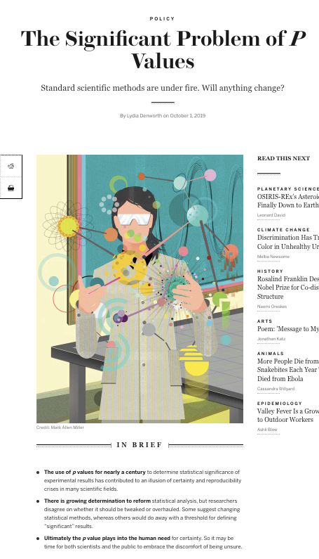
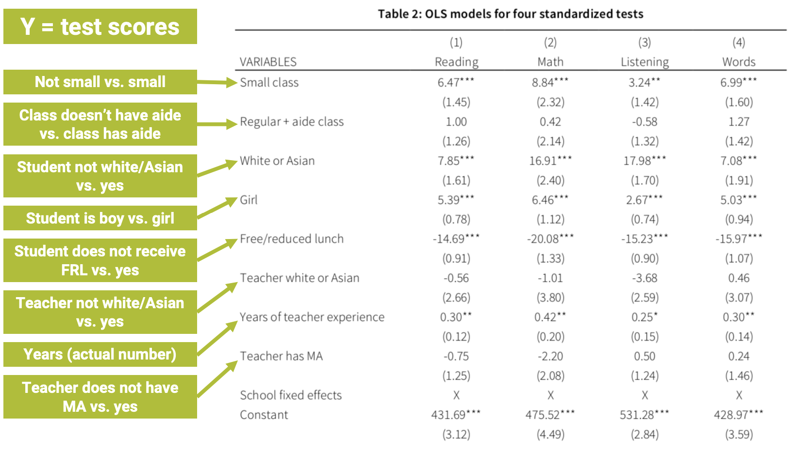

```{r setup, include=FALSE}
# set knit options
knitr::opts_chunk$set(
  fig.width=9, 
  fig.height=5, 
  fig.retina=3,
  fig.align="center",
  out.width = "100%",
  cache = FALSE,
  echo = FALSE,
  message = FALSE, 
  warning = FALSE
)

# load libraries
library(socviz)
library(ggplot2)
library(juanr)
library(patchwork)
library(broom)
library(paletteer)
library(moderndive)
library(huxtable)


# source
source(here::here("slides/R", "funcs.R"))
```

# Plan for today {.center background-color="#dc354a"}

. . .

The confidence interval

. . .

Are we sure it's not zero?

. . .

Making inferences from data

## Bootstrap works for regression, too

Say we wanted to know the relationship between number of kids and age:

```{r, echo = FALSE}
huxreg("Number of kids" = lm(childs ~ age, data = gss_sm), statistics = "nobs")
```

## Bootstrap regression

We can simulate uncertainty in our estimate by bootstrapping

. . .

```{r}
boot_lm_kids = gss_sm %>% 
  rep_sample_n(size = nrow(gss_sm), reps = 1000, replace = TRUE) %>% 
  nest(data = -replicate) %>% 
  mutate(model = data %>% map(.x = ., .f = ~lm(childs ~ age, data = .x))) %>% 
  mutate(results = map(model, tidy)) %>% 
  unnest(results) %>% 
  ungroup() %>% 
  filter(term == "age") 

boot_lm_kids %>% 
  select(`Bootstrap` = replicate, `Coefficient` = term, Estimate = estimate) %>%
  slice(1:10) %>% 
  knitr::kable(digits = 4)
```

## Regression uncertainty

How much might our estimate of `lm(childs ~ age)` vary? Look at the standard error

```{r, echo = FALSE}
boot_lm_kids %>% 
  summarise(mean = mean(estimate), 
            standard_error = sd(estimate))
```

You might report it is .0345, +/- 2 standard errors

## Connecting the dots

Notice! This is what the (NUMBERS) mean in the regression table; they are the **standard error of the coefficient estimate**

. . .

::::: columns
::: {.column width="50%"}
```{r, echo = TRUE}
boot_lm_kids %>% 
  summarise(mean = mean(estimate), 
            standard_error = sd(estimate))
```
:::

::: {.column width="50%"}
```{r}
lm(childs ~ age, data = gss_sm) %>% 
  huxreg("Number of kids" = ., statistics = "nobs") %>% 
  map_background_color(-(1:3), -1, by_regex(
        "\\(" = "yellow"
      ))
```
:::
:::::

## Regression uncertainty

We can also look at the 95% confidence interval -- we are 95% "confident" the effect of age on the number of children a person has is between .032 and .038

```{r, out.width="90%"}
low = quantile(boot_lm_kids$estimate, probs = c(.025))
hi = quantile(boot_lm_kids$estimate, probs = c(.975))
ggplot(boot_lm_kids, aes(x = estimate)) + 
  geom_histogram(fill = red, color = "white") + 
  theme_nice() + 
  labs(x = "Estimates of lm(childs ~ age)") +
  annotate(geom = "rect", 
           xmin = low, 
           xmax = hi, 
           ymin = 0, ymax = Inf, 
           alpha = .5, fill = yellow) + 
  geom_label(data = tibble(estimate = .034, 
                                 count = 90, 
                           label = glue::glue("95% CI: ({round(low, 3)}, {round(hi, 3)})")), 
                   aes(y = count, label = label), 
                   family = "Fira Sans", size = 7)
```

## Uncertainty in R

`lm()` will estimate the standard error of regression estimates for us using the **statistical theory** approach, but the results are similar to **boostrapping**

. . .

```{r, echo = TRUE}
mod = lm(obama ~ sex, data = gss_sm)
tidy(mod)
```

## Uncertainty in R

We can also ask `tidy` for the 95% CI:

```{r, echo = TRUE}
tidy(mod, conf.int = TRUE)
```

`conf.low` and `conf.high` are the lower and upper bound of the 95% CI

# Statistical significance {.center background-color="#dc354a"}

The last (and most controversial) way to quantify uncertainty is **statistical significance**

. . .

We want to make a binary decision: are we **confident** enough in this estimate to say that it is **significant**?

. . .

Or are we **too uncertain**, given sampling variability?

. . .

Is the result *significant*, or *not significant*?

# Can you persuade voters?

Imagine we run an experiment on TV ads, estimate the effect of the treatment on voter turnout, and the 95% confidence interval for that effect

. . .

The experiment went well so we are confident in **causal** sense, but there is still uncertainty from **sampling**

## Three scenarios

Three scenarios for the results: same effect size, different *95% CIs*

```{r, out.width="60%"}
scens = tribble(~scenario, ~low, ~estimate, ~high, 
        "Small range", 8, 10, 12,
        "Big range", 1, 10, 19,
        "Crosses zero", -2, 10, 22) %>% 
  mutate(scenario = fct_rev(fct_relevel(scenario, "Small range", "Big range", "Crosses zero")))

ggplot(scens, aes(x = scenario, 
                  y = estimate, ymin = low, ymax = high, 
                  color = scenario)) + 
  geom_pointrange(size = 1) + 
  coord_flip() + 
  geom_hline(yintercept = 0, lty = 2) + 
  theme_nice() + 
  theme(legend.position = "none", 
        axis.text.y = element_blank(), 
        axis.ticks.y = element_blank()) + 
  labs(y = "Estimated increase in voter turnout", 
       x = NULL) + 
  scale_y_continuous(labels = scales::percent_format(scale = 1)) + 
  scale_color_manual(values = c(red, blue, yellow)) +  
  geom_label_repel(aes(label = scenario), size = 6)
```

## How much should we worry?

::::: columns
::: {.column width="50%"}
-   `r kableExtra::text_spec("Small range", color = yellow, bold = TRUE)`: great! Effect is precise; ads are worth it!

-   `r kableExtra::text_spec("Big range", color = blue, bold = TRUE)`: OK-ish! Effect could be *tiny*, or *huge*; are the ads worth it? At least we know they help (positive)

-   `r kableExtra::text_spec("Crosses zero", color = red, bold = TRUE)`: awful! Ads could work (+), they could do nothing (0), or they could be counterproductive (-)
:::

::: {.column width="50%"}
```{r}
scens = tribble(~scenario, ~low, ~estimate, ~high, 
        "Small range", 8, 10, 12,
        "Big range", 1, 10, 19,
        "Crosses zero", -2, 10, 22) %>% 
  mutate(scenario = fct_rev(fct_relevel(scenario, "Small range", "Big range", "Crosses zero")))

ggplot(scens, aes(x = scenario, 
                  y = estimate, ymin = low, ymax = high, 
                  color = scenario)) + 
  geom_pointrange(size = 1) + 
  coord_flip() + 
  geom_hline(yintercept = 0, lty = 2) + 
  theme_nice() + 
  theme(legend.position = "none", 
        axis.text.y = element_blank(), 
        axis.ticks.y = element_blank()) + 
  labs(y = "Estimated increase in voter turnout", 
       x = NULL) + 
  scale_y_continuous(labels = scales::percent_format(scale = 1)) + 
  scale_color_manual(values = c(red, blue, yellow)) +  
  geom_label_repel(aes(label = scenario), size = 6)
```
:::
:::::

## Crossing zero: the worst scenario

When the 95% CI crosses zero we are so uncertain we are unsure whether effect is positive, zero, or negative

. . .

Researchers worry so much about this that it is **conventional** to report whether the 95% CI of an effect estimate crosses zero

. . .

When a 95% CI for an estimate **doesn't cross zero**, we say that the estimate is **statistically significant**

. . .

If the 95% CI crosses zero, the estimate is **not** statistically significant

## Statistical significance

```{r, out.width="100%"}
scens = tribble(~scenario, ~low, ~estimate, ~high, 
        "Small range", 8, 10, 12,
        "Big range", 1, 10, 19,
        "Crosses zero", -2, 10, 22) %>% 
  mutate(scenario = fct_rev(fct_relevel(scenario, "Small range", "Big range", "Crosses zero"))) %>%
  mutate(sig = ifelse(scenario == "Crosses zero", "No", "Yes"))

ggplot(scens, aes(x = scenario, 
                  y = estimate, ymin = low, ymax = high, 
                  color = sig)) + 
  geom_pointrange(size = 1) + 
  coord_flip() + 
  geom_hline(yintercept = 0, lty = 2) + 
  theme_nice() + 
  theme(legend.position = "top", 
        axis.text.y = element_blank(), 
        axis.ticks.y = element_blank()) + 
  labs(y = "Estimated increase in voter turnout", 
       x = NULL, color = "Is estimate statistically significant?") + 
  scale_y_continuous(labels = scales::percent_format(scale = 1)) + 
  scale_color_manual(values = c(red, blue)) +  
  geom_label_repel(aes(label = scenario), size = 6, show.legend = FALSE)
```

## Hypothesis testing

::::: columns
::: {.column width="50%"}
-   Statistical significance is at the center of **hypothesis testing**
-   Researcher wants to decide between two possibilities:
    -   **null hypothesis** ($H_0$): the ad has no effect on turnout
    -   **alternative hypothesis** ($H_a$): the ad has *some* effect on turnout
-   A statistically significant estimate **rejects** the null
-   Remember this is all about **sampling uncertainty**, not **causality**!
:::

::: {.column width="50%"}
```{r}

```
:::
:::::

## Arbitrary?

-   You could have an estimate with a 95% CI that *barely* escapes crossing zero, and call that **statistically significant**

-   And another estimate with a 95% CI that *barely* crosses zero, and call that **not** statistically significant

-   That's pretty arbitrary!

-   And it all hinges on the size of the confidence interval

-   if we made a 98% CI, or a 95.1% CI, we might conclude different things are and aren't significant

-   The 95% CI is a **convention**; where does it come from?

## The arbitrary nature of "significance testing"

Fisher (1925), who came up with it, says:

> *It is convenient to take this point \[95% CI\] as a limit in judging whether \[an effect\] is to be considered significant or not.* (Fisher 1925)

. . .

But that other options are plausible:

> *If one in twenty \[95% CI\] does not seem high enough odds, we may, if we prefer it, draw the line at one in fifty \[98% CI\]... or one in a hundred \[99% CI\]...Personally, the writer prefers...\[95% CI\]* (Fisher 1926)

::: notes
95% = one in twenty
:::

## The significance testing controversy

::::: columns
::: {.column width="60%"}
-   So arbitrary; why make this **binary** distinction?

-   Sometimes we have to make the call:

    -   when is a baby's temperature so high that you should give them medicine?

    -   100.4 is a useful (arbitrary) threshold for action

-   This is a huge topic of debate in social science, other proposals we can't cover:

    -   redefining how we think about probability
    -   focusing on estimate sizes
    -   focusing on *likely* range of estimates
:::

::: {.column width="40%"}
```{r}

```
:::
:::::

## Statistical significance in R

::::: columns
::: {.column width="50%"}
-   The *stars* (`*`) in regression output tell you whether an estimate's confidence interval crosses zero and at what *level of confidence*

-   This is done with the **p-value** (which we don't cover), the mirror image of the confidence interval
:::

::: {.column width="50%"}
```{r}
lm(childs ~ age, data = gss_sm) %>% 
  huxreg("Number of kids" = ., statistics = "nobs") %>% 
  map_background_color(by_regex(
        "\\*" = "yellow"
      ))
```
:::
:::::

## Reading the stars

-   (`*`) p \< .05 = the 95% confidence interval does not cross zero
-   (`**`) p \< .01 = the 99% confidence interval does not cross zero
-   (`***`) p \< .001 = the 99.9% confidence interval does not cross zero

```{r}
lm(childs ~ age, data = gss_sm) %>% 
  huxreg("Number of kids" = ., statistics = "nobs") %>% 
  map_background_color(by_regex(
        "\\*" = "yellow"
      ))
```

## Another way...

The estimate is **statistically significant** at the...

-   (`*`) p \< .05 = the 95% confidence level
-   (`**`) p \< .01 = the 99% confidence level
-   (`***`) p \< .001 = the 99.9% confidence level

```{r}
lm(childs ~ age, data = gss_sm) %>% 
  huxreg("Number of kids" = ., statistics = "nobs") %>% 
  map_background_color(by_regex(
        "\\*" = "yellow"
      ))
```

# Making inferences with data {.center background-color="#dc354a"}

# How much data do I need to estimate X?

-   With the Law of Large Numbers and simulation (or theory), we can figure out how much data we would need to **reliably** estimate an effect of a particular size

-   This is called **power analysis**

-   How much **statistical** power do we have, or need to answer our research question?

## How much data do I need to estimate X?

You need *less* data to estimate *larger* effects

```{r}
crossing(d = seq(.1, 1, by = .05)) |> 
  mutate(power = map_dbl(.x = d, .f = ~ power.t.test(delta = .x, sig.level = .05, 
           power = .8, type = "two.sample")$n)) |> 
  mutate(total_n = power * 2) |> 
  ggplot(aes(x = d, y = total_n)) + 
  geom_point() + 
  geom_line() + 
  labs(x = "Minimum detectable effect size (standardized)", y = "Size of sample needed") + 
  annotate(geom = "rect", xmin = 0, xmax = 0.2, ymin = 0, ymax = Inf, fill = "orange", alpha = .4) + 
  annotate(geom = "rect", xmin = 0.2, xmax = 0.5, ymin = 0, ymax = Inf, fill = blue, alpha = .4) + 
  annotate(geom = "rect", xmin = 0.5, xmax = 0.8, ymin = 0, ymax = Inf, fill = red, alpha = .4) + 
  annotate(geom = "rect", xmin = 0.8, xmax = 1, ymin = 0, ymax = Inf, fill = yellow, alpha = .4) + 
  annotate(geom = "label", x = .1, y = 2000, label = "Tiny effect", color = "orange") + 
  annotate(geom = "label", x = .3, y = 2000, label = "Small effect", color = blue) + 
  annotate(geom = "label", x = .6, y = 2000, label = "Medium effect", color = red) + 
  annotate(geom = "label", x = .9, y = 2000, label = "Large effect", color = yellow)
  
```

## How good is my sample?

You can see how big (small) of an effect you can estimate **given your data**

```{r}
dat = crossing(n = seq(10, 1000, by = 50)) |> 
  mutate(power = map_dbl(.x = n, .f = ~ power.t.test(n = .x, sig.level = .05, 
         power = .8, type = "two.sample")$d)) |> 
  mutate(total_n = n * 2) 

ggplot(dat, aes(x = total_n, y = power)) + 
  geom_point() + 
  geom_line() + 
  labs(y = "Minimum detectable effect size (standardized)", x = "Size of sample") + 
  geom_label_repel(data = filter(dat, total_n == 520), aes(label = "My sample: 520 respondents"),
             nudge_y = .1) + 
  geom_hline(yintercept = 0.246, size = 2, color = blue, alpha = .4)
  
```

## Statistical significance and causalitly

. . .

When we control for a **confounder**, our treatment estimate can change a lot

. . .

In this case, shrinks closer to zero, but not perfectly; is there still "an effect"?

```{r}
m1 = lm(price ~ bathrooms, data = house_prices)
m2 = lm(price ~ bathrooms + sqft_living, data = house_prices)
huxreg(list("Naive model" = m1, "Model with controls" = m2), statistics = "nobs", number_format = 1)
```

## Statistical significance and causalitly

One (**controversial**) approach is to notice that the effect has shrunk closer to zero, so much so that it is no longer **statistically significant**

```{r}
huxreg(list("Naive model" = m1, "Model with controls" = m2), statistics = "nobs", number_format = 1) |> 
  set_background_color(row = c(4, 9), value = yellow)
```

::: notes
controlling for the size of the house, there is no longer a **statistically significant** effect on price
:::

## From the homework

::::: columns
::: {.column width="50%"}
-   In the naive model, the `r kableExtra::text_spec("effect", color = red, bold = TRUE)` of children on affairs is positive and statistically significant

-   But once we control for the right confounds, the `r kableExtra::text_spec("effect", color = blue, bold = TRUE)` of children on affairs is negative and **not** statistically significant

-   This is one way (the correct) controls can help us make better inferences
:::

::: {.column width="50%"}
```{r}
library(AER)
data("Affairs")
m1 = lm(affairs ~ children, data = Affairs)
m2 = lm(affairs ~ children + yearsmarried, data = Affairs)

huxreg("Naive model" = m1, "Controls model" = m2, statistics = "nobs") %>% 
  set_text_color(4, 2, red) %>% 
  set_bold(4, 2) %>% 
  set_text_color(4, 3, blue) %>% 
  set_bold(4, 3)
```
:::
:::::

# Don't forget

::::: columns
::: {.column width="50%"}
-   A lot of this hinges on that arbitrary 95% CI **convention**
-   Sometimes conventions are good and useful
-   But we shouldn't forget they are conventions!
:::

::: {.column width="50%"}
```{r}

```
:::
:::::

## Pulling it all together

```{r}

```
