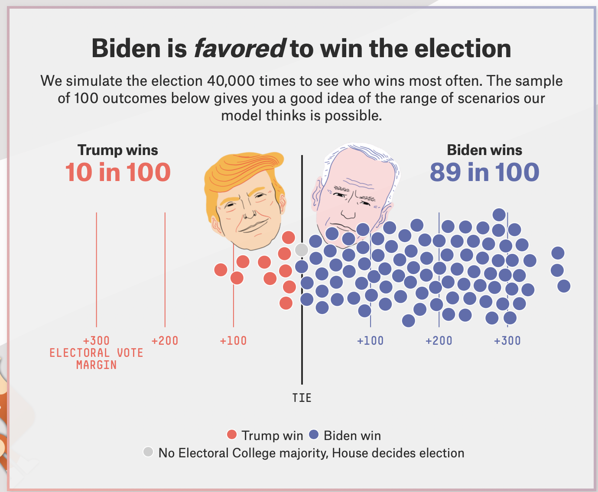
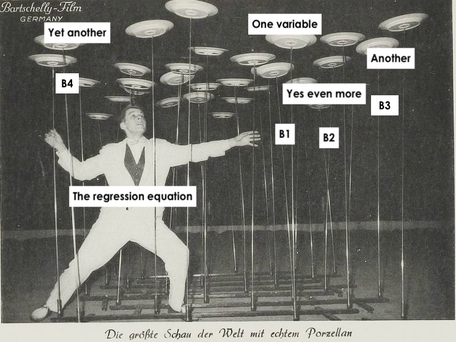

```{r setup, include=FALSE}
# set knit options
knitr::opts_chunk$set(
  fig.width=9, 
  fig.height=5, 
  fig.retina=3,
  fig.align="center",
  out.width = "100%",
  cache = FALSE,
  echo = FALSE,
  message = FALSE, 
  warning = FALSE
)

# load libraries
library(socviz)
library(juanr)
library(gapminder)
library(patchwork)
library(broom)

# source
source(here::here("slides/R", "funcs.R"))
```

# Plan for today {.center background-color="#dc354a"}

. . .

Making predictions

. . .

Multiple regression

. . .

How right are we?

# Why predict?

## Why predict?

::::: columns
::: {.column width="50%"}
-   Companies, policymakers, and academics want to predict
-   who will win an election
-   whether UN peacekeepers can reduce conflict
-   whether you'll get the vaccine or not
-   At stake is what decision to take under **uncertainty about the future**
:::

::: {.column width="50%"}
```{r}

```
:::
:::::

## Making predictions

::::: columns
::: {.column width="50%"}
The basics of prediction are pretty straightforward:

1.  Take/collect existing data ✅
2.  Fit a model to it ✅
3.  Design a **scenario** you want a prediction for ☑️
4.  Use the model to generate an **estimate** for that scenario ☑️
:::

::: {.column width="50%"}
```{r}

```
:::
:::::

## What's the scenario?

::::: columns
::: {.column width="60%"}
-   A scenario is a hypothetical **observation** (real, or imagined) that we want a prediction for
-   You define a scenario by picking **values** for explanatory variables
-   Example: what is the predicted fuel efficiency for a car that *weighs 3 tons*?
-   Example: what vote share should we expect for Democrats in a county with a *median income of 45k*, a *large urban center*, and where the *percent of non-white residents is 50%*?
:::

::: {.column width="40%"}
```{r}

```
:::
:::::

## Prediction (by hand)

```{r, echo = TRUE}
weight_model = lm(mpg ~ wt, data = mtcars)
```

Remeber our model is an equation:

. . .

$\widehat{mpg} = 37.29 - 5.34(wt)$

. . .

We only have one explanatory variable to work with (`wt`), so our scenario can only rely on weight

. . .

**Scenario**: a car that weights 3.25 tons $\rightarrow$ what fuel efficiency should we expect?

. . .

To get an estimate of `mpg`, we simply plug in the value of "weight" we are interested in:

. . .

Estimate for weight = [3.25]{.red}

$\widehat{mpg} = 37.29 - 5.34 \times \color{red}{3.25} = 19.935$

## Prediction (in R)

First **define the scenario** we want a prediction for, using `crossing()`

. . .

```{r, echo = TRUE}
weight_scenario = crossing(wt = 3.25) 
weight_scenario
```

. . .

Note that I store this as a data object

. . .

::: callout-note
the variables in `crossing` have to have the same name as the variables in the model
:::

## Prediction (in R)

We can then combine our scenario with our model using `augment()`

```{r, echo = TRUE}
augment(weight_model, newdata = weight_scenario)
```

. . .

`augment` takes the values for our scenario and plugs them in to our model equation to get an estimate

. . .

Note we got the same answer as when we did it by hand

::: callout-note
We tell `augment` what our new scenario is using the `newdata =` argument
:::

## Multiple scenarios

We can also look at multiple scenarios, maybe a light, medium, and heavy car:

. . .

```{r, echo = TRUE}
weight_scenario = crossing(wt = c(1.5, 3, 5)) 
weight_scenario
```

. . .

And then use `augment` to get the estimates:

```{r, echo = TRUE}
augment(weight_model, newdata = weight_scenario)
```

## Sequence of scenarios

Or we can look at a *sequence* of scenarios using the `seq()` function

. . .

Example: estimates for every weight between 2 and 6 tons, in .1 ton increments

. . .

```{r, echo = TRUE}
seq_weights = crossing(wt = seq(from = 2, to = 6, by = .1)) 
seq_weights
```

::: callout-note
`seq` needs a starting point (`from`), an end point (`to`), and an interval (`by`)
:::

## Prediction (in R)

And then get predictions for all these scenarios:

```{r, echo = TRUE}
augment(weight_model, newdata = seq_weights)
```

## Trivial

Do we really need a model to predict MPG when weight = 3.25? Probably not

```{r}
ggplot(mtcars, aes(x = wt, y = mpg)) + 
  geom_point() + geom_smooth(method = "lm") + 
  theme_nice()
```

## Multiple regression

The real power of modeling and prediction comes with using multiple explanatory variables

. . .

Many factors influence a car's fuel efficiency; we can use that information to make more precise predictions

. . .

```{r}
mtcars %>% 
  select(mpg, wt, cyl, hp, am, vs) |> 
  sample_n(4) |> 
  kbl(digits = 2)
```

## Multiple regression

Here, a car's fuel efficiency is a function of its weight (`wt`), number of cylinders (`cyl`), horse power (`hp`), and whether its transmission is manual or automatic (`am`)

```{r, echo = TRUE}
big_model = lm(mpg ~ wt + cyl + hp + am, data = mtcars)
```

. . .

The model equation we want in the end is this one:

$$\operatorname{mpg} = \beta_0 + \color{red}{\beta_{1}}(\operatorname{wt}) + \color{red}{\beta_{2}}(\operatorname{cyl}) + \color{red}{\beta_{3}}(\operatorname{hp}) + \color{red}{\beta_{4}}(\operatorname{am})$$

# Multiple regression

## Multiple regression

::::: columns
::: {.column width="50%"}
-   Just as when we had one variable, our OLS model is trying to find the values of $\beta$ that "best" fits the data

-   OLS estimator = $\sum{(Y_i - \hat{Y_i})^2}$

-   Where $\widehat{Y} = \beta_0 + \beta_1 x_1 + . . . \beta_4 x_4$

-   Now searching for $\beta_0 ... \beta_4$ to minimize loss function
:::

::: {.column width="50%"}
```{r}

```

*`lm()` hard at work*
:::
:::::

## Interpretation

::::: columns
::: {.column width="50%"}
```{r, echo = FALSE}
tidy(big_model) %>% 
  select(term, estimate) |> 
  kbl(digits = 2)
```
:::

::: {.column width="50%"}
-   wt = every ton of weight is associated with a 2.61 decrease in mpg
-   cyl = every cylinder is associated with a .7 decrease in mpg
-   hp = every unit of horse power is associated with a .02 decrease in mpg
-   am = on average, cars with manual transmissions (`am = 1`) have 1.48 more mpg than cars with automatic transmissions (`am = 0`)
:::
:::::

. . .

::: callout-note
Note how the estimate on weight changed as we added more variables
:::

## Prediction (by hand)

We can make predictions just as before, plugging in values for our explanatory variables

$$
\operatorname{\widehat{mpg}} = 36.15 - 2.61(\operatorname{wt}) - 0.75(\operatorname{cyl}) - 0.02(\operatorname{hp}) + 1.48(\operatorname{am})
$$

. . .

With more variables, we can create more specific **scenarios**

. . .

For example: a car that weighs 3 tons, has 4 cylinders, 120 horsepower, and has a manual transmission

. . .

$$
\operatorname{\widehat{mpg}} = 36.15 - 2.61 \times \color{blue}{3} - 0.75 \times  \color{blue}{4} - 0.02 \times  \color{blue}{120} + 1.48 \times  \color{blue}{1}
$$

. . .

$$
\operatorname{\widehat{mpg}} = 24
$$

## Prediction (in R)

We can do this in R with `crossing()` and `augment()`

. . .

```{r, echo = TRUE}
big_scenario = crossing(wt = 3, cyl = 4, hp = 120, am = 1)

augment(big_model, newdata = big_scenario)
```

## Troubleshooting

Note that your scenario needs to include every variable in your model, otherwise you will get an error

. . .

The one below is missing cylinders, which is in `big_model`, and won't run:

. . .

```{r, echo = TRUE, eval = FALSE}
bad_scenario = crossing(wt = 3, 
                      hp = 120,
                      am = 1)

augment(big_model, newdata = bad_scenario)
```

## Pick scenarios that make sense

. . .

Note that to make predictions that make sense, we have to look through our data and see what values are plausible for the variables

. . .

For example, a scenario where we set `am` = 3 doesn't make sense, since `am` is a dummy variable that takes two values (0 = automatic, 1 = manual)

. . .

But R doesn't know that, and will give you (nonsensical) estimates:

```{r, echo = TRUE}
crazy_car = crossing(wt = 3, cyl = 4, hp = 120, am = 3)
augment(big_model, newdata = crazy_car)
```

::: callout-note
Remember `data |> distinct(variable)` to see a variable's values
:::

## Holding all else constant

One cool part of **multiple regression** is that we can see what happens to our estimates when one variable changes but the others are held at a fixed value

. . .

*Holding all else in the model constant*, how does increasing a car's horsepower change its fuel efficiency?

. . .

We can use `seq()` to see what happens when horsepower changes while everything else is left at a fixed value

. . .

```{r, echo = TRUE}
varying_hp = crossing(wt = 3, cyl = 4, am = 1, hp = seq(from = 50, to = 340, by = 5))

augment(big_model, newdata = varying_hp)
```

## Visualizing predictions

We could then store our estimate, and use it for plotting

```{r, echo = TRUE, out.width="70%"}
hp_pred = augment(big_model, newdata = varying_hp)
ggplot(hp_pred, aes(x = hp, y = .fitted)) + geom_point()
```

## One more example: Gapminder

Say we wanted to predict a country's life expectancy, using population, GDP per capita, the year, and what continent it is in:

. . .

```{r, echo = TRUE}
life_model = lm(lifeExp ~ gdpPercap + pop + year + continent, data = gapminder)
tidy(life_model)
```

## Predicting health

**Scenario**: what if we wanted to predict the life expectancy of a country with a GDP per capita of \$7,000, a population of 20 million, in the year 2005, in Asia?

. . .

```{r, echo = TRUE}
life_scenario = crossing(gdpPercap = 7000, 
                       pop = 20000000, year = 2005, 
                       continent = "Asia")
augment(life_model, newdata = life_scenario)
```

## Imaginary changes

What if we could "dial up" this country's GDP slowly? How would its life expectancy change?

. . .

**Scenario**: we can vary GDP and keep all else constant

. . .

```{r, echo = TRUE}
life_scenario = crossing(gdpPercap = seq(from = 5000, to = 100000, by = 5000), 
                       pop = 20000000, year = 2005, 
                       continent = "Asia")
augment(life_model, newdata = life_scenario)
```

## Imaginary scenarios

How different would this all look in different continents? We can vary continents too:

. . .

```{r, echo = TRUE}
life_continent_scenario = crossing(gdpPercap = seq(from = 5000, to = 100000, by = 5000), 
                       pop = 20000000, year = 2005, 
                       continent = c("Asia", "Africa", "Americas", "Europe")) 
augment(life_model, newdata = life_continent_scenario)
```

## Predicting health

We can then save our predictions as an object, and plot them:

```{r, echo = TRUE, out.width="70%"}
pred_health = augment(life_model, newdata = life_continent_scenario)
ggplot(pred_health, aes(x = gdpPercap, y = .fitted, color = continent)) + 
  geom_point() + geom_line()
```

## Your turn: 🤴 Colonial fire sale 🤴

::::: columns
::: {.column width="50%"}
-   During the 1600s and 1700s the Spanish Crown would sell colonial governorships to raise money
-   Governorships were valuable because you could tax / exploit the local population
:::

::: {.column width="50%"}
```{r}

```

Charles II. His wife: *"The Catholic King is so ugly as to cause fear and he looks ill."*
:::
:::::

## Your turn: 🤴 Colonial fire sale 🤴

```{r}
colony %>% 
  sample_n(5) |> 
  knitr::kable()
```

## Your turn: 🤴 Colonial fire sale 🤴

Using `colony`:

1.  How much would a noble (`noble`), without military experience (`military`) expect to pay (`rprice1`) for a governorship with a suitability index of .8 (`suitindex`) and a repartimiento (`reparto2`) of 98,000 pesos?

2.  Adjust the scenario above so that the repartimiento quota increases from 10,000 to 200,000 in increments of 1,000 pesos, but everything else stays the same. Store as an object and plot to observe the changes.

::: callout-note
1.  Use package `juanr` to find the data set `colony`

2.  `library(broom)`

3.  **Example:**

    `life_continent_scenario = crossing(gdpPercap = seq(from = 5000, to = 100000, by = 5000), pop = 20000000, year = 2005, continent = c("Asia", "Africa", "Americas", "Europe"))`

    `augment(life_model, newdata = life_continent_scenario)`
:::

```{r}
countdown::countdown(minutes = 10L, font_size = 3)
```

## 🤴 Colonial fire sale 🤴

```{r}
#| echo: true

library(juanr)
library(broom)

colony_ols <- lm(rprice1 ~ noble + military + suitindex + reparto2, data = colony)

colony_scenario = crossing(noble = 1,  military = 0, suitindex = .8, reparto2 = seq(from = 10000, to = 200000, by = 1000)) 

colony_augment = augment(colony_ols, newdata = colony_scenario)

ggplot(colony_augment, aes(x =  reparto2, y = .fitted)) + 
  geom_point() + geom_line()

```

# How right are we?

## Prediction accuracy

::::: columns
::: {.column width="50%"}
-   The question with prediction is always: how accurate were we?
-   If our model is predicting the outcome accurately that might be:
    -   a good sign that we are modeling the process that generates the outcome well
    -   useful for forcasting the future, or situations we don't know about
:::

::: {.column width="50%"}
```{r}

```
:::
:::::

## Comparing to reality

How good are our predictions? We could compare our estimate to a real country, say Jamaica in 2007:

. . .

```{r}
gapminder %>% 
  filter(country == "Jamaica", year == 2007) %>% 
  knitr::kable()
```

. . .

We can use Jamaica's values as our scenario, and see what our model predicted:

```{r, echo = TRUE}
jamaica = crossing(continent = "Americas", year = 2007, pop = 2780132, gdpPercap = 7321)
```

## Pretty close

Actual:

```{r}
gapminder %>% 
  filter(country == "Jamaica", year == 2007) %>% 
  knitr::kable()
```

Estimate:

```{r, echo = TRUE}
augment(life_model, newdata = jamaica)
```

## Is this really a prediction?

::::: columns
::: {.column width="50%"}
-   Our estimate of Jamaica is not *really* prediction, since we *used* that observation to fit our model

-   This is an **in-sample** prediction $\rightarrow$ seeing how well our model does at predicting the data that we used to generate it

-   "True" prediction is **out-of-sample** $\rightarrow$ using a model to generate predictions about something that *hasn't happened yet*
:::

::: {.column width="50%"}
```{r,fig.cap="Figure. Is catch and release really fishing?"}

```
:::
:::::

## Out of sample prediction

Imagine in the year 1957 we fit a model with the info we had available at the time:

. . .

```{r, echo = TRUE}
gap_57 = gapminder %>% filter(year <= 1957)
mod_57 = lm(lifeExp ~ gdpPercap + pop + continent + year, data = gap_57)
```

. . .

Now it's 2007, someone finds the model, and wants to know: how well could this model have predicted the future?

. . .

```{r, echo = TRUE}
jamaica = crossing(continent = "Americas", year = 2007, pop = 2780132, gdpPercap = 7321)
```

. . .

This is an **out-of-sample** prediction: our model has data before 1957, but our prediction is based off of Jamaica's characteristics in 2007

## How did we do?

Jamaica in 2007:

```{r}
gapminder %>% 
  filter(country == "Jamaica", year == 2007) %>% 
  knitr::kable(digits = 1)
```

. . .

What our 1957 model predicted for 2007 (out of sample):

```{r}
augment(mod_57, newdata = jamaica) |> 
  kbl(digits = 1)
```

. . .

What our model with all the data predicted, 2007 included (in sample):

```{r}
augment(life_model, newdata = jamaica) |> 
  kbl(digits = 1)
```

# Out of sample prediction is worse

As a general rule, models will tend to perform **worse** out-of-sample than in-sample

. . .

This is because the model is **over-fitting** the data $\rightarrow$ tailoring the model equation too closely to the data we have

## 🚨 Your turn: 🎥 The movies 🎥🚨

Using `movies`:

1.  Fit a model that predicts gross (outcome) using genre1, duration, budget, year, imdb_score, and whether or not it's in color.

2.  Look up a movie in the dataset. How well does the model predict a movie that shares that movie's characteristics?

3.  Look up a movie on IMDB that came out after the data ends (2016). How well does your model predict that movie's gross?

```{r}
countdown::countdown(minutes = 10L)
```

## 🚨 🎥 The movies 🎥🚨 {.smaller}

```{r}
#| echo: true

movie_ols <- lm(gross ~ genre1 + duration + budget + year + imdb_score + color, data = movies)

# tron: Legacy

tron_scenario = crossing(genre1 = "Action",  duration = 125, budget = 170000000, year = 2010, imdb_score = 6.8, color = "Color") 

augment(movie_ols, newdata = tron_scenario)

## actual gross = $172.1 million
## difference = $197.3 million - $172.1 million

# Tron: Aries

tron_2_scenario = crossing(genre1 = "Action",  duration = 119, budget = 220000000, year = 2025, imdb_score = 6.1, color = "Color") 

augment(movie_ols, newdata = tron_2_scenario)

## actual gross = $142.2 million
## difference: $230.0 million - $142.2 million

```
