```{r setup, include=FALSE}
# set knit options
knitr::opts_chunk$set(
  fig.width=9, 
  fig.height=5, 
  fig.retina=3,
  fig.align="center",
  out.width = "100%",
  cache = FALSE,
  echo = FALSE,
  message = FALSE, 
  warning = FALSE
)

# load libraries
library(socviz)
library(juanr)
library(gapminder)
library(patchwork)
library(broom)
library(huxtable)
library(ggdag)
library(wakefield)
library(paletteer)
library(ggbeeswarm)

# source
source(here::here("slides/R", "funcs.R"))
```

# Plan for today {.center background-color="#dc354a"}

. . .

The causal revolution

. . .

Natural experiments

. . .

Regression discontinuities

## \# A brief, unfair history of social science research {.center background-color="#dc354a"}

## Garbage can models

::::: columns
::: {.column width="50%"}
-   for a long time there was a tendency to estimate **"garbage can" models**
-   throw every variable under the sun into regression model, hope for the best
-   in some cases, no pre-meditated *treatment* variable
-   little recognition that of tradeoff between controlling for **forks** but avoiding **pipes/colliders**
:::

::: {.column width="50%"}
```{r}
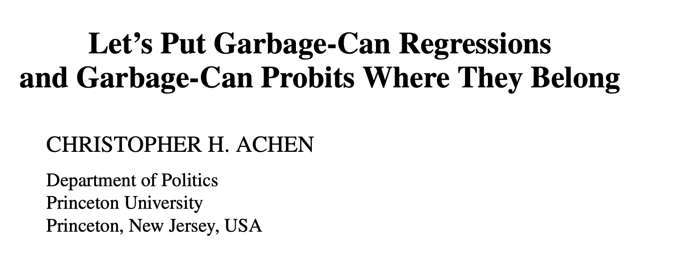
```
:::
:::::

## An empty-garbage-can model

::::: columns
::: {.column width="50%"}
-   Some studies don't even control for confounds

-   From the dog ownership improves health article in the homework:

-   ["*A possible limitation was that the analyses were not adjusted for confounders.*"](https://www.ahajournals.org/doi/10.1161/CIRCOUTCOMES.119.005554)

-   Huge confounds abound! A person who is too sick to care for a dog won't get one
:::

::: {.column width="50%"}
```{r, out.width="80%"}
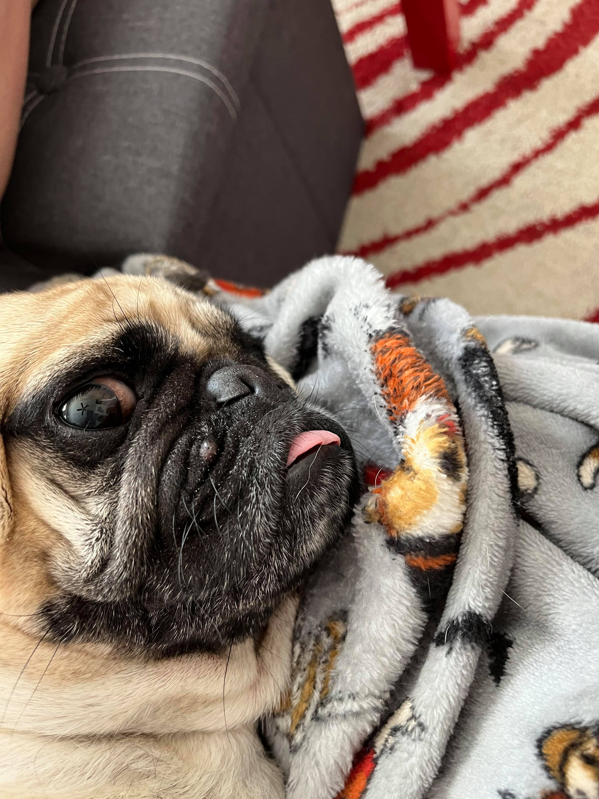
```
:::
:::::

## Causal inference

::::: columns
::: {.column width="50%"}
-   More recently: a greater emphasis on worrying about **causality**
-   Recognition that confounds are lurking everywhere, and we should worry about them
-   Recognition that **pipes** and **colliders** means we *shouldn't* just throw every variable into a model
:::

::: {.column width="50%"}
```{r}

```
:::
:::::

## Improvements but obvious limits

. . .

IF we can correctly specify our model (i.e., control for all backdoors, leave front-doors open) we will identify the effect of X on Y

. . .

Easier said than done! Often there is some confound (like W) that we **know exists but can't measure**, or worse, **don't know exists at all**

```{r, out.width="50%", fig.align='center'}
dagify(Y ~ X + W + Z + G, 
       X ~ W + G, 
       Z ~ G,
       outcome = "Y", 
       exposure = "X", 
       latent = "W") %>% 
  ggdag_status() + theme_dag() + theme(legend.position = "none")
```

## The causal revolution

Hard to correctly specify the DAG and measure all the variables; what can we do?

. . .

Ideal = an experiment -- where *treatment is randomly assigned* -- but this is rarely feasible

```{r,out.width="50%"}
dagify(Support ~ Ad + Age + Income + Race + Region + Religion +
         Parents + Media, 
       Income ~ Region + Parents, 
       Religion ~ Parents, 
       Media ~ Parents + Religion + Age + Region, 
       exposure = "Ad", 
       outcome = "Support") %>% 
  ggdag_status(text = FALSE, use_labels = "name") + theme_dag() + 
  theme(legend.position = "none") + 
  scale_fill_manual(values = wesanderson::wes_palettes$Darjeeling1, 
                     na.value = "grey20") + 
  scale_color_manual(values = wesanderson::wes_palettes$Darjeeling1, 
                     na.value = "grey20")
```

## Natural experiments

::::: columns
::: {.column width="50%"}
-   Alternative - find moments, situations, or weird, freak occurrences where some group is exposed to some *treatment* **by chance** while another group was not

-   These weird moments in history are called **natural experiments**

-   As though nature accidentally created an experiment
:::

::: {.column width="50%"}
```{r, out.width="80%"}
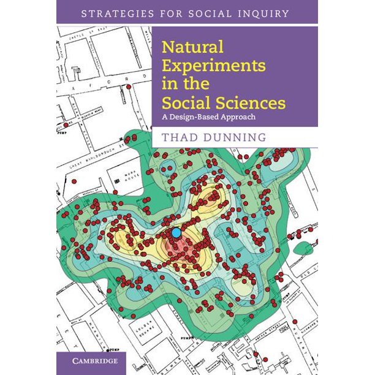
```
:::
:::::

## A good year for causality

2021 Nobel Prize winners in economics pioneered **quasi-experimental methods** -- using research designs that leverage *natural experiments*

::::: columns
::: {.column width="50%"}
```{r, out.width="60%", fig.align='center'}
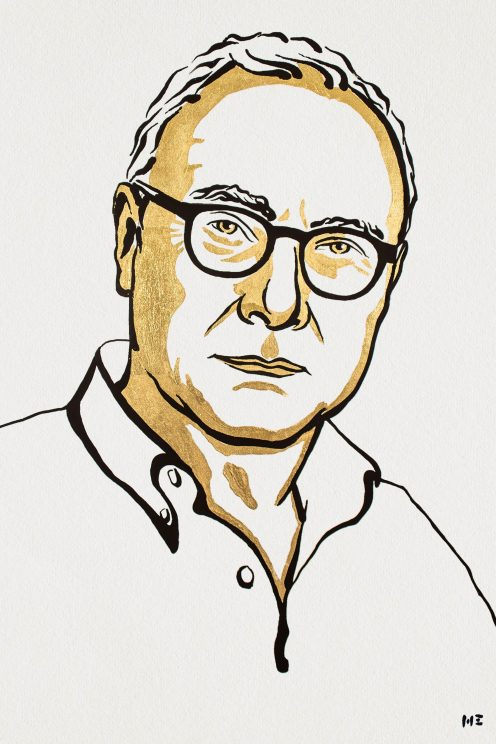
```
:::

::: {.column width="50%"}
```{r, out.width="60%", fig.align='center'}

```
:::
:::::

## \# Regression discontinuity {.center background-color="#dc354a"}

## Do gifted programs pay off?

::::: columns
::: {.column width="50%"}
-   Millions of kids across the US placed in gifted programs
-   Parents/society have to weigh pros and cons; is this worth doing?
-   For instance: does being in gifted program **increase** your chances of success later in life?
:::

::: {.column width="50%"}
```{r,out.width="80%"}
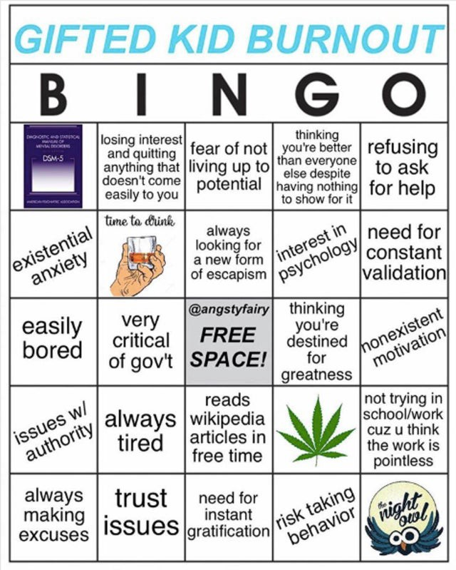
```
:::
:::::

::: notes
what does cause mean here?
:::

## The (fake) data

Go out and collect data on people who were and were not in gifted:

```{r}
fake_students = r_data_frame(n = 10000, name, age, grade, sex, height, smoker = valid) %>% 
  mutate(test = runif(n = n())*100) %>% 
  mutate(gifted = ifelse(test >= 75, "yes", "no")) %>% 
  mutate(earnings = rgamma(n = n(), 2) * 20000 - 25000 * (gifted == "yes") +
         1000 * test)
fake_students |> 
  sample_n(8) |> 
  select(Name, Age, Grade, gifted, earnings) |> 
  knitr::kable(digits = 0)
```

## The results

Big gifted program premium: `r scales::dollar(coef(lm(earnings ~ gifted, data = fake_students))[2])` more in earnings

```{r}
avgs = 
  fake_students %>% 
  group_by(gifted) %>% 
  summarise(earnings = round(mean(earnings), 0))
ggplot(fake_students, aes(x= gifted, y = earnings, 
                          color = gifted)) + 
  ggbeeswarm::geom_quasirandom(size = 2, alpha = .9) + 
  coord_flip() + 
  scale_y_continuous(labels = scales::dollar) + 
  scale_color_paletteer_d(palette = "nationalparkcolors::BlueRidgePkwy", 
                          direction = -1) + 
  theme_nice() + 
  theme(legend.position = "none") + 
  labs(y = "Current salary", x = "Was the respondent in gifted?") + 
  geom_label_repel(data = avgs, aes(label = paste0("Avg: ", scales::dollar(earnings))), 
                   size = 5, fontface = "bold", nudge_y = 30000, 
                   nudge_x = .2)
  
```

::: notes
Does this mean gifted caused this, or even some of it?
:::

## The problem

So many potential confounds, including ones that are really, really hard to measure (like [ability]{.red}) and others that are *unknown*

```{r}
dagify(earnings ~ gifted + family + location + ability + unknown, 
       gifted ~ family + location + ability + unknown, 
       exposure = "gifted", 
       outcome = "earnings", 
       latent = "ability") %>% 
  ggdag_status(text = FALSE, use_labels = "name") + theme_dag() + 
  theme(legend.position = "none")
```

## The solution

::::: columns
::: {.column width="50%"}
-   To get into gifted you typically need a certain score on an aptitude/IQ test

-   Imagine that the **cutoff** score is 75/100; above you're in gifted, below you are not

-   This cutoff is known as the **assignment mechanism** = why some receive treatment (gifted program) or not

-   How was that cutoff chosen?
:::

::: {.column width="50%"}
```{r, out.width="70%",fig.align='center'}
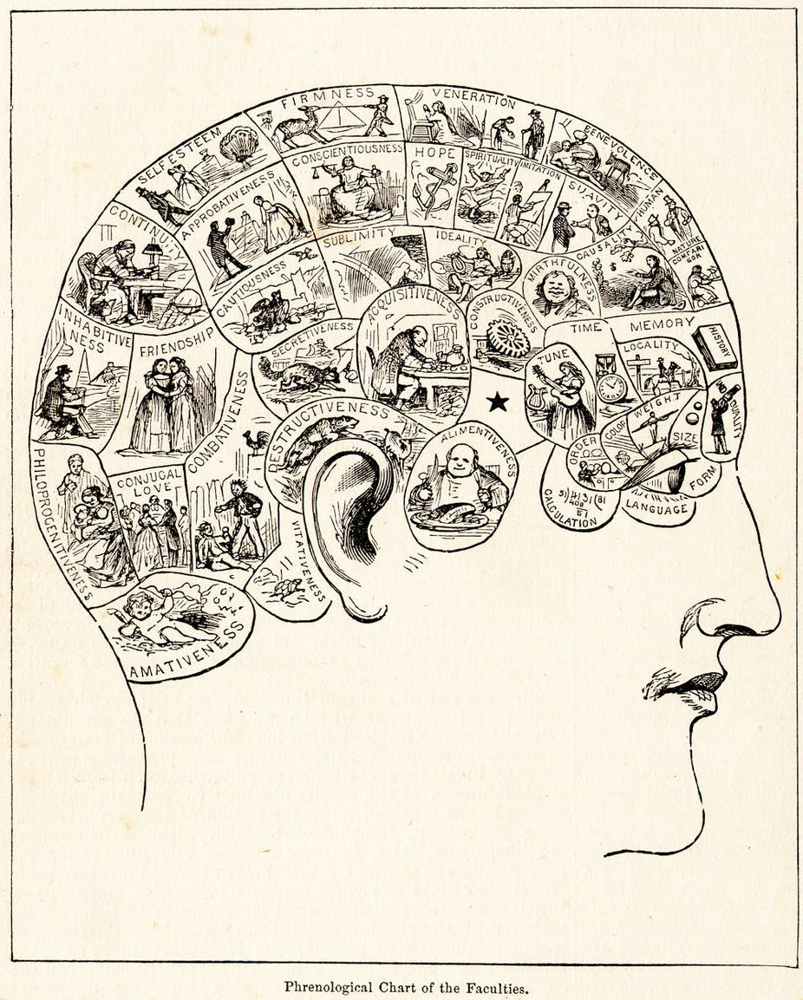
```
:::
:::::

## The solution

The precise **cutoff** is completely arbitrary; could have been 74.5, or 76, or 80, or whatever

. . .

The *arbitrary* nature of the cutoff creates a **natural experiment**

. . .

A student who a 76 and a student who got a 34 are probably very different;

. . .

if one makes more money than the other today, is that because of gifted? or other factors ([ability]{.red}?)

. . .

But a student who got a 76 and one who got a 74 are probably interchangeable

. . .

Few points difference might be function of: **random** error, luck, whatever

## The natural experiment

If we look *only* at students who scored close to the 75 cutoff we have the makings of a **natural experiment**

. . .

Around cutoff, essentially random whether you get treatment (gifted program) or not

. . .

Why? Score on test = [ability]{.red} + luck + measurement error

. . .

Example: Joe got a 74 and Amy got a 76; if they took the test many times, how often would Joe score worse than Amy?

. . .

“Natural experiments”: situations where some *thing* (often a rule) creates random assignment of treatment

## Looking around the cutoff

In analysis terms, (can be) simple: look only at students who scored close to 75, let's say +/- 2:

```{r, echo = TRUE}
subset_students = fake_students %>% 
  filter(test >= 73 & test <= 77)
```

. . .

Then we estimate model on this group; let's also estimate in the full (confounded!) sample

```{r, echo = TRUE}
wrong_model = lm(earnings ~ gifted, data = fake_students)
discon_model = lm(earnings ~ gifted, data = subset_students)

```

::: callout-note
The difference between these two models is the **sample** the model is being fit to
:::

## The results {.scrollable}

Ouch! Looks like being in gifted actually **hurts** students in the long-run:

```{r}
huxreg("all students" = wrong_model, "students near cutoff" = discon_model, 
       statistics = "nobs", number_format = 0)
```

## Visualize it

People with higher aptitude/training/ability/etc. better off today:

```{r}
ggplot(fake_students, aes(x = test, y = earnings)) + 
  geom_point() + 
  theme_nice() + 
  labs(x = "Score on IQ test", y = "Current salary") + 
  scale_y_continuous(labels = scales::dollar)
```

## The cutoff

```{r}
ggplot(fake_students, aes(x = test, y = earnings, 
                          color = gifted)) + 
  geom_point(size = 2, alpha = .8) + 
  theme_nice() + 
  labs(x = "Score on IQ test", y = "Current salary", 
       color = "Gifted?") + 
  scale_y_continuous(labels = scales::dollar) + 
  scale_color_paletteer_d(palette = "nationalparkcolors::BlueRidgePkwy", 
                          direction = -1) + 
  geom_vline(xintercept = 75, lty = 2, linewidth = 2, color = "red")
```

## The natural experiment

```{r}
ggplot(fake_students, aes(x = test, y = earnings, 
                          color = gifted)) + 
  geom_point(size = 2, alpha = .8) + 
  theme_nice() + 
  labs(x = "Score on IQ test", y = "Current salary", 
       color = "Gifted?") + 
  scale_y_continuous(labels = scales::dollar) + 
  scale_color_paletteer_d(palette = "nationalparkcolors::BlueRidgePkwy", 
                          direction = -1) + 
  annotate(geom = "rect", xmin = 73, xmax = 77, ymin = -Inf, ymax = Inf, 
           fill = "coral3", alpha = .4)
```

## The discontinuity

These are the students who, **by chance**, just barely made it (or not) into gifted

```{r}
ggplot(fake_students, aes(x = test, y = earnings, 
                          color = gifted)) + 
  geom_point(size = 2, alpha = .8) + 
  theme_nice() + 
  labs(x = "Score on IQ test", y = "Current salary", 
       color = "Gifted?") + 
  scale_y_continuous(labels = scales::dollar) + 
  scale_color_paletteer_d(palette = "nationalparkcolors::BlueRidgePkwy", 
                          direction = -1) +
  coord_cartesian(xlim = c(73, 77))
```

## The discontinuity

On average, the students who *by chance* made it in make **less money**

```{r}
ggplot(fake_students, aes(x = test, y = earnings, 
                          color = gifted)) + 
  geom_point(size = 2, alpha = .8) + 
  theme_nice() + 
  labs(x = "Score on IQ test", y = "Current salary", 
       color = "Gifted?") + 
  scale_y_continuous(labels = scales::dollar) + 
  scale_color_paletteer_d(palette = "nationalparkcolors::BlueRidgePkwy", 
                          direction = -1) +
  coord_cartesian(xlim = c(73, 77)) + 
  geom_label_repel(data = tibble(test = 73.5, earnings = coef(discon_model)[1], 
                                 gifted = "no"), 
                   aes(label = paste("Avg earnings: ", scales::dollar(earnings)))) + 
  geom_label_repel(data = tibble(test = 76.5, 
                                 earnings = coef(discon_model)[1] + coef(discon_model)[2], 
                                 gifted = "yes"), 
                   aes(label = paste("Avg earnings: ", scales::dollar(earnings))))
```

## The payoff

::::: columns
::: {.column width="50%"}
-   In the **naive** estimate we think gifted programs help students in the long-run;

-   With the **discontinuity** we see the opposite: gifted hurts

-   *Arbitrary cutoff* gets us clean estimates for free: no need to worry about backdoor paths
:::

::: {.column width="50%"}
```{r}
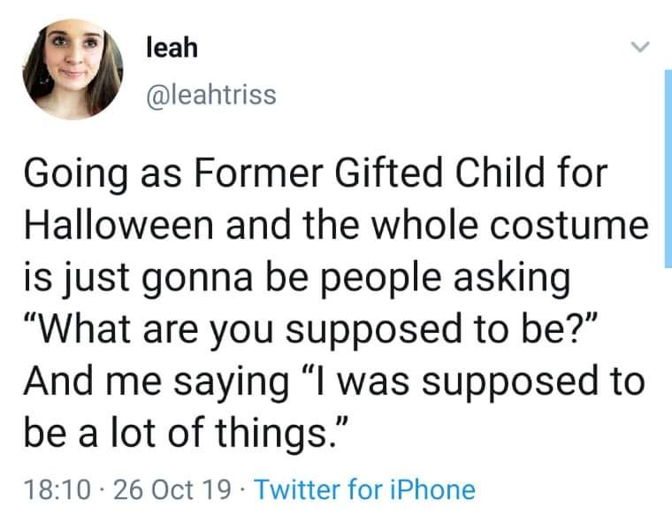
```
:::
:::::

## \# Other examples {.center background-color="#dc354a"}

## Moral hazard

::::: columns
::: {.column width="50%"}
-   How much **moral hazard** is there in insurance? E.g., if your insurance covers 10k in services, will provider charge you \$10k even if you only need 8k in services?

-   Naive estimate: `lm(charge ~ insurance)`

-   What's wrong with the naive estimate?
:::

::: {.column width="50%"}
```{r}
r_data_frame(n = 8, `has insurance` = valid, `Hospital charge` = income) |> 
  kbl(digits = 0, caption = "Moral hazard data")
```
:::
:::::

## Diamond and Doyle

```{r, out.width="60%", fig.align='center'}
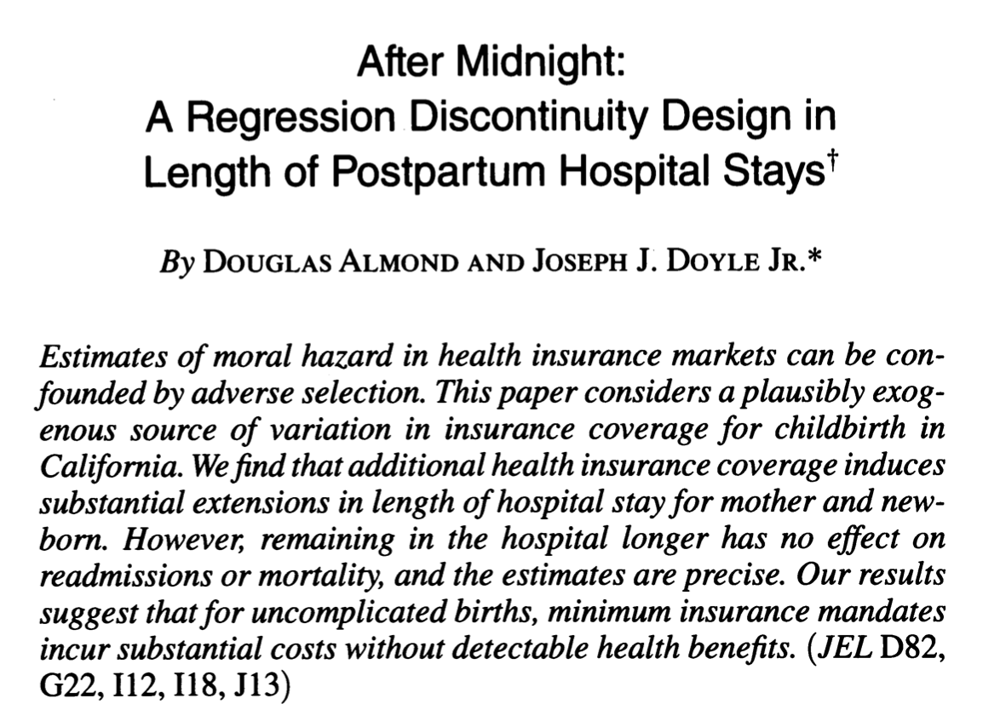
```

## Baby problems

-   Insurance will cover **two nights** in a hospital after delivery

-   But how long is "**a night**"?

-   Nights counted by number of *midnights* (*arbitrary cutoff*)

-   👶 born on Monday at 11:59pm = gets Tue + Wed in hospital

-   👶 born on Tuesday at 12:01am = gets Tue + Wed + Thur in hospital (by chance, get extra minimum coverage)

## Finding

1 in 4 babies born after midnight spend an *extra night in hospital* (💵💵💵), even when there is *no health benefit to doing so*

```{r, fig.align='center', out.width="70%"}
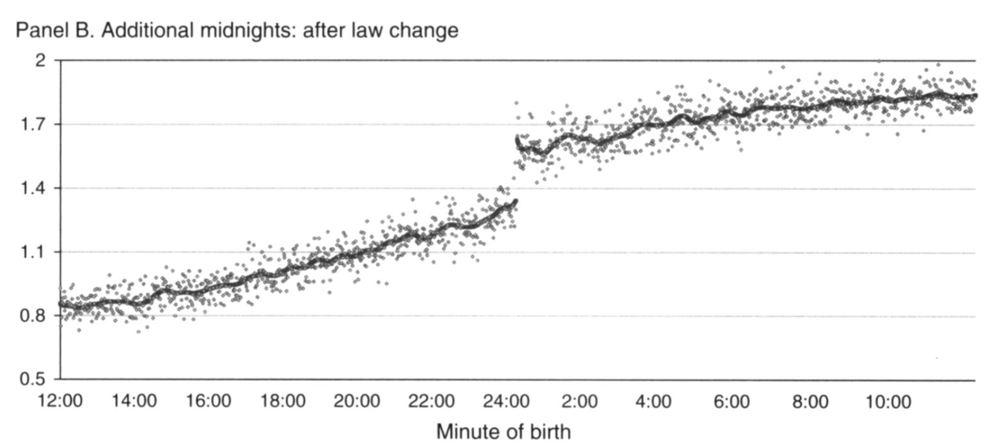
```

## Other examples: McNamara and the Whiz Kids

::::: columns
::: {.column width="50%"}
-   What effect did bombing raids in Vietnam have long-term?

-   Problem: the places that *were* bombed are **very different** from the places that were never bombed

-   Biggest confound: if bombing accurate, places that were most bombed had most Vietcong presence
:::

::: {.column width="50%"}
```{r}
vietnam |> 
  select(month, control, bombs) |>
  sample_n(5) |> 
  kbl(caption = "Vietnam bombing data")
```
:::
:::::

## McNamara and the Whiz Kids

::::: columns
::: {.column width="50%"}
-   Decision to bomb based on **threat scoring system** (1, very secure, to 5, very insecure)
-   Final score based on average of sub-scores, then **rounded** to whole number so:
-   4.4999 --\> 4, whereas 5.0001 -\> 5 (**arbitrary cutoff**)
-   Paper shows long-term deleterious effects to bombing
:::

::: {.column width="50%"}
```{r}

```
:::
:::::

## How do we know we have a natural experiment?

::::: columns
::: {.column width="50%"}
-   In a true experiment, the treatment and control group should look **similar** or **balanced** demographically

-   i.e., if I put people into two groups **at random**, it should be very unlikely that the average person in the control is 22 years old and the average in treatment group is 55 years old

-   One thing we can do is **compare** the characteristics of the treatment and control group in our natural experiment; are they in fact similar?
:::

::: {.column width="50%"}
```{r}
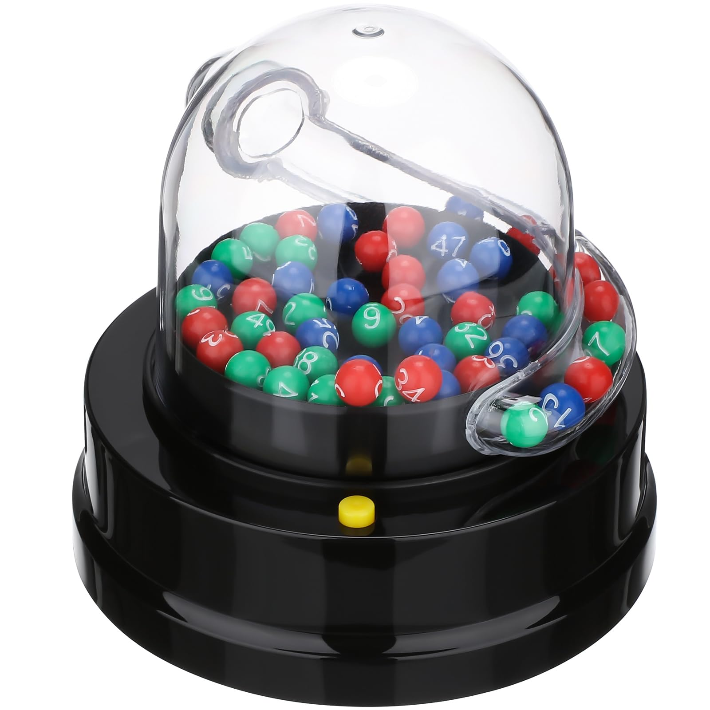
```
:::
:::::

## Are they similar? Back to the gifted program

It looks like people close to the cutoff are pretty balanced

```{r}
subset_students |> 
  select(Age:smoker, gifted, -Grade) |> 
  mutate(Sex = ifelse(Sex == "Female", 1, 0)) |> 
  group_by(gifted) |> 
  summarise(across(everything(), mean)) |> 
  mutate(Sex = Sex * 100,
         smoker = smoker * 100) |> 
  select(`Gifted?` = gifted, `Average age` = Age, `Percent women` = Sex, `Average height` = Height, 
         `Percent drug use` = smoker) |> 
  kbl(digits = 1)
```

**Some** evidence we have a natural experiment

## Why *some* evidence?

::::: columns
::: {.column width="50%"}
-   If checking for balance is a way to see if we have a natural experiment, why can't we always do this?

-   Want to know the effect of X on Y; test for balance on X; if balanced we are good to go / not confounded

-   Remember the problem is often we don't know what confounds are out there! Or we know, but can't measure them!

-   Checking for balance is **suggestive, weak evidence** that we have a natural experiment
:::

::: {.column width="50%"}
```{r}

```
:::
:::::

## Big picture

Natural experiments are "strongest" causal tool, and regression discontinuity designs are probably the most convincing version

. . .

Easy to implement; less worry about confounding; the tough part? Finding one! And collecting the data

. . .

Often the result of some rule, boundary, or some other random, **arbitrary** process having a sudden impact in the world

. . .

Premium on: *specific* knowledge of a particular region/area/issue

## 🚨 Your turn: 🧠🧠🧠 🚨

With your teams/groups:

1.  Write down as many rules, demarcations, cutoffs, etc., out there in the world that you can think of.

2.  Can any of these create an opportunity for a natural experiment, where *something* happens to some people/countries/places but not to others as a result of this rule/cutoff/thing?

3.  What problem could that natural experiment help solve? In the gifted program case: the IQ test cutoff helps solve the problem of estimating the effect of gifted programs on future success.

## \# Limitations {.center background-color="#dc354a"}

## No free lunch

::::: columns
::: {.column width="50%"}
-   Natural experiments are great but there are limitations:

-   **Changing estimate** If we find a good one, the thing we are trying to estimate likely changes (is this bad? depends)

-   **Sorting at the cutoff** If there's a rule out there that has consequences, people will do what they can to end up on the right side of it
:::

::: {.column width="50%"}
```{r}
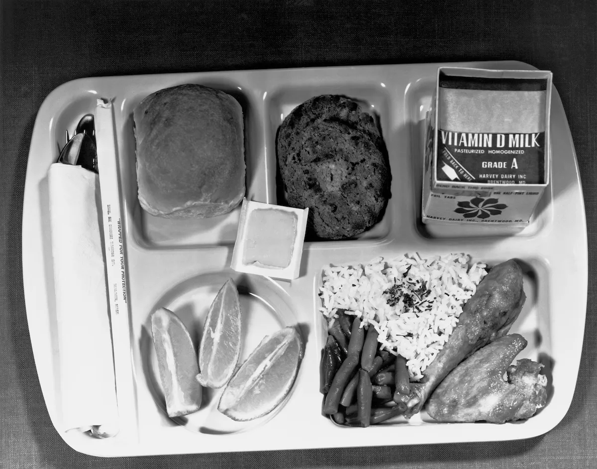
```
:::
:::::

## Limitations: changing estimates

::::: columns
::: {.column width="50%"}
By focusing on units near cutoff, our estimate subtly changes:

-   ~~effect of putting *a child* in gifted on future earnings, on average~~

-   effect of putting a child *with roughly 75 IQ* in gifted on earnings ✅

-   Is this a problem? Depends, but better to know one narrow(er) fact that nothing at all?
:::

::: {.column width="50%"}
```{r, out.width="100%"}
ggplot(fake_students, aes(x = test, y = earnings, 
                          color = gifted)) + 
  geom_point(size = 2, alpha = .8) + 
  theme_nice() + 
  labs(x = "Score on IQ test", y = "Current salary", 
       color = "Gifted?") + 
  scale_y_continuous(labels = scales::dollar) + 
  scale_color_paletteer_d(palette = "nationalparkcolors::BlueRidgePkwy", 
                          direction = -1) + 
  annotate(geom = "rect", xmin = 73, xmax = 77, ymin = -Inf, ymax = Inf, 
           fill = "coral3", alpha = .4)
```
:::
:::::

## Limitations: "sorting around the cutoff"

There is also a risk that if people *know* about the cutoff they will behave strategically in ways that **confound our estimate**

. . .

Imagine that there is room to pressure/bully the school psychologist into turning a 74.9 into a 75 so little Timmy can be gifted

. . .

And image wealthier/better-connected/etc parents are better bullies than poor parents

. . .

In that case, being gifted is no longer *random*

. . .

wealthy parents **cause** you to get over the cutoff

## Sorting around the cut-off

If parents can force almost-there kids into gifted, parents become a **backdoor path to earnings** (since your parents likely affect your earnings directly, or in other ways)

```{r, out.width="90%"}
dagify(earnings ~ gifted + parents, 
       gifted ~ parents, 
       exposure = "gifted", 
       outcome = "earnings") %>% 
  ggdag_status(text = FALSE, use_labels = "name") + theme_dag() + 
  theme(legend.position = "none")
```

## 🚨 Your turn: sorting around the cutoff 🚨

Think back to the arbitrary cutoff you came up with in the last exercise.

1.  Could someone "game" or sort around that cutoff?
2.  What would that look like?
3.  And how could it confound your estimate / ruin the natural experiment?

```{r}
countdown::countdown(minutes = 10L, font_size = "2em")
```

# Where to go from here? {.center background-color="#dc354a"}

We've done **a lot** this quarter

## Where to go from here?

::::: columns
::: {.column width="50%"}
1.  Basics of data wrangling, visualization, and analysis
2.  Modeling relationships between variables
3.  Thinking and modeling **causally**
4.  Making inferences with **uncertainty**
:::

::: {.column width="50%"}
```{r}
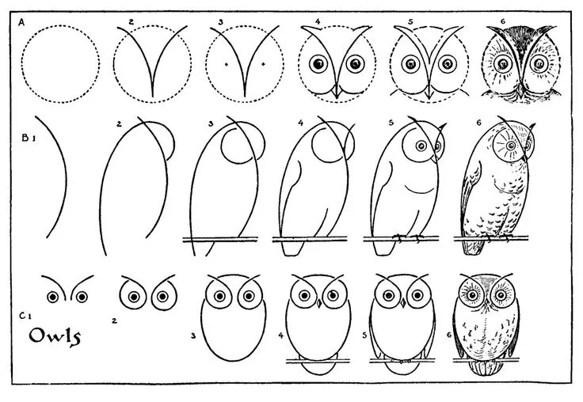
```
:::
:::::

## Keep learning R

[Every Tuesday](https://www.tidytuesday.com/): free data + a visualization challenge + free code

::::: columns
::: {.column width="50%"}
```{r}
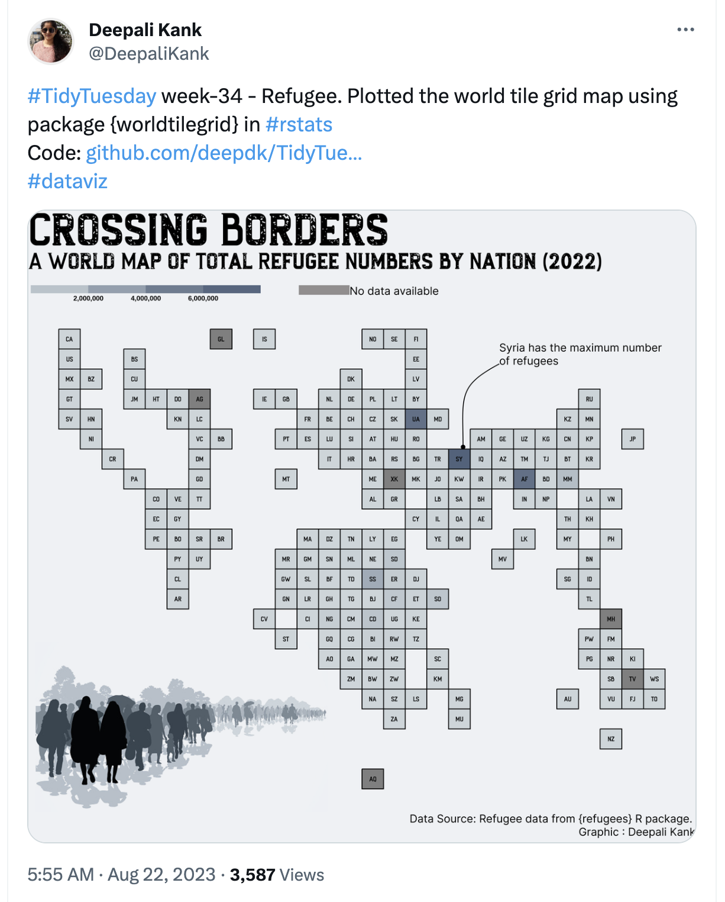
```
:::

::: {.column width="50%"}
```{r}
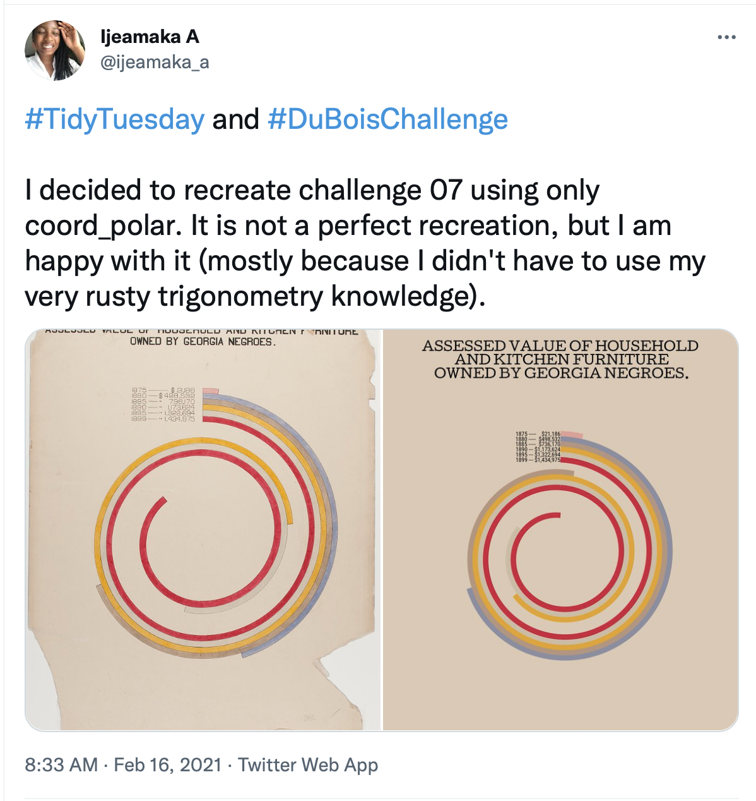
```
:::
:::::

## Keep thinking causally

::::::: columns
:::: {.column width="50%"}
::: fragment
```{r, out.height="50%"}
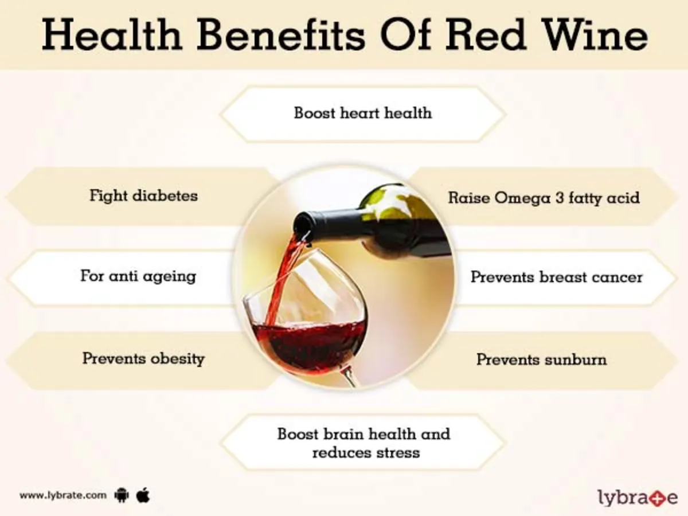
```

No randomization; who is being **compared** here?
:::
::::

:::: {.column width="50%"}
::: fragment
```{r}
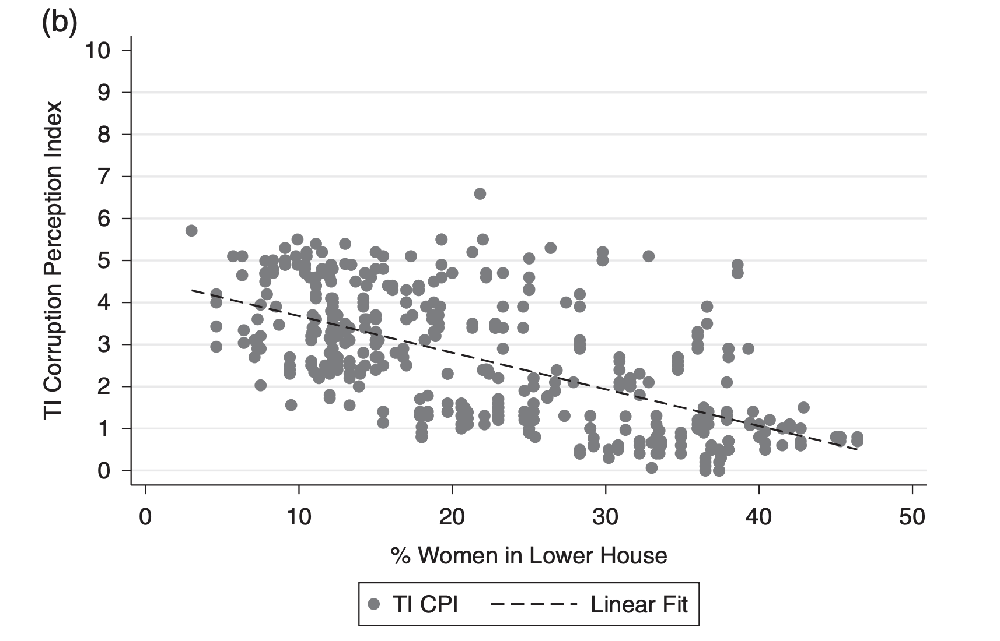
```

But also: don't be a **lazy cynic**! What is the confound?
:::
::::
:::::::

## Keep thinking about uncertainty

::::::: columns
:::: {.column width="50%"}
::: fragment
```{r}
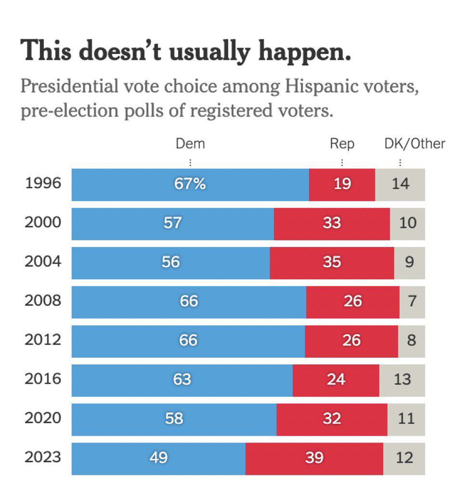
```

Where is the **uncertainty**?
:::
::::

:::: {.column width="50%"}
::: fragment
```{r}
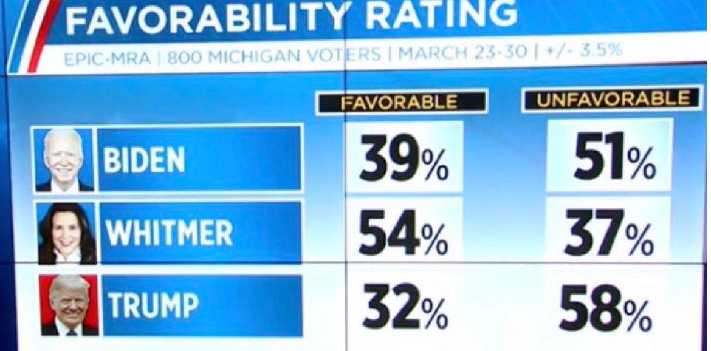
```

95% CI between Biden and Trump **overlap**
:::
::::
:::::::
