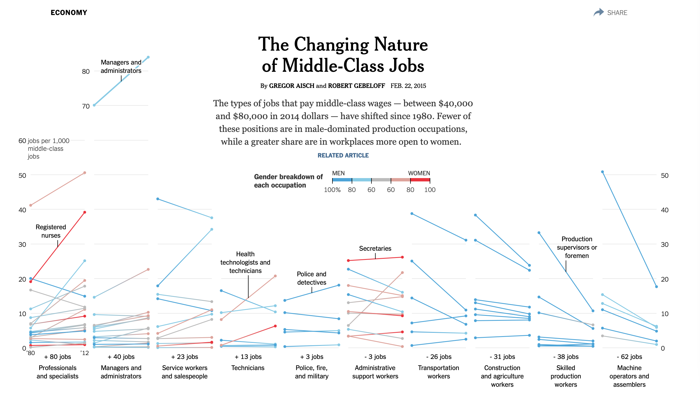
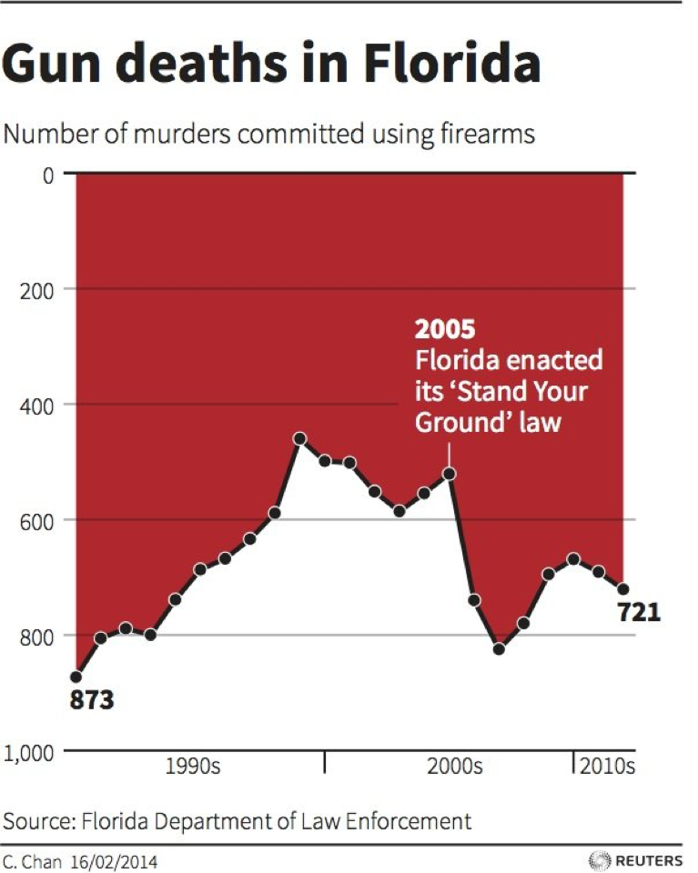

```{r setup, include=FALSE}
# set knit options

knitr::opts_chunk$set(
  fig.width=9, 
  fig.height=5, 
  fig.retina=3,
  fig.align="center",
  out.width = "100%",
  cache = FALSE,
  echo = FALSE,
  message = FALSE, 
  warning = FALSE
)

# libraries
library(gapminder)
library(socviz)

# source
source(here::here("slides/R/funcs.R"))


```

## Why visualize data?

::: incremental
-   Data carries **weight** in our society

-   **Visualizing** data is an effective way to convey information, convince, argue

-   Visualization can be used to tell **The Truth™️** (or not)
:::

## Dataviz to inform

```{r,out.width="60%"}

```

## Dataviz to mislead

```{r,out.width="40%"}

```

## Inform? or mislead?

```{r}
gap_10 = gapminder |> 
  filter(year == max(year)) |> 
  filter(continent == "Americas")

 
p1 = ggplot(gap_10, aes(y = reorder(country, lifeExp), x = lifeExp)) + 
  geom_col(color = "white", fill = red, alpha = .8) +
  labs(x = NULL, 
       y = NULL,
       title = "Barplot")

p2 = ggplot(gap_10, aes(y = reorder(country, lifeExp), x = lifeExp)) + 
  geom_point(color = red, size = 3, alpha = .8) + 
  labs(x = NULL,
       y = NULL,
       title = "Cleveland dot plot")

p1 + p2 + plot_annotation(title = "Life expectancy in the Americas (2007)",
                          theme = theme(plot.title = element_text(hjust = 0.5)))
```

# Making graphs in `R` {background-color="#dc354a"}

## The Gapminder dataset

```{r}
gapminder |> 
  slice(1:5) |> 
  kbl(digits = 0) %>% 
  kable_styling(bootstrap_options = c("striped", "hover"))
```

## Rows are observations

```{r}
gapminder |> 
  slice(1:5) |> 
  kbl(digits = 0) %>% 
  kable_styling(bootstrap_options = c("striped", "hover")) |> 
  row_spec(row = 1, bold = TRUE, background = yellow)
```

In a dataset, **rows** are **observations**

. . .

The data we **observe** for *Afghanistan* in the year *1952*

## Rows are observations

```{r}
gss_sm |> 
  select(id, age, degree, race, sex) |> 
  slice(1:5) |> 
  kbl(digits = 0) %>% 
  kable_styling(bootstrap_options = c("striped", "hover")) |> 
  row_spec(row = 3, bold = TRUE, background = yellow)
```

In **survey** data, an observation is typically a **person** who took the survey (a *respondent*)

## Columns are variables

```{r}
gapminder |> 
  slice(1:5) |> 
  kbl(digits = 0) %>% 
  kable_styling(bootstrap_options = c("striped", "hover")) |> 
  column_spec(column = 4, bold = TRUE, background = yellow)
```

In a dataset, **columns** are **variables**

. . .

Life expectancy and GDP per capita are some of the **variables** in our data

## The final graph

```{r,echo = FALSE}
# subset data to focus on 2007
gap_07 = 
  gapminder %>% 
  filter(year == 2007)


# calculate average life span by year
life_yr = 
  gapminder %>% 
  select(year, lifeExp) %>% 
  group_by(year) %>% 
  summarise(avg_yrs = mean(lifeExp))

# calculate average life expectancy by continent
life_region = 
  gap_07 %>% 
  group_by(continent) %>% 
  summarise(avg_yrs = mean(lifeExp))

# calculate average life expectancy by continent-year
life_region_yr = 
  gapminder %>% 
  group_by(continent, year) %>% 
  summarise(avg_yrs = mean(lifeExp))

# plot
ggplot(gap_07, aes(x = gdpPercap, y = lifeExp, 
                      color = continent, 
                      size = pop)) + 
  geom_point() + 
  labs(x = "GDP per capita ($USD, inflation-adjusted)", 
       y = "Life expectancy (in years)", 
       title = "Wealth and Health Around the World", 
       subtitle = "Data from 2007. Source: gapminder package.",
       color = NULL, size = "Population") + 
  scale_size_continuous(labels = scales::comma) 
```

There are four variables on this graph. What are they?

## The **grammar** of graphics {.center}

. . .

Graphs have an internal logic, or **grammar** that connects data to visuals

. . .

**Data** = variables in a dataset

. . .

**Aesthetic** = visual property of a graph (position, shape, color, etc.)

. . .

**Geometry** = representation of an aesthetic (point, line, text, etc.)

## Mapping data to aesthetics

```{r}
df = tribble(~Data, ~Aesthetic, ~Geometry, 
             "GDP per capita", "Position(x-axis)", "Point", 
             "Life expectancy", "Position (y-axis)", "Point", 
             "Continent", "Color", "Point", 
             "Population", "Size", "Point")
knitr::kable(df)
```

1.  Take the **data**,

2.  map it onto an **aesthetic**,

3.  and visualize it with a **geometry**

## In R

```{r}
df = tribble(~`Data`, ~`aes()`, ~`geom_`, 
             "gdpPercap", "x", "geom_point()", 
             "lifeExp", "y", "geom_point()", 
             "continent", "color", "geom_point()", 
             "pop", "size", "geom_point()")
knitr::kable(df)
```

Use the variable names *exactly* as they appear in the data, map them onto the *exact* function names in R

## `ggplot()`: our first function 😢

```{r,echo = TRUE}
#| code-line-numbers: "1"
ggplot()
```

don't fret; You will not memorize these as they appear on screen

## `ggplot`: specify the data

```{r, echo = TRUE}
ggplot(data = gap_07) 
```

## Use `aes()` to map variables to aesthetics

```{r,echo=TRUE}
ggplot(data = gap_07, aes(x = gdpPercap, y = lifeExp)) 
```

## add geometries and layers using `+`

```{r,echo=TRUE, out.width="80%"}
ggplot(data = gap_07, aes(x = gdpPercap, y = lifeExp)) + geom_point() 
```

## mapping population to size in `aes()`

```{r,echo=TRUE, out.width="80%"}
ggplot(data = gap_07, aes(x = gdpPercap, y = lifeExp, size = pop)) + 
  geom_point()
```

## mapping continent to color in `aes()`

```{r,echo=TRUE, out.width="80%"}
ggplot(data = gap_07, aes(x = gdpPercap, y = lifeExp, size = pop, color = continent)) + 
  geom_point()
```

## Other layers: add the missing titles with `labs()`

```{r,echo = TRUE, out.width="70%"}
ggplot(data = gap_07, aes(x = gdpPercap, y = lifeExp, size = pop, color = continent)) + 
  geom_point() + labs(x = "GDP per capita", y = "Life expectancy", 
       title = "Global wealth and health in 2007", size = "Population",
       color = "")
```

Notice that text is placed within **quotation marks**!

## Other layers: add a theme

```{r,echo = TRUE, out.width="60%"}
ggplot(data = gap_07, aes(x = gdpPercap, y = lifeExp, size = pop, color = continent)) + 
  geom_point() + labs(x = "GDP per capita", y = "Life expectancy", 
       title = "Global wealth and health in 2007") + 
  theme_bw()
```

There are many more themes, [here are a few](https://ggplot2.tidyverse.org/reference/ggtheme.html)

## The final formula

```{r,echo = TRUE, eval = FALSE}
ggplot(data = gap_07, aes(x = gdpPercap, y = lifeExp, 
                          size = pop, color = continent)) +
  geom_point() + labs(x = "GDP per capita", y = "Life expectancy", 
       title = "Global wealth and health in 2007") +
  theme_bw()
```

1.  Tell `ggplot()` the data we want to plot

2.  Map all variables onto aesthetics within `aes()`

3.  Add layers like `geom_point()` and `theme_bw()` using `+`

## What's that country way out on the bottom right?

```{r,echo = FALSE}
ggplot(data = gap_07, aes(x = gdpPercap, y = lifeExp, 
                          size = pop, color = continent)) +
  geom_point() + 
  labs(x = "GDP per capita", y = "Life expectancy", 
       title = "Global wealth and health in 2007") + 
  geom_label_repel(data = filter(gap_07, country == "Gabon"), 
                   aes(label = "???"), color = red, 
                   nudge_x = 5e3, size = 4, fontface = "bold")
```

## 🚨 Your turn: try labeling the points 🚨

1.  Add labels to each point by mapping country names onto the `label` aesthetic within `aes()`

2.  Add `geom_text` layer to your plot to plot the names

    ```{r}
    #| echo: true
    #| eval: false
     
    install.packages("gapminder")
    library(gapminder)

    gap_07 <- gapminder %>%
      filter(year == 2007)

    ```

```{r}
countdown::countdown(minutes = 5L)
```

## The basic plot

```{r, echo = TRUE,out.width="70%"}
ggplot(data = gap_07, aes(x = gdpPercap, y = lifeExp, size = pop, 
                          color = continent)) + 
  geom_point()
```

## Map country names to label aesthetic

```{r, echo = TRUE,out.width="70%"}
ggplot(data = gap_07, aes(x = gdpPercap, y = lifeExp, size = pop, 
                          color = continent, label = country)) + 
  geom_point()
```

## Plot the labels

```{r, echo = TRUE,out.width="70%"}
ggplot(data = gap_07, aes(x = gdpPercap, y = lifeExp, size = pop, 
                          color = continent, label = country)) + 
  geom_point() + 
  geom_text() 
```

## What did we do?

```{r}

df = tribble(~Data, ~Aesthetic, ~Geometry, 
             "gdpPercap", "x", "geom_point()", 
             "lifeExp", "y", "geom_point()", 
             "continent", "color", "geom_point()", 
             "pop", "size", "geom_point()", 
             "country", "label", "geom_text()")

kbl(df) %>% 
  kable_styling(bootstrap_options = c("striped", "hover")) |> 
  row_spec(row = 5, bold = TRUE, background = yellow)
```

Take your *data*, map it onto an *aesthetic*, represent with a *geometry*

## 🇺🇸 The presidents 🇺🇸

```{r, echo = TRUE, eval = FALSE}

elections_historic %>% 
  select(year, winner, win_party, ec_pct, popular_pct, two_term) %>% 
  slice_head(n = 4) %>% 
  knitr::kable(caption = "Sample of presidential elections", digits = 2)
```

## 🚨 Your turn 🚨

1.  Make a plot of presidential election results using the `elections_historic` dataset

2.  \% of popular vote (x-axis, `popular_pct`) and % of electoral college vote (y-axis, `ec_pct`)

3.  map the winner's party to the `color` aesthetic, whether or not president served two terms to `shape`, and add labels to each point (use `winner_label`)

```{r}
#| echo: true
#| eval: false

install.packages("socviz")
library(socviz)
```

```{r}
countdown::countdown(minutes = 5L)
```

## US Presidents

```{r, echo = FALSE}
ggplot(elections_historic, aes(x = popular_pct, y = ec_pct, label = winner_label,
                               color = win_party, shape = two_term, 
                               label = winner_label)) + 
  geom_hline(yintercept = 0.5, size = 1.4, color = "gray80") +
  geom_vline(xintercept = 0.5, size = 1.4, color = "gray80") +
  geom_point() +  
  geom_text_repel() + 
  labs(x = "Percent of popular vote", 
       y = "Percent of Electoral College vote", 
       title = "Presidential Elections: Popular & Electoral College Margins",
       subtitle = "1824-2016", color = NULL, size = NULL) + 
  scale_y_continuous(labels = scales::percent) + 
  scale_x_continuous(labels = scales::percent) + 
  scale_color_manual(values = c(yellow, red, blue, "gray")) + 
  theme(legend.position = "none") 
```

What's going on here?

## What did we do?

```{r}
df = tribble(~Data, ~Aesthetic, ~Geometry, 
             "popular_pct", "x", "geom_point()", 
             "ec_pct", "y", "geom_point()", 
             "win_party", "color", "geom_point()", 
             "two_term", "shape", "geom_point()",
             "winner_label", "label", "geom_text()")
knitr::kable(df)
```

Take your *data*, map it onto an *aesthetic*, represent with a *geometry*

# A graph for every season {.center}

-   There are many graphs out there

-   Each one works best in a specific **context**

-   Each one combines different **aesthetics** and **geometries**

# Key plotting questions {.center}

-   What am I trying to **show**?

    -   (a distribution, a relationship, a comparison, an amount)

-   What **kind** of variables do I have?

    -   (continuous, discrete, something in between)

-   What **aesthetics** and **geometries** do I need for this plot?

    -   (x-axis, y-axis, color, size, shape, etc.)

## What kind of variable do I have?

```{r}
gss_sm |> 
  select(id, age, degree, race, num_kids = childs) |> 
  slice(1:5) |> 
  kbl(digits = 0, caption = "General Social Survey") %>% 
  kable_styling(bootstrap_options = c("striped", "hover")) |> 
  column_spec(column = c(2, 5), bold = TRUE, background = yellow)
```

::: incremental
-   **Continuous** variables take on lots of values (GDP, population, income, age, etc.)
:::

## What kind of variable do I have?

```{r}
gss_sm |> 
  select(id, age, degree, race, num_kids = childs) |> 
  slice(1:5) |> 
  kbl(digits = 0, caption = "General Social Survey") %>% 
  kable_styling(bootstrap_options = c("striped", "hover")) |> 
  column_spec(column = c(3, 4), bold = TRUE, background = yellow)
```

::: incremental
-   *Discrete* or **categorical** variables takes on a few values, often "qualitative" (yes/no, 1/0, race, etc.)
:::

## Graph 1 - The Scatterplot

```{r,out.width="80%"}
ggplot(gap_07, aes(x = gdpPercap, y = lifeExp)) +
  geom_point(size = 1.5, color = blue) +
  annotate(geom = "rect", xmin = 8500, xmax = 15000, ymin = 48, ymax = 58, 
           fill = red, alpha = .4) + labs(x = "GDP per capita", y = "Life expectancy", title = "Global wealth and health in 2007") 
```

. . .

The **scatterplot** visualizes the relationship between two **continuous** variables

. . .

Shows every point in the data, reveals trends and *outliers*

## The grammar of scatterplots

::::::: columns
:::: {.column width="50%"}
::: fragment
```{r}
gap_07 |> select(gdpPercap, lifeExp) |> 
  slice_head(n = 5) |> 
  kable(digits = 2, caption = "The data")
```
:::
::::

:::: {.column width="50%"}
::: fragment
```{r}
df = tribble(~Data, ~Aesthetic, ~Geometry, 
             "gdpPercap", "x", "geom_point()", 
             "lifeExp", "y", "geom_point()")
knitr::kable(df, caption = "Mapping the data")
```
:::
::::
:::::::

<br>

. . .

```{r, echo = TRUE, eval = FALSE}
ggplot(gap_07, aes(x = gdpPercap, y = lifeExp)) +
  geom_point()
```

Typically, we put the **cause** on the x-axis and the **effect** on the y-axis

## Scatterplots are for *continuous* variables

```{r,out.width="80%"}
ggplot(gap_07, aes(x = continent, y = pop)) +
  geom_point()
```

Plot is uninformative because continent is *discrete* (i.e., a category)

## Graph 2: the time series

```{r,out.width="80%",echo = FALSE}
ggplot(life_yr, aes(x = year, y = avg_yrs)) +
  geom_line(size = 1.8, color = red) +
  labs(y = "Average life expectancy (years)",
       title = "Global average life expectancy over time")
```

The **time series** uses a *line* to show you how a variable (y-axis) moves over time (x-axis)

## The grammar of time series

::::::: columns
:::: {.column width="50%"}
::: fragment
```{r}
life_yr |> 
  slice_head(n = 5) |> 
  kable(digits = 2, caption = "The data")
```
:::
::::

:::: {.column width="50%"}
::: fragment
```{r}
df = tribble(~Data, ~Aesthetic, ~Geometry, 
             "year", "x", "geom_line()", 
             "avg_yrs", "y", "geom_line()")
knitr::kable(df, caption = "Mapping the data")
```
:::
::::
:::::::

<br>

. . .

Notice the new geometry, `geom_line()`

## The time series

```{r, echo = TRUE, eval = TRUE}
ggplot(life_yr, aes(x = year, y = avg_yrs)) +
  geom_line()
```

## 🚨 Your turn: 💸Recession💸 🚨

-   Look at the `economics` dataset from the `tidyverse` package

-   Type and run `economics` to see the data

-   Type and run `?economics` to read about the data

-   Make a time series of unemployment over time

-   Can you identify the **recessions**?

```{r}
countdown::countdown(minutes = 5L)
```

## 💸Recession💸

```{r}

?economics

ggplot(economics, aes(x = date, y = unemploy)) +
  geom_line()

```

## Multiple time series

Sometimes we observe multiple **units** over time; how can we visualize these?

```{r}
gapminder_sample = 
  gapminder %>% 
  filter(country %in% c("Bolivia", "China", "Germany", "United States", "Denmark", 
                        "Ghana", "Egypt"))
knitr::kable(sample_n(gapminder_sample, size = 5))
```

## Start from scratch

```{r,echo =TRUE}
ggplot(data = gapminder_sample) 
```

## Add aesthetics

```{r,echo=TRUE}
ggplot(data = gapminder_sample, aes(x = year, y = lifeExp)) 
```

## Add geometry: 🤢

```{r,echo=TRUE}
ggplot(data = gapminder_sample, aes(x = year, y = lifeExp)) +
  geom_line()
```

## using `color` to separate lines

```{r,echo=TRUE, out.width="80%"}
ggplot(data = gapminder_sample, aes(x = year, y = lifeExp, color = country)) + 
  geom_line()
```

## Multiple time series

```{r, out.width="60%", echo = TRUE}
ggplot(data = gapminder_sample, aes(x = year, y = lifeExp, color = country)) + 
  geom_line()
```

. . .

These are useful for *comparing* **trends** across units (countries, places, people, etc)

## Graph 3: the histogram

```{r, echo = FALSE,out.width="60%"}
ggplot(gap_07, aes(x = lifeExp)) +
  geom_histogram(color = "white", fill = blue) + 
  labs(x = "Life expectancy (years)", y = NULL, 
       title = "Life expectancy across the world")
```

A **histogram** shows you how a continuous variable is *distributed*

## Interpreting histograms

```{r}
gap_07 %>% 
  select(lifeExp, gdpPercap, pop) %>% 
  pivot_longer(everything()) %>% 
  mutate(name = case_when(name == "pop" ~ "Population",
                          name == "lifeExp" ~ "Life expectancy",
                          name == "gdpPercap" ~ "GDP per capita")) |> 
  ggplot(aes(x = value, fill = name)) + 
  geom_histogram(color = "white") + 
  facet_wrap(vars(name), scales = "free") + 
  theme(legend.position = "none") + 
  labs(x = NULL, y = NULL)
```

::: notes
What do we see here?
:::

## The grammar of histograms

::::::: columns
:::: {.column width="50%"}
::: fragment
```{r}
gap_07 |> 
  select(lifeExp) |> 
  slice_head(n = 5) |> 
  kable(digits = 2, caption = "The data")
```
:::
::::

:::: {.column width="50%"}
::: fragment
```{r}
df = tribble(~Data, ~Aesthetic, ~Geometry, 
             "lifeExp", "x", "geom_histogram()")
knitr::kable(df, caption = "Mapping the data")
```
:::
::::
:::::::

<br>

. . .

Notice the new geometry, `geom_histogram()`; and that a histogram *only* uses the x-axis!

## The histogram

```{r, echo = TRUE}
ggplot(gap_07, aes(x = lifeExp)) + geom_histogram()
```

## 🚨 Your turn: organs 🫁🧠 🚨

::::: columns
::: {.column width="50%"}
In some countries, when you die it is **assumed** you want to donate your organs

-   To not donate, you have to **opt out**

-   In other countries, when you die it is **assumed** you *do not* want to donate your organs

-   To not donate, you have to **opt in**
:::

::: {.column width="50%"}
```{r}
organdata |> 
  select(country, donors, opt) |> 
  sample_n(5) |> 
  kbl(digits = 1, caption = "Sample from organdata")
```
:::
:::::

## 🚨 Your turn: organs 🫁🧠 🚨

Using the `organdata` dataset:

1.  Make a histogram of country's organ donation rate (`donors`)

2.  Then set the fill aesthetic to `opt`, whether donors have to opt in or opt out of donating. How does the graph change?

```{r}
countdown::countdown(minutes = 5L)
```

## organs 🫁🧠

```{r}

ggplot(organdata, aes(x= donors, fill = opt)) +
  geom_histogram()

```

## Graph 4: the barplot

```{r,out.width="80%"}
tv = gss_cat %>% 
  group_by(marital) %>% 
  summarise(tv = mean(tvhours, na.rm = TRUE)) 

ggplot(tv, aes(y = fct_reorder(marital, tv), x = tv)) + 
  geom_col(color = "white", fill = blue) + 
  labs(y = "Average hours of tv watched per day", 
       x = NULL, title = "TV and marriage in the USA")
```

. . .

Barplots place a *category* (place, country, person, etc) on one axis and a *quantity* (amount, average, median, etc.) on another

. . .

Useful for making **comparisons**, highlighting **differences**

::: notes
Why would there be differences across TV consumption?
:::

## The grammar of barplots

::::::: columns
:::: {.column width="50%"}
::: fragment
```{r}
tv |> 
  slice_head(n = 5) |> 
  kable(digits = 2, caption = "The data")
```
:::
::::

:::: {.column width="50%"}
::: fragment
```{r}
df = tribble(~Data, ~Aesthetic, ~Geometry, 
             "tv", "x", "geom_col()",
             "marital", "y", "geom_col()")
knitr::kable(df, caption = "Mapping the data")
```
:::
::::
:::::::

<br>

. . .

::: callout-note
You could switch the x and y mapping around, but I think categories look better on the y-axis
:::

## The barplot

```{r, echo = TRUE}
ggplot(tv, aes(y = marital, x = tv)) + 
  geom_col()
```

## Graph 5: the boxplot

```{r, out.width="80%"}
gapminder %>% 
  ggplot(aes(y = continent, 
             x = lifeExp, color = continent)) + 
  geom_boxplot() +
  labs(y = "Life expectancy", 
       x = NULL, 
       title = "Distribution of life expectancy across continents") + 
  theme(legend.position = "none")
```

. . .

Boxplots compare **distributions** of *continuous* variables across groups

::: notes
they show us *more* than the barplot which only gives us a quantity for each group
:::

## Compare distributions: the boxplot

::::: columns
::: {.column width="50%"}
Boxplots contain a lot of info 🥵:

-   bold line is the **median** observation
-   box is the **middle** 50% of observations
-   thin lines show you min and max value, *except...*
-   the dots, which are **outlier** observations
:::

::: {.column width="50%"}
```{r}
gapminder %>% 
  ggplot(aes(y = continent, 
             x = lifeExp, color = continent)) + 
  geom_boxplot() +
  labs(y = "Life expectancy", 
       x = NULL, 
       title = "Distribution of life expectancy across continents") + 
  theme(legend.position = "none")
```
:::
:::::

::: notes
interpret
:::

## The grammar of boxplots

::::::: columns
:::: {.column width="50%"}
::: fragment
```{r}
gap_07 |> 
  select(continent, lifeExp) |> 
  slice_head(n = 5) |> 
  kable(digits = 2, caption = "The data")
```
:::
::::

:::: {.column width="50%"}
::: fragment
```{r}
df = tribble(~Data, ~Aesthetic, ~Geometry, 
             "contient", "y", "geom_boxplot()",
             "lifeExp", "x", "geom_boxplot()")
knitr::kable(df, caption = "Mapping the data")
```
:::
::::
:::::::

<br>

. . .

::: callout-note
You could switch the x and y mapping around, but I think categories look better on the y-axis
:::

## The boxplot

```{r, echo = TRUE, out.width="80%"}
ggplot(gapminder, aes(y = continent, x = lifeExp)) + geom_boxplot()
```

## The five(-ish) graphs

```{r}
tribble(~Graph, ~`aes()`, ~`geom_`, ~Purpose,
        "Scatterplot", "x = cause, y = effect", "point()", "Relationships",
        "Time series", "x = date, y = variable", "line()", "Trends",
        "Histogram", "x = cont. variable", "histogram()", "Distributions",
        "Barplot", "y = category, x = quantity", "col()", "Compare amounts", 
        "Boxplot", "y = category, x = cont. variable", "boxplot()", "Compare distributions") %>% 
  kbl() |> 
  kable_styling(bootstrap_options = c("striped", "hover"))
```

. . .

Know how and when to use which!

# Making better graphs {background-color="#dc354a"}

-   We've barely scratched the surface; there's many more aesthetics, geometries, and layers in `ggplot()`

-   Here are some of my favorite ones

-   And some ideas for making graphs better

## Showing "movement" using panels

```{r, out.width="80%"}
ggplot(gapminder, aes(x = lifeExp)) + 
  geom_histogram() + 
  facet_wrap(vars(year)) + 
  labs(title = "Distribution of life expectancy over time")
```

. . .

We can use **panels** to show *movement* of a variable across time, space, etc.

::: notes
What is this graph showing us?
:::

## Using facet_wrap

```{r, echo = TRUE, out.width="60%"}
ggplot(gapminder, aes(x = lifeExp)) + geom_histogram()
```

## Using facet_wrap

```{r, echo = TRUE, out.width="60%"}
ggplot(gapminder, aes(x = lifeExp)) + geom_histogram() + 
  facet_wrap(vars(year)) 
```

::: callout-note
Make sure the facetting variable is wrapped in `vars()`!
:::

## Make aesthetics static

```{r,echo = TRUE, out.width="60%"}
ggplot(gap_07, aes(x = gdpPercap, y = lifeExp)) + 
  geom_point(size = 4, color = "orange", shape = 2) 
```

Take your aesthetics out of `aes()` and into `geom()` to make them *static*

## Ridge plots (better than grouped histograms)

```{r, echo = TRUE, out.width="70%"}
library(ggridges)
ggplot(gapminder, aes(y = continent, x = lifeExp)) + geom_density_ridges() 
```

Ease visual comparison + kinda looks like the Joy Division album

## Beeswarm plots (alternative boxplots)

```{r, echo = TRUE, out.width="60%"}
library(ggbeeswarm)
ggplot(gapminder, aes(y = continent, x = lifeExp)) +  geom_quasirandom() 
```

Beeswarm plots tell us something boxplots don't: the number observations by group; used recently by the [NYT](https://www.nytimes.com/2022/09/11/nyregion/hasidic-yeshivas-schools-new-york.html)

## Use different color and fill scales

```{r, echo = TRUE, out.width="60%"}
ggplot(gapminder, aes(x = lifeExp, fill = continent)) + geom_histogram() + 
  scale_fill_brewer(palette = "Blues") 
```

`scale_fill_brewer()` for `fill`, `scale_color_brewer` for `color`

## My favorite scale (right now)

```{r, echo = TRUE, out.width="60%"}
ggplot(gapminder, aes(x = lifeExp, fill = continent)) + geom_histogram() + 
  scale_fill_viridis_d(option = "magma") 
```

`scale_fill_viridis_d` for *discrete* variables, `scale_fill_viridis_d` for continuous

## Many other themes

```{r,out.width="80%"}
library(tvthemes)
ggplot(gapminder, aes(x = lifeExp, fill = continent)) + 
  geom_histogram() + theme_spongeBob() + labs(title = "So ugly") + 
  scale_fill_spongeBob()
```

`theme_spongeBob()` from `tvthemes` package, many more online
