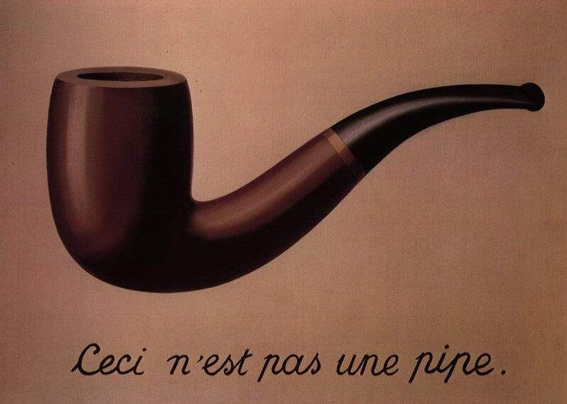
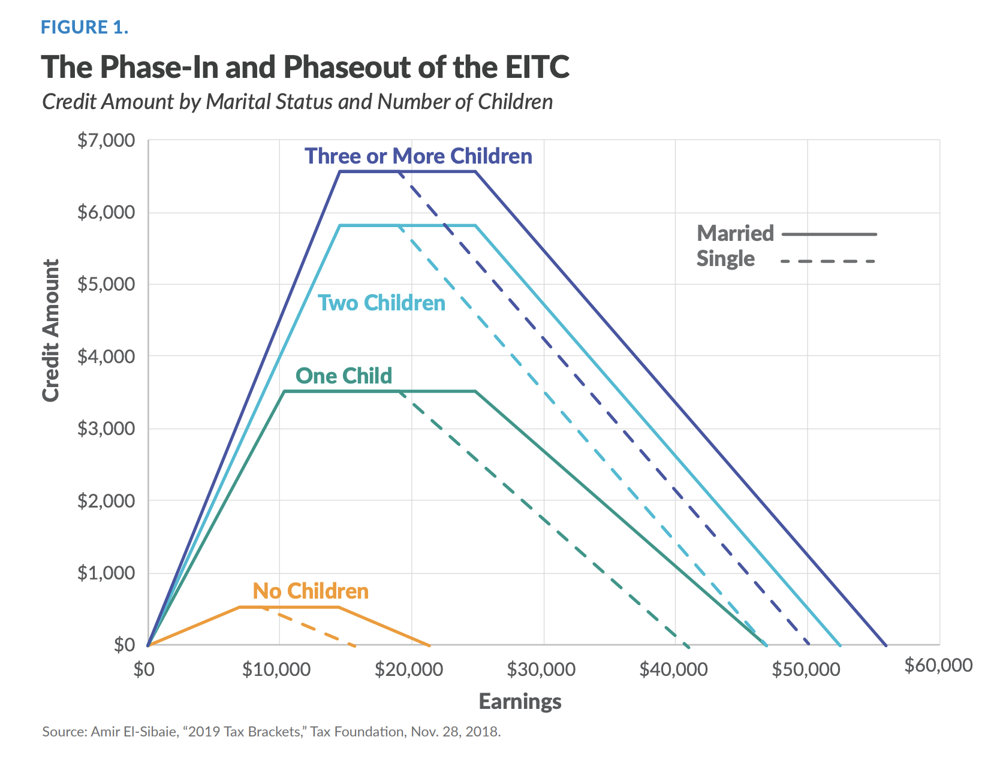
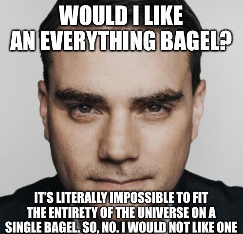
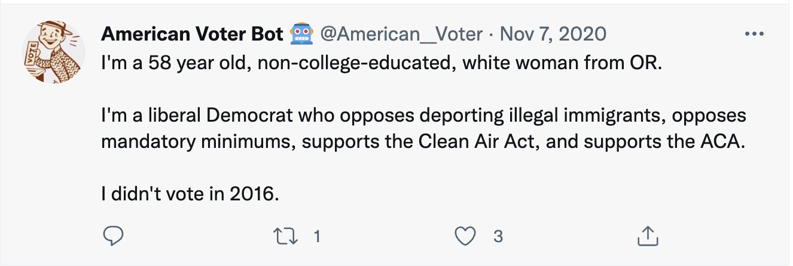

```{r setup, include=FALSE}
# set knit options
knitr::opts_chunk$set(
  fig.width=9, 
  fig.height=5, 
  fig.retina=3,
  fig.align="center",
  out.width = "100%",
  cache = FALSE,
  echo = FALSE,
  message = FALSE, 
  warning = FALSE
)

# libraries
library(gapminder)
library(socviz)

# source
source(here::here("slides/R/funcs.R"))


```

# Plan for today {.center background-color="#dc354a"}

Wrangling and pipes

. . .

Subsetting data

. . .

The (tricky!) programming objects

# The new starting point {background-color="#dc354a"}

. . .

Before, I *wrangled* data and you plotted the finished product

. . .

First step of all your code was `ggplot()`

. . .

Now, **you** will wrangle the data

. . .

First step is now *the data object*

## What is data-wrangling?

. . .

> ...the process of transforming and mapping data from one "raw" data form into another format with the intent of making it more appropriate and valuable for a variety of downstream purposes such as analytics... **Data analysts typically spend the majority of their time in the process of data wrangling compared to the actual analysis of the data.** -- Wikipedia

. . .

Most of your time working with data will be spent **wrangling** it into a usable form for analysis

## Pipes: connecting data to functions

```{r, echo = TRUE, eval = FALSE}
directors_profit = movies |> 
  # only look at horror movies
  filter(genre1 == "Horror" | genre2 == "Horror" | genre3 == "Horror") |> 
  # calculate profit
  mutate(profit = gross - budget)
```

<br>

You've seen these before...

## What are pipes?

::::: columns
::: {.column width="50%"}
-   **Pipes** link **data** to **functions**

-   They look like this `%>%`, or `|>`

-   Definitely use keyboard shortcuts

    -   OSX: <kbd>Cmd</kbd> + <kbd>Shift</kbd> + <kbd>M</kbd>
    -   Windows: <kbd>Ctrl</kbd> + <kbd>Shift</kbd> + <kbd>M</kbd>
:::

::: {.column width="50%"}

:::
:::::

## Why pipes?

. . .

With pipes: 😍

```{r, echo = TRUE, eval = FALSE}
penguins %>% 
  filter(species == "Adelie") %>% 
  mutate(body_mass_kg = body_mass_g / 1000) %>% 
  select(body_mass_kg)
```

. . .

Without pipes: 🤢

```{r, echo = TRUE, eval = FALSE}
select(mutate(filter(penguins, species == "Adelie"), body_mass_kg = body_mass_g / 1000), body_mass_kg)
```

. . .

<br>

Both produce the same output, but pipes make code more **legible**

## Making sense of pipes: "and then..."

```{r, echo = TRUE, eval = FALSE}
directors_profit = movies %>% 
  # only look at horror movies
  filter(genre1 == "Horror" | genre2 == "Horror" | genre3 == "Horror") %>% 
  # calculate profit
  mutate(profit = gross - budget)
```

. . .

<br>

You can read the pipe as if it said "*and then*"...

. . .

1.  Take the data object `movies`, AND THEN

2.  `filter` so genre1, genre2, or genre3 equal HORROR, AND THEN

3.  `mutate` so that...

# Subsetting data and logical operators {background-color="#dc354a"}

## Our first wrangling function: `filter()`

. . .

`filter()` **subsets** data objects based on **rules**

```{r, out.width="60%"}

```

. . .

```{r, eval = FALSE, echo = TRUE}
baby_subset <- babynames %>%
  filter(name == "Angel")
```

Subset `babynames` to only babies named `Angel`

# Why filter? {.center background-color="#dc354a"}

## Why filter? {.center}

. . .

Lots of real-world **applications**: finding flights, addresses, IDs, etc.

. . .

Sometimes we want to focus on a specific **subset** of data: the South, Latin America, etc.

. . .

Useful to deal with common problems: outliers, missing data, strange responses

## The Earned Income Tax Credit (EITC)

::::: columns
::: {.column width="50%"}
Third largest welfare program in the US

Only people who meet certain **criteria** receive it

**Effects** of program and its **design** are hotly debated
:::

::: {.column width="50%"}

:::
:::::

::: notes
What does this graph tell us about the criteria?
:::

## Identifying beneficiaries

Imagine you are the IRS, and have data on all 360+ million Americans:

. . .

```{r}
library(wakefield)
fake = r_data_frame(n = 7, sex, race, age, income, marital, children) |> 
  mutate(Marital = ifelse(Marital != "Married", "Not married", "Married"))

fake |> 
  kbl(digits = 0)
```

. . .

How could use use these variables to **identify** what benefits they should receive?

## Identifying beneficiaries

Say we wanted to identify people in the flat part of the [blue line]{.blue}

::::: columns
::: {.column width="50%"}
```{r}
fake |> 
  select(Income, Marital, Children) |> 
  kbl()
```
:::

::: {.column width="50%"}

:::
:::::

## Using `filter()`

To use `filter()`, we need to tell R which **observations** we want to include (or exclude) using *rules*

. . .

<br>

```{r, eval = FALSE, echo = TRUE}
gap_africa = gapminder |> 
  filter(region == "Africa")
```

Rule: return all observations from `gapminder` where the `region` variable **is equal to** "Africa"

## Making the rules: logical operators

::::: columns
::: {.column width="50%"}
-   Rules filter data based on whether **variables** meet certain criteria

-   Rules rely on **logical operators**:

    -   Equal to, not equal to, less than, more than, included in, etc.

    -   Observations that meet the rule are returned; those that are not are **dropped**
:::

::: {.column width="50%"}
```{r, out.width="90%"}

```
:::
:::::

## The logical operators

```{r,echo = FALSE}
tribble(~Operator, ~meaning, 
        "==", "equal to", 
        "!=", "not equal to", 
        ">", "greater than", 
        "<", "less than", 
        ">=", "greater than or equal to", 
        "<=", "less than or equal to", 
        "&", "AND (both conditions true)", 
        "|", "OR (either condition is true)",
        "%in%", "IN (in the set of)") %>% 
  knitr::kable(align = "cc")
```

::: notes
Why double equal sign?
:::

## Using `filter()`

Say we have some data on 🍎

```{r}
apples = tribble(~name, ~color, ~pounds, ~sweet,
        "Fuji", "red", 2, TRUE,
        "Gala", "green", 4, TRUE,
        "Macintosh", "green", 8, FALSE,
        "Granny Smith", "red", 3, FALSE)


apples %>% knitr::kable()
```

## Apples

```{r,echo = TRUE}
apples
```

::: callout-note
The output reports how many rows and columns our dataset has (4 rows x 4 columns)
:::

## Green apples

```{r,echo = TRUE}
apples |> 
  filter(color == "green")
```

. . .

Notice words are in quotations!

. . .

Notice that the number of rows has decreased: `2 x 4`

## Green and unsweet apples

```{r,echo = TRUE}
apples |> 
  filter(color == "green") |> 
  filter(sweet == FALSE)
```

Notice TRUE/FALSE are all-caps!

## Apples that aren't green

```{r,echo = TRUE}
apples |> 
  filter(color != "green")
```

The <kbd>!<kbd> symbol **negates**: *not* equal to

## At least 4 pounds but less than 6

```{r,echo = TRUE}
apples |> 
  filter(pounds >= 4, pounds < 6)
```

Notice: **at least** implies *greater than or equal to*

. . .

I could also split this up over multiple `filter` calls

```{r, echo = TRUE}
apples |> 
  filter(pounds >= 4) |> 
  filter(pounds < 6)
```

. . .

## Combinations: The OR (\|) operator

"Observations where either *this* is true **OR** *that* is true"

. . .

Apples that are red OR green

```{r, echo = TRUE}
apples |> 
  filter(color == "red" | color == "green")
```

::: callout-note
The <kbd>\|</kbd> should be above your Return/Enter key
:::

## Combinations: the AND operator (&)

The `&` operator can be used to combine rules

. . .

Returns observations where *both* rules are true

. . .

"Apples that are red AND sweet or green AND sour":

. . .

```{r, echo = TRUE, eval = FALSE}
apples |> 
  filter(color == "red" & sweet == TRUE | color == "green" & sweet == FALSE)
```

## %in%

The `%in%` operator is super powerful

. . .

It returns observations that belong to a **set**

. . .

Say I wanted to look at just South American countries, normally:

```{r, echo = TRUE, eval = FALSE}
gapminder |> 
  filter(country == "Argentina" | country == "Brazil" | country == "Chile")
```

Brutally repetitive

## %in%

Make a list of countries and return observations that match any of them

```{r, echo = TRUE, eval = FALSE}
keep = c("Argentina", "Brazil", "Chile")

gapminder |> filter(country %in% keep)
```

::: callout-note
To make a "list" of items (a **vector**), use `c()`
:::

## Your turn: 👑 World leaders 👑

Open an r script and download two new packages: `remotes` and `juanr`.

Next Using the `leader` dataset, identify:

1.  A Vietnamese Emperor who, in his first year in office, was 11 years old. Famously depraved.

```{r}
#| echo: true
#| eval: false

install.packages("remotes")
remotes::install_github("hail2thief/juanr")
library(juanr)

```

```{r}

countdown::countdown(minutes = 10L)
```

::: callout-note
You can use `?leader` to see the codebook. The acronym for Vietnam is "VNM"
:::

## 👑 World leaders 👑

```{r}
#| echo: true

library(juanr)

?leader

leader |> 
  filter(country == "VNM" & yr_office <= 1 & age == 11)

```

# Objects {background-color="#dc354a"}

## Objects and Pipes

Step 1-2: the data, the pipe, the wrangling functions

```{r, echo = TRUE, eval = FALSE}
apples |> 
  filter(sweet == FALSE)
```

<br>

. . .

Step 3: store the subsetted data as a new **object** for later use

```{r, echo = TRUE, eval = FALSE}
green_apples = apples |>
  filter(sweet == FALSE)
```

## Reminder on Objects

In programming, **objects** can be used to store all sorts of stuff for later use

. . .

data, functions, values

. . .

We create objects using `=` or `<-`

. . .

Like this:

```{r, echo = TRUE, eval = FALSE}
new_object = stuff |> filter(year == 1999)
```

. . .

Or like this:

```{r, echo = TRUE, eval = FALSE}
new_object <- stuff |> filter(year == 1999)
```

## Naming objects

> *There are only two hard things in Computer Science: cache invalidation and naming things.* -- Phil Karlton

. . .

Recommend: keep it short, easy to type, informative, and use `_` to separate words

. . .

```{r, echo = TRUE, eval = FALSE}
# Good
gap_africa = gapminder |> 
  filter(continent == "Africa")

# Bad
Countries_In_Africa_That_I_Want_To_Look_Up = gapminder |> 
  filter(continent == "Africa")
```

. . .

I use the excellent [Tidyverse syntax guide](https://style.tidyverse.org/syntax.html) in my work

## Reminder: no object, no save

Without objects, your work washes away, like tears in the rain

. . .

::::::: columns
:::: {.column width="50%"}
Here, we store our data wrangling

::: fragment
```{r, echo = TRUE}
green_apples = apples |>
  filter(sweet == FALSE)

green_apples
```
:::
::::

:::: {.column width="50%"}
Here we didn't store

::: fragment
```{r, echo = TRUE}
apples |>
  filter(sweet == FALSE)

apples
```
:::
::::
:::::::

. . .

Notice the original `apples` remains unchanged!

## The formula

*Wrangle* the data until you're satisfied with the output:

```{r, echo = TRUE, eval = FALSE}
apples |> 
  filter(sweet == FALSE)
```

. . .

Store the output as a new object:

```{r, echo = TRUE, eval = FALSE}
sour_apples = apples |> 
  filter(sweet == FALSE)
```

. . .

Use the new object (e.g., plotting):

```{r, echo = TRUE, eval = FALSE}
ggplot(sour_apples, aes(x = name, y = pounds)) + geom_col()
```

## Challenge: 🗳️ The (unusual) American voter 🗳️

There's a Twitter bot that randomly tweet profiles of real voters from the Cooperative Election Study:

```{r, out.width="60%"}

```

## Challenge: 🗳️ The (unusual) American voter 🗳️

```{r}
juanr::bot |> 
  sample_n(5) |> 
  knitr::kable(caption = "A small sample of Americans")
```

## 🗳️ The (unusual) American voter 🗳️

In your teams, using `bot`:

1.  Identify the most **unusual** subgroup of voters you can think of

2.  Constraint: need *at least* five voters in your subgroup

3.  Store your unusual subgroup as an object

4.  One member tells the class what was your subgroup of voters.

::: callout-note
Remember you can use `?bot` to look at the codebook
:::

```{r}
countdown::countdown(minutes = 10L)
```
