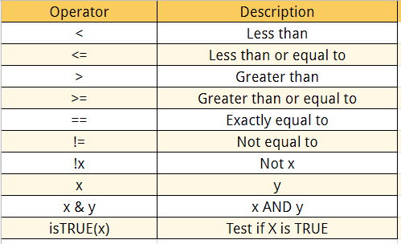

In the following coding examples, you will see three important functions, a `pipe`, `select()`, and `filter()`.

## Pipes (%\>% or \|\>)

First, a pipe is written as a `%>%` or `|>`. Pipes are a powerful tool that help us clearly expressing a sequence of functions. Pipes tell R that you want to use a designated set for a chain of functions that build off of each other. A way to think about is in math terms.

\$\$

$$ F(G(H(X))), X=Data$$

\$\$

In this series of functions, the first step is you solve $H(X)$, then using that solution you solve $G()$, then after you solve $F()$. The final output is the solution of those chain of events with the information of $X$. This is how pipes work! Pipes use a set of information, typically a data frame, and then apply it to a series of functions that build off each other.

## Filter() and Select()

In the following example, I use the `select()` and `filter()` to simplify the data. The `select()` allows me to select certain variables from the data and eliminate the rest. `filter()` does something similar but instead of variables, it allows me to simplify the data based on values based on a set of programmed logical operators. In my first example, I select for the `circuit`, `year`, `constructor`, `surname` of the driver, and the number of `points` awarded during that race. I use the `unique()` to remove duplicates, and then I filter for the race information for the constructor McLaren during the 2023 season.

```{r}

library(tidyverse)
library(RandomData)


race_stats |>
  select(circuit, year, constructor, surname, points) |>
  # remove duplicates
  unique() |>
  filter(constructor == "McLaren" & year == 2023)


```

What if we wanted two different constructors? Then we want to use the logical operator for `|` and also differentiate it from the next instruction for filter by using a `,` or `()`. In the example bellow, I filter for the race information for the constructor `Mercades` and `Red Bull` during the `2021` season.

```{r}

race_stats |>
  select(circuit, year, constructor, surname, points) |>
  # remove duplicates
    unique() |>
    filter(constructor == "Mercades" |  constructor == "Red Bull", year == 2021) |>
    print()

```

However, if we wanted to use the modified data, we could not because it is not saved. If we want to use this data we need to save it as a new object!

```{r}

season_2021 <- race_stats |>
  select(circuit, year, constructor, surname, points) |>
  # remove duplicates
    unique() |>
    filter(constructor == "Mercades" |  constructor == "Red Bull", year == 2021) |>
    print()

```

Now, we can use this information!

## Logical Operators



## Filtering and Selecting Data

In the following coding examples, you will see three important functions, a `pipe`, `select()`, and `filter()`. First, a pipe is written as a `%>%` or `|>`. Pipes are a powerful tool that help us clearly expressing a sequence of functions. Pipes tell R that you want to use a designated set for a chain of functions that build off of each other. A way to think about is in math terms.

\$\$

$$ F(G(H(X))), X=Data$$

\$\$

In this series of functions, the first step is you solve $H(X)$, then using that solution you solve $G()$, then after you solve $F()$. The final output is the solution of those chain of events with the information of $X$. This is how pipes work! Pipes use a set of information, typically a data frame, and then apply it to a series of functions that build off each other.

{width="100%"}

In the following example, I use the `select()` and `filter()` to simplify the data. The `select()` allows me to select certain variables from the data and eliminate the rest. `filter()` does something similar but instead of variables, it allows me to simplify the data based on values based on a set of programmed logical operators. In my first example, I select for the `circuit`, `year`, `constructor`, `surname` of the driver, and the number of `points` awarded during that race. I use the `unique()` to remove duplicates, and then I filter for the race information for the constructor McLaren during the 2023 season.

```{r}

library(tidyverse)
library(RandomData)


race_stats |>
  select(circuit, year, constructor, surname, points) |>
  # remove duplicates
  unique() |>
  filter(constructor == "McLaren" & year == 2023)


```

What if we wanted two different constructors? Then we want to use the logical operator for `|` and also differentiate it from the next instruction for filter by using a `,` or `()`. In the example bellow, I filter for the race information for the constructor `Mercades` and `Red Bull` during the `2021` season.

```{r}

race_stats |>
  select(circuit, year, constructor, surname, points) |>
  # remove duplicates
    unique() |>
    filter(constructor == "Mercades" |  constructor == "Red Bull", year == 2021) |>
    print()

```

However, if we wanted to use the modified data, we could not because it is not saved. If we want to use this data we need to save it as a new object!

```{r}

season_2021 <- race_stats |>
  select(circuit, year, constructor, surname, points) |>
  # remove duplicates
    unique() |>
    filter(constructor == "Mercades" |  constructor == "Red Bull", year == 2021) |>
    print()

```

Now, we can use this information!

## Creating New Variables

We can also add to our data sets! If we want to make a new variable, we can use the `mutate()`, which uses existing data to create new variables. The correct format of the function is the following, first is the new variable name and then an equal sign `=`, followed by how the new variable will be formed and what existing variables are used to make it.

`mutate(new_column_name = function(old_variable_1))`

In the example below, we calculate the average lap time by taking the total time for the driver to finish the race divided by the number of laps.

```{r}

season_2023 <- race_stats |>
  select(circuit, year, constructor, surname, time, laps) |>
  filter(constructor == "McLaren" & year == 2023) |>
  mutate(avg_laptime = sum(time)/laps)

season_2023 |> 
   select(circuit, year, constructor, surname, avg_laptime) |>
   # remove duplicates
   unique() |>
   print()

```

If we wanted to make a new character variable we would use the `case_when()` in the `mutate()` function. In this example, I make a new variable based on the final position of the race for the two McLaren drivers, Piastri and Norris, in the 2023 season. I use the existing variables the circuit and surname to make this new variable.

```{r}

McLarenStandings_2023 <- race_stats |>
  select(circuit, year, constructor, surname) |>
  # remove duplicates
  unique() |>
  filter(constructor == "McLaren" & year == 2023) |>
  mutate(
    final_position = case_when(
      #PIASTRI
      circuit == "Bahrain International Circuit" & surname == "Piastri" ~ "DNF",
      circuit == "Jeddah Corniche Circuit" & surname == "Piastri" ~ "15",
      circuit == "Albert Park Grand Prix Circuit" & surname == "Piastri" ~ "8", 
      circuit ==  "Baku City Circuit" & surname == "Piastri" ~ "11",
      circuit ==  "Miami International Autodrome" & surname == "Piastri" ~ "19",
      circuit == "Circuit de Monaco" & surname == "Piastri" ~ "10",
      circuit == "Circuit de Barcelona-Catalunya" & surname == "Piastri" ~ "13",
      circuit == "Circuit Gilles Villeneuve" & surname == "Piastri" ~ "11", 
      circuit == "Red Bull Ring" & surname == "Piastri" ~ "16",
      circuit == "Silverstone Circuit" & surname == "Piastri" ~ "4",
      circuit == "Hungaroring" & surname == "Piastri" ~ "5",
      circuit == "Circuit de Spa-Francorchamps" & surname == "Piastri" ~ "DNF",
      circuit == "Circuit Park Zandvoort" & surname == "Piastri" ~ "9",
      circuit == "Autodromo Nazionale di Monza" & surname == "Piastri" ~ "12",
      circuit == "Marina Bay Street Circuit" & surname == "Piastri" ~ "7",
      circuit == "Suzuka Circuit" & surname == "Piastri" ~ "3",
      circuit == "Losail International Circuit" & surname == "Piastri" ~ "2",
      circuit == "Circuit of the Americas" & surname == "Piastri" ~ "DNF",
      circuit == "Autódromo Hermanos Rodríguez" & surname == "Piastri" ~ "8",
      circuit == "Autódromo José Carlos Pace" ~ "14",
      circuit == "Las Vegas Strip Street Circuit" & surname == "Piastri" ~ "10",
      circuit == "Yas Marina Circuit" & surname == "Piastri" ~ "6",
        
        # NORRIS
        circuit == "Bahrain International Circuit" & surname == "Norris" ~ "17",
        circuit == "Jeddah Corniche Circuit" & surname == "Norris" ~ "17",
        circuit == "Albert Park Grand Prix Circuit" & surname == "Norris" ~ "6",
        circuit ==  "Baku City Circuit" & surname == "Norris" ~ "9",
        circuit ==  "Miami International Autodrome" & surname == "Norris" ~ "17", 
        circuit == "Circuit de Monaco" & surname == "Norris" ~ "9", 
        circuit == "Circuit de Barcelona-Catalunya" & surname == "Norris" ~ "17", 
        circuit == "Circuit Gilles Villeneuve" & surname == "Norris" ~ "13",
        circuit == "Red Bull Ring" & surname == "Norris" ~ "4", 
        circuit == "Silverstone Circuit" & surname == "Norris" ~ "2",
        circuit == "Hungaroring" & surname == "Norris" ~ "2",
        circuit == "Circuit de Spa-Francorchamps" & surname == "Norris" ~ "7",
        circuit == "Circuit Park Zandvoort" & surname == "Norris" ~ "9",
        circuit == "Autodromo Nazionale di Monza" & surname == "Norris" ~"8",
        circuit == "Marina Bay Street Circuit" & surname == "Norris" ~ "2",
        circuit == "Suzuka Circuit" & surname == "Norris" ~ "2",
        circuit == "Losail International Circuit" & surname == "Norris" ~ "3",
        circuit == "Circuit of the Americas" & surname == "Norris" ~ "3",
        circuit == "Autódromo Hermanos Rodríguez" & surname == "Norris" ~ "5",
        circuit == "Autódromo José Carlos Pace" ~ "2",
        circuit == "Las Vegas Strip Street Circuit" & surname == "Norris" ~ "DNF",
        circuit == "Yas Marina Circuit" & surname == "Norris" ~ "5"
        )
  ) 

print(McLarenStandings_2023)

```

## Descriptive Statistics Using Tidyverse

Now that we know some basic ways to manipulate the data frame, lets look at different way to do basic descriptive statistics! In this section we will be using the function, `summarize()`. This function is similar to the mutate function, except instead of adding a variable, it makes a new data frame based on existing variables. You will also see the function `group_by()`. This function allows us to organize the data by telling it to group things by a variable(s). Essentially, the functions splits things into groups.

For this example we are going to find the total points for each team in the 2023 season!

```{r}

TeamStandings_2023 <- race_stats |>
  select(circuit, year, constructor, surname, points) |>
  # remove duplicates
  unique() |>
  filter(year==2023) |>
  group_by(constructor) |>
  summarize(
    total_points = sum(points)
  )

print(TeamStandings_2023)
```

```{r}

TeamStandings_2023 <- race_stats |>
  select(circuit, year, constructor, surname, points) |>
  # remove duplicates
  unique() |>
  filter(year==2023) |>
  group_by(constructor) |>
  summarize(
    total_points = sum(points)
  ) |>
  arrange(desc(total_points))

print(TeamStandings_2023)

```

What if we wanted to know the percentage of points each driver contributed to the teams total?

```{r}

TeamStandings_2023 <- race_stats |>
  select(circuit, year, constructor, surname, points) |>
  # remove duplicates
  unique() |>
  filter(year==2023) |>
  group_by(constructor) |>
  mutate(total_points = sum(points, na.rm = TRUE)) |>
  ungroup() |>  # Ungroup to avoid issues with the next group_by
  group_by(surname) |>
  summarize(
  perc_points = sum(points, na.rm = TRUE) / unique(total_points) * 100)  |>
  arrange(desc(perc_points))

print(TeamStandings_2023)

```

## Class Examples

## filter() and variables types

Filtering requires knowing the **type** of variable you are working with

Numerical variables do not use quotes

```{r, echo = TRUE, eval = FALSE}
library(gapminder)

gapminder |> filter(year > 2000)
```

Categorical variables use quotes, and spelling must be *exact*

✅

```{r, echo = TRUE, eval = FALSE}
gapminder |> filter(continent == "Asia")
```

❌

```{r, echo = TRUE, eval = FALSE}
gapminder |> filter(continent == "asia")
```

`TRUE/FALSE` variables are all-caps, no quotes

```{r, echo = TRUE, eval = FALSE}
gapminder |> filter(is_asia == TRUE)
```

## What values does a variable take on?

To figure out what **values** a variable can take on, you can use `distinct()`

```{r, echo = TRUE}
library(juanr)

bot |> 
  distinct(religion)
```

### World Leaders Example

```{r}
#| echo: true

library(juanr)

?leader

leader |> 
  filter(country == "VNM" & yr_office <= 1 & age == 11)
```

### Climate Change Example {.center background-color="#dc354a"}

```{r}
#| echo: true

library(juanr)

climate_cap <- climate |>
  filter(country  %in% c("Germany", "United States", "China", "India")) |>
  mutate(co2_capita = co2/population)

ggplot(climate_cap, aes(x=year, y = co2, color = country)) + geom_line()

ggplot(climate_cap, aes(x=year, y = co2_capita, color = country)) + geom_line()


```

### Elections Example

```{r}
#| echo: true

elections_cat <- elections |>
  mutate(
   won = case_when(
      per_dem_2012 >  per_gop_2012 & per_dem_2016 >  per_gop_2016 ~ "blue",
      per_dem_2012 >  per_gop_2012 & per_dem_2016 >  per_gop_2016 ~ "red",
      per_dem_2012 <  per_gop_2016 & per_dem_2016 >  per_gop_2016 ~ "red to blue",
      per_dem_2012 >  per_gop_2016 & per_dem_2016 <  per_gop_2016 ~ "blue to red"
    ) 
  )

ggplot(data= elections_cat, aes(x = hh_income, y = won)) + geom_boxplot() 

```
